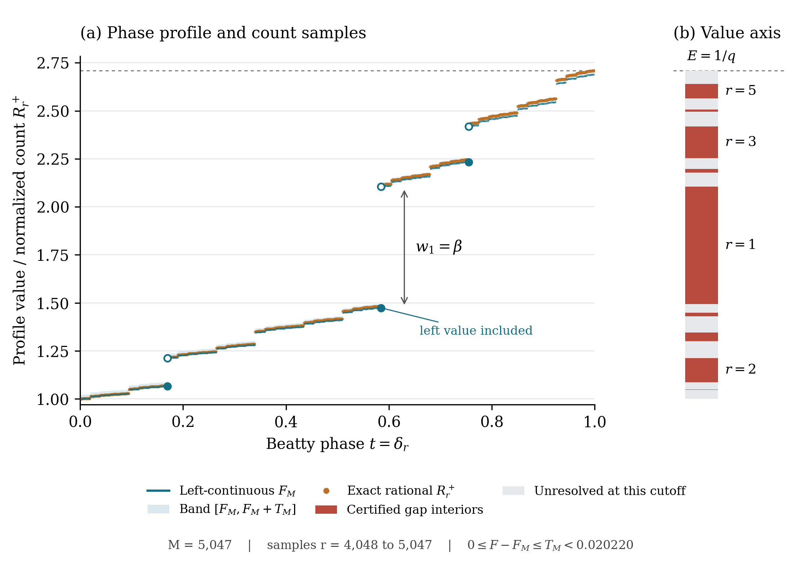

# A Jump Profile and Singular Geometry for Beatty First-Passage Counts

Philippe Cochin. 24 September 2026. Unpublished working note.

**Abstract.** Binary first-passage counts at a Beatty boundary belong to the
binomial random-walk framework of Bauer, Godrèche and Luck. For every
irrational slope `alpha>1`, we identify an explicit positive cumulative
jump profile for the original binomial-normalized counts. Their complete
set of accumulation values is the profile's envelope with its open jump
intervals removed: a nonempty compact perfect set of Lebesgue measure zero.
The empirical probabilities converge to the image of uniform phase measure
under the profile. This law is singular continuous, and its continuous CDF
inverts the profile and has explicit plateaus at the Beatty phases.
The gap lengths have order `r^(-3/2)` and the neighbourhood volume has an
exact positive `epsilon^(1/3)` asymptotic, giving Minkowski dimension `2/3`
and explicit content. The whole rescaled neighbourhood measure converges
weakly to the empirical law weighted by its value to the two-thirds power,
with the same geometric scale factor. All of these statements hold for every
irrational slope above one and are proved in Lean for the actual integer
word counts. The Hausdorff dimension of the accumulation set is at most
`2/3` for every such slope, exactly `2/3` for Lebesgue-almost every
slope, and `0` at every Liouville slope; every quadratic irrational slope
has positive finite two-thirds Hausdorff measure. The weights, laws and Minkowski content depend
continuously on the slope at every irrational slope.
For every irrational slope above one, the
same integer counts in BGL's exact Gamma normalization have an absolutely
continuous limiting law, mutually singular with the first. We give its
density as a nonnegative series over the exponentially rescaled jump intervals.
This second law has an interval as its exact support and full accumulation
set. Its explicit density is finite almost everywhere, lower semicontinuous,
and locally essentially unbounded throughout the support interior, with a
dense null set of infinite values. It is in weak `L^(3/2)` and every
`L^p` with `1<=p<3/2`; its CDF is `1/3`-Holder but nowhere locally
Lipschitz in the support interior. The entire infinite-density set has
Hausdorff dimension at most `2/3`. These conclusions and all real-power
moments are also Lean-checked for the whole family. At the logarithmic
slope `alpha=log_2 3`, classical irrationality measures for
`log_2 3` give written positive lower bounds on the Hausdorff dimension of
the first cluster set: `2/39.9` with Rhin's effective constant and
`2/(3*4.1163051)=0.16195...` from Wu and Wang. The underlying
periodic survivor amplitude has a classical precursor; the focus here is
its explicit transfer to the cumulative profile and the resulting singular
geometry.

**Main conclusions.** For every irrational `alpha>1`, use the actual word
counts of Section 24 and write `E=alpha/(alpha-1)`. The checked statements are

\[
\begin{gathered}
F(t)=1+\sum_{\delta_j<t}w_j,\qquad
R_r^+-F(\delta_r)\longrightarrow0,\qquad
\sum_{j\ge1}w_j=E-1,\\[3pt]
\operatorname{Clust}(R_r^+)=K=\operatorname{cl}(F([0,1])),\qquad
K=[1,E]\setminus\bigcup_{j\ge1}(F(\delta_j),F(\delta_j)+w_j),\\[3pt]
\frac1N\sum_{0\le r<N}\delta_{R_r^+}
\Longrightarrow\mu=F_*\bigl(\lambda\!\restriction_{(0,1]}\bigr),
\qquad \mu(K)=1,\quad \lambda(K)=0,\quad \mu(\{y\})=0.
\end{gathered}
\]

For the continuous CDF `G(y)=mu((-infinity,y])`,

\[
G(F(t))=t\quad(0\le t\le1),\qquad
G(y)=\delta_j\quad\bigl(F(\delta_j)\le y\le F(\delta_j)+w_j\bigr).
\]

Thus the phase profile has dense jumps, while the distribution of its
values is continuous and singular. Sections 14–15 give the limit-set and
frequency proofs; Sections 16–18 prove its two-thirds Minkowski dimension,
identify its exact content with a moment of the limiting law, and determine
the whole geometric limiting measure by a two-thirds-power reweighting.
Section 19 proves finite two-thirds Hausdorff measure and isolates a
quantitative phase-hitting condition for matching lower bounds.
Section 20 derives that condition from uniform Diophantine lower bounds,
with no loss in the exponent, and separates the arithmetic premises for
dimension equality and critical-measure positivity. At the logarithmic
slope it applies the irrationality measures of Rhin and of Wu and Wang to
obtain positive Hausdorff lower bounds as written corollaries.
Sections 12–13 establish their counting and asymptotic inputs.
Section 21 identifies the empirical law in BGL's Gamma normalization and
explains why changing the normalization changes the type of limiting measure.
Section 22 identifies its interval support and full cluster set, and proves
the density's dense null blowup and local essential unboundedness.
Section 23 quantifies this law by cube-root concentration, subcritical
density integrability, CDF regularity and exceptional-set Hausdorff bounds.
Section 24 extends the explicit first-passage phase theorem to every
irrational slope above one, using a subcritical tilt whose weight cancels
from the final integer ratio. Section 25 extends the complete cluster set,
singular empirical law and exact CDF identities to this whole family.
Section 26 proves the sharp gap asymptotic, exact Minkowski content and
whole geometric limiting measure for every irrational slope above one.

For every irrational slope above one, the central spatial conclusion is, with
`kappa=(2 pi alpha (alpha-1))^(-1/2)`,
\[
 \varepsilon^{-1/3}\lambda\!\restriction_{K_\varepsilon}
 \Longrightarrow 3\,2^{1/3}\kappa^{2/3}y^{2/3}\,\mu(dy).
\]
It distinguishes the distribution of the original normalized counts from
geometric sampling in shrinking neighbourhoods of their accumulation set.

**Relation to earlier work.** Bauer, Godrèche and Luck [8] study the same
survival paths after a change of coordinates. Their crossing-edge counts
are exactly the `c_r` here, and their survivor-amplitude series becomes
`psi` term by term; Section 1.1 gives the dictionary. Their Section 6.1
also proposes a periodic first-passage amplitude at irrational slopes.
The profile theorem gives the explicit realization `q^t F(t)` at the
logarithmic slope, with the present trace convention. We claim no priority
for periodic survivor modulation, its series or Fourier representation,
the crossing recurrence, or the critical probability-flow identity.

The global gap criterion for Minkowski measurability is due to
Lapidus and Pomerance [9, Theorem 2.2]. The phase-dependent gap count supplies
its constant here; Section 17 makes this application explicit. The complete
normalized-count cluster set, its singular empirical law and the explicit
local content measure are the focus of this note. General jump-profile
geometry and local Minkowski content are established constructions, and
comparison with these sources alone does not establish literature priority.

**Evidence boundary.** The profile, cluster-set, empirical-law and tube-measure
conclusions displayed above are **EXACT — LEAN VERIFIED**
for every irrational slope `alpha>1`, without unproved counting, binomial,
first-passage or equidistribution inputs. Sections 1–7 also retain a broader
written argument for irrational `1<alpha<2`, including a quantitative
`O(r^(-1/2))` rate. Those stronger statements are explicitly distinguished
from the checked qualitative statements. Section 24 now proves the
qualitative phase theorem for every irrational `alpha>1`, with no rate or
uniformity in the slope. Section 25 extends the compact perfect null cluster set,
singular empirical law and exact threshold frequencies to that whole family.
Section 26 extends the sharp gap asymptotic, Minkowski dimension, content
and local tube-measure conclusions to every irrational slope above one.
The exact Gamma-normalized
first-passage amplitude in Section 1.1 and its absolutely continuous empirical
law, density and real-power moment identities in Section 21, and the exact
interval support and density topology in Section 22, are also Lean-checked.
Section 29 extends the Gamma-normalized package to every irrational
slope above one. The path dictionary with BGL, the spectral corollary in
Section 17 and the Hausdorff lower bounds from Rhin and from Wu and Wang
in Section 20 remain written deductions (**EXACT — HUMAN PROOF**).
This is a standalone working
note supporting Paper B; it does not revise a deposited paper or establish
literature priority or trajectory termination.

For every irrational slope, the phase theorem is
[passage_phase_asymptotic_reciprocal](../../formal/Problems/Juggler/BeattySlopeAsymptotic.lean),
the cluster set and empirical law are in
[BeattySlopeCluster.lean](../../formal/Problems/Juggler/BeattySlopeCluster.lean)
and [BeattySlopeDistribution.lean](../../formal/Problems/Juggler/BeattySlopeDistribution.lean),
and the gap, content and tube-measure theorems are in
[BeattySlopeContent.lean](../../formal/Problems/Juggler/BeattySlopeContent.lean)
and [BeattySlopeLocalContent.lean](../../formal/Problems/Juggler/BeattySlopeLocalContent.lean).
The expanded original-count consumers are
[InterfaceCheckBeattySlopeGeometry.lean](../../formal/InterfaceCheckBeattySlopeGeometry.lean)
and [InterfaceCheckBeattySlopeContent.lean](../../formal/InterfaceCheckBeattySlopeContent.lean).
The modules listed next are the earlier specializations at the logarithmic slope.
Its phase-asymptotic interface is
[certificate_phase_asymptotic](../../formal/Problems/Juggler/BeattyCertificateAsymptotic.lean).
The exact series equality is in
[BeattyCertificateIdentification.lean](../../formal/Problems/Juggler/BeattyCertificateIdentification.lean),
with critical mass and concrete atom properties in
[BeattyCertificateMass.lean](../../formal/Problems/Juggler/BeattyCertificateMass.lean)
and [BeattyCertificateSeries.lean](../../formal/Problems/Juggler/BeattyCertificateSeries.lean).
[BeattyEndpointAsymptotic.lean](../../formal/Problems/Juggler/BeattyEndpointAsymptotic.lean)
discharges the finer terminal input and yields the unconditional survivor
`MeanderShape`. These build on the counting, coarse bounds and renewal modules
recorded below. The complete limit-set interface is
[certificateRatio_cluster_iff](../../formal/Problems/Juggler/BeattyCertificateCluster.lean),
and the empirical-law interface is
[certificateRatio_empiricalLaw_tendsto](../../formal/Problems/Juggler/BeattyCertificateDistribution.lean).
The latter module also proves continuity of the CDF, singularity and the
exact threshold and plateau formulas.
The neighbourhood-volume and dimension interfaces are in
[BeattyCertificateCantor.lean](../../formal/Problems/Juggler/BeattyCertificateCantor.lean).

## 1. Statement and notation

This section and Sections 2–7 present the broader written argument with its
quantitative remainder. The geometric formal package is proved for every irrational \(\alpha>1\)
in Sections 24–26; the earlier concrete modules specialize to \(\alpha=\log_2 3\).
Fix an irrational \(1<\alpha<2\), and put
\[
\beta=\alpha^{-1},\quad q=1-\beta,\quad s=\alpha-1=q/\beta,\quad
v=\beta^{-\beta}q^{-q},\quad \rho=v/2,\quad
B=v^\alpha=\frac{\alpha^\alpha}{(\alpha-1)^{\alpha-1}}.
\]
The application is \(\alpha=\log_2 3\). Let \(N_d\) count binary words for which
every nonempty prefix of length \(j\) has more than \(\beta j\) ones.
Set \(N_0=1\), \(M_d=2N_{d-1}-N_d\),
\[
m_r=\lfloor\alpha r\rfloor,\quad \delta_r=\alpha r-m_r,\quad
c_r=M_{m_r+1},\quad C_r=\binom{m_r-1}{r-1},\quad
R_r^+=\frac{r c_r}{C_r}.
\]
The \(M_d\) in this note always counts first-descent words, not words sitting
on the survivor barrier.

Define the positive weights
\[
\boxed{\quad
w_r=\frac{c_r}{B^r q^{\delta_r}}
    =c_r\beta^r q^{m_r-r},\qquad r\ge1.
\quad}                                                     \tag{1}
\]
The cumulative profile, identified in Lean at the logarithmic slope, is the
left-continuous function
\[
\boxed{\quad
F(\delta)=1+\sum_{\substack{r\ge1\\\delta_r<\delta}}w_r,
\qquad 0\le\delta\le1.
\quad}                                                     \tag{2}
\]
The written argument gives the stronger rate
\[
R_r^+=F(\delta_r)+O(r^{-1/2}),\qquad
\sum_{r\ge1}w_r=\frac1{\alpha-1}.                           \tag{3}
\]
At \(\alpha=\log_2 3\), the total mass and the qualitative error
\(R_r^+-F(\delta_r)=o(1)\) are Lean-checked; the displayed quantitative
rate is a separate written claim.
In particular
\[
F(0+)=1,\qquad F(1-)=\frac{\alpha}{\alpha-1},\qquad
F(\delta_r+)-F(\delta_r-)=w_r.                              \tag{4}
\]
It is continuous at every other interior point. All interior jumps are upward.
Their locations are dense, so “pure jump” does not mean piecewise constant on
nonempty intervals. In fact \(F\) is strictly increasing: the orbit is dense
and every \(c_r\ge1\), as witnessed by \(r\) ones followed by zeros until the
first crossing. On the circle there is additionally a downward wrap at zero.

For the first atom, \(m_1=c_1=1\); hence
\[
\boxed{\Delta F(\{\alpha\})=\beta\quad\text{and, at }\alpha=\log_2 3,\quad
\beta=\log_3 2
       =0.630929753571457\ldots.}                           \tag{5}
\]
No fitted amplitude occurs in these formulas.

### 1.1. The binomial random-walk dictionary

**REPARAMETERIZATION.** Use `v_B` for BGL's wall velocity, distinct from our
growth factor `v`. Encode a binary one as a left step and a zero as a right
step. With `k_j` ones in a prefix, its position is `x_j=j-2k_j`. Setting
`p_c=beta` and `v_B=1-2 beta` gives
\[
 x_j<v_Bj\quad\Longleftrightarrow\quad k_j>\beta j.
\]
Irrationality excludes equality at positive integer times. At fair bias
BGL's survival probability is `N_n/2^n`. Their crossing edge
`n_r=1+floor(r/p_c)` is `m_r+1`; their integer `A_r` counts surviving
length-`m_r` prefixes with `r` ones. Appending a zero identifies these with
our first-descent words, so `A_r=c_r` exactly. Their (4.1) becomes
\[
 \binom{m_r}{r-1}=c_r+
 \sum_{\ell=1}^{r-1}c_\ell\binom{m_r-m_\ell}{r-\ell}.
\]
The binomial on the left differs from `C_r=binom(m_r-1,r-1)`.

At fair bias their large-deviation exponent satisfies `exp(-S)=v/2`.
Their kernel `a^-`, using fractional parts in `[0,1)`, is our `Phi`.
Substitution in [8, (2.25)] gives
\[
 b^-(x)=\sum_{j\ge0}(N_j/2^j)e^{jS}a^-(x-j\beta)
       =\sum_{j\ge0}u_j\Phi(\{x-j\beta\})=\psi(x).
\]
Their (2.22) similarly specializes to the Fourier identity (15).
Kernel point values matter even though strict and weak finite survival
events agree at this irrational slope.

Changing the bias to `p=beta` retains the counts but gives crossing
probabilities `q w_r`. The critical flow identity [8, (3.15)] becomes
`0=beta-q sum_r w_r`, exactly our mass identity. Section 7 and the concrete
formalization prove the vanishing critical survival probability.

**First-passage amplitude: EXACT — LEAN VERIFIED at the logarithmic slope.**
For BGL's normalization [8, (4.11)], put
\[
 D_r=\frac{\Gamma(r/\beta)}{r!\,\Gamma(rq/\beta+1)},\qquad
 \mathcal B_r=c_r/D_r.
\]
Stirling gives `D_r=kappa B^r r^(-3/2)(1+O(r^(-1)))`. The identity
`c_r=B^r q^(delta_r) w_r` and the checked gap asymptotic (23) of Section 16 imply
\[
 \mathcal B_r-q^{\delta_r}F(\delta_r)\longrightarrow0.
\]
Thus `mathcal B(t)=q^t F(t)` on `[0,1)`, extended periodically, realizes
the irrational-slope form proposed in [8, Section 6.1, (6.8)–(6.9)] at
`alpha=log_2 3`. Its endpoint traces agree since `q F(1)=F(0)=1`.
The concrete theorem
[certificateGammaRatio_periodic_asymptotic](../../formal/Problems/Juggler/BeattyFirstPassageAmplitude.lean)
uses exactly this Gamma quotient and the original integer counts. Its
independent consumer statement is
[original_count_gamma_amplitude](../../formal/InterfaceCheckBeattyAmplitude.lean).
The dependency audit permits only Lean's standard `propext`,
`Classical.choice` and `Quot.sound`; no extra analytic premise remains.

The checked normalization bridge avoids assuming a real-variable Stirling
remainder. Log-convexity gives, uniformly for `0<=t<=1` and integers `n>=2`,
\[
 \frac{n-1}{n}\le
 H(n,t):=\frac{\Gamma(n+t)}{\Gamma(n)n^t}\le1.
\]
With `k_r=m_r-r+1`, exact factorial identities give
\[
 \mathcal B_r=R_r^+q^{\delta_r}
 \frac{H(k_r,\delta_r)}{H(m_r,\delta_r)}
 \left(\frac{k_r}{m_rq}\right)^{\delta_r}.
\]
Both integer arguments diverge and `k_r/m_r -> q`, so the last two
factors tend to one even when the phases keep moving. This proves the
qualitative additive limit directly from the checked binomial-normalized
phase theorem. The general interpolation lemmas are in
[BeattyGammaNormalization.lean](../../formal/Problems/Juggler/BeattyGammaNormalization.lean).
No Gamma-normalized convergence rate, arbitrary-slope formalization or
priority over subsequent literature is asserted.

## 2. Exact comparison of normalizations

At a crossing \(d=m_r+1\), irrationality gives \(0<\delta_r<1\), and
\[
\{m_r\beta\}=1-\beta\delta_r,\qquad
\{(m_r+1)\beta\}=\beta(1-\delta_r).                         \tag{6}
\]
If a bounded survivor profile \(\psi\) gives
\[
N_d=v^d d^{-3/2}\bigl(\psi(\{d\beta\})+o(1)\bigr),          \tag{7}
\]
the certificate identity and the uniform binomial normalization imply
\[
F(\delta)=
\frac{2\sqrt{2\pi(\alpha-1)}}{\alpha}\,
s^{-\beta\delta}
\left[
 \psi(1-\beta\delta)-\rho\,\psi(\beta(1-\delta))
\right],\qquad 0<\delta<1.                                 \tag{8}
\]
Here
\[
C_r=\kappa q^{\delta_r}B^r r^{-1/2}(1+O(r^{-1})),
\qquad \kappa=(2\pi\alpha(\alpha-1))^{-1/2}.
\]
This is Proposition 34 of the public v21 manuscript *Marked Rotations and
Factorization Heights for Dual Beatty Passage Counts* [2], where the lower
normalized family is denoted \(R_r^G\). The earlier \(R_r^+\) notation is
retained in this laboratory.

For verification, before taking a limit the relevant bracket is
\[
L_m-\rho\left(\frac m{m+1}\right)^{3/2}L_{m+1},
\qquad L_j=j^{3/2}N_j/v^j.
\]
The polynomial ratio tends to one. Boundedness of the profiles controls the
error; positivity of the difference need not be assumed to obtain an additive
\(o(1)\). This avoids subtracting two relative asymptotics without controlling
cancellation.

## 3. The generating-function input and a uniform binomial estimate

Let \(T_n\) count all binary words with a positive endpoint, with no prefix
restriction:
\[
T_n=\sum_{k=\lceil n\beta\rceil}^n\binom nk,\qquad
A_n=T_n/v^n,\quad b_n=A_n/n,\quad u_n=N_n/v^n.
\]
The classical positive-partial-sum identity is
\[
U(z):=\sum_{n\ge0}u_nz^n
=\exp\left(\sum_{n\ge1}b_nz^n\right).                      \tag{9}
\]
One obtains it by applying the Sparre Andersen–Spitzer identity to independent
fair binary increments \(X-\beta\), then rescaling the generating variable.
There are no nonempty zero-sum words because \(\beta\) is irrational.
The positive-partial-sum generating identity is given, for example, in
[Baxter (1960), Example 3](https://msp.org/pjm/1960/10-3/pjm-v10-n3-p01-s.pdf);
it specializes to (9) by extracting the diagonal where all partial sums
are positive. This is a classical input, not a new identity.

Put
\[
a_0=(2\pi\beta q)^{-1/2},\qquad
\Phi(x)=\frac{a_0s^{1-x}}{1-s}\quad(0\le x<1).
\]
Uniform Stirling expansion at \(k=n\beta+h\), \(0<h<1\), gives
\[
\binom n{\lceil n\beta\rceil}/v^n
=a_0n^{-1/2}s^{1-\{n\beta\}}(1+O(n^{-1})).
\]
The successive ratios in the upper binomial tail approach \(s<1\);
summing that geometric tail gives, uniformly in the offset,
\[
\boxed{\sqrt n\,A_n=\Phi(\{n\beta\})+O(n^{-1}).}            \tag{10}
\]
For completeness, the uniformity is not a non-lattice approximation: write
each term relative to the first as a product of successive ratios. These
ratios are bounded above by \(s\). For \(j\le n^{1/4}\), that product is
\(s^j(1+O((j+1)^2/n))\), uniformly in \(h\). Summing its error uses
\(\sum(j+1)^2s^j<\infty\); the remaining tail is exponentially small in
\(n^{1/4}\). This proves the stated \(O(n^{-1})\) relative tail estimate.
Thus \(0\le b_n\le K n^{-3/2}\) and \(L:=\sum b_n<\infty\).

## 4. A coefficient bound without assuming the desired asymptotic

It would be circular to use the conjectured \(n^{-3/2}\) estimate for \(u_n\)
to justify the limiting convolution. The following elementary bound supplies
it directly from (9).

For a \(k\)-tuple of positive integers summing to \(n\), at least one component
is at least \(n/k\). In the coefficient of \(b(z)^k\), sum over the possible
choice of that component and then over the other \(k-1\) components. The
chosen component is fixed by their sum, so
\[
0\le[z^n]b(z)^k
\le K k^{5/2}L^{k-1}n^{-3/2}.
\]
Summing over \(k\ge1\), with the exponential coefficient \(1/k!\), gives
\[
u_n\le K_u n^{-3/2},\qquad
K_u=K\sum_{k\ge1}\frac{k^{5/2}L^{k-1}}{k!}<\infty.          \tag{11}
\]
This also gives
\[
\sum_{j>J}u_j=O(J^{-1/2}),\qquad
\sum_{1\le j\le J}j u_j=O(\sqrt J).
\]
In particular \(U(1)<\infty\). These facts precede, and do not assume, a
phase-only limit.

## 5. Constructing the survivor profile and bounding the remainder

Define
\[
\boxed{\psi(x)=\sum_{j\ge0}u_j\Phi(\{x-j\beta\}).}           \tag{12}
\]
The series converges uniformly and absolutely because \(\Phi\) is bounded and
\(\sum u_j<\infty\). It is bounded above, and bounded below by
\(a_0s/(1-s)>0\), since \(u_0=1\).

Differentiate the formal identity (9) and compare coefficients:
\[
n u_n=\sum_{j=0}^{n-1}A_{n-j}u_j.                          \tag{13}
\]
Let \(x_n=\{n\beta\}\). Multiplying by \(\sqrt n\), split the sum at \(j=n/2\).
For \(j\le n/2\), (10) and
\(\{x_n-j\beta\}=\{(n-j)\beta\}\) give
\[
\sqrt n A_{n-j}
=\sqrt{\frac n{n-j}}\,
\left[\Phi(\{x_n-j\beta\})+O((n-j)^{-1})\right].
\]
Since \(\sqrt{n/(n-j)}=1+O(j/n)\), the error summed against \(u_j\) is
\[
O\left(n^{-1}\sum_{j\le n/2}(j+1)u_j\right)=O(n^{-1/2}).
\]
For \(j>n/2\), put \(k=n-j\). By (10) and (11), the remaining contribution is
\[
\sqrt n\sum_{1\le k<n/2}A_ku_{n-k}
=O\left(n^{-1}\sum_{k<n/2}k^{-1/2}\right)=O(n^{-1/2}).
\]
The omitted tail of (12) is also \(O(n^{-1/2})\). Consequently,
\[
\boxed{n^{3/2}u_n=\psi(\{n\beta\})+O(n^{-1/2}).}            \tag{14}
\]
This proves the asserted phase asymptotic by a coefficient argument.
The abstract Lean moving-kernel theorem applies to the first-half kernel
\(\mathbf1_{j<n,\;2j\le n}\sqrt n A_{n-j}\), the shifted kernel
\(\Phi(\{x_n-j\beta\})\), and the second-half remainder above. Its fixed-index
approximation follows from (10) and \(\sqrt{n/(n-j)}\to1\); its domination
follows from \(n/(n-j)\le2\). Sections 12–13 formalize the qualitative
specialization of these inputs at the logarithmic slope. The displayed
quantitative remainder remains part of the written argument.
It never replaces a moving phase by its limit, and so does not require
continuity at an orbit point or uniform separation from the dense jump set.
The constants depend on the fixed slope; no uniformity as \(\alpha\to2\)
or \(\alpha\to1\) is claimed.

Each summand in (12) has a downward jump of size \(a_0u_j\) at \(\{j\beta\}\).
Dominated convergence permits termwise one-sided limits. Irrationality makes
these points distinct, giving the previously conjectured jump law. Off that
orbit the series is continuous. If desired, its Fourier identity is
\[
\widehat\psi(k)=
\frac{a_0}{\log(1/s)-2\pi i k}\,
U(e^{-2\pi i k\beta}).                                    \tag{15}
\]
The denominator contains \(\log(1/s)\). Replacing it by \(-2\pi i k\)
is only a high-frequency approximation; it loses the continuous part of
the survivor profile.

## 6. Cancellation gives a pure jump profile

For \(0<\delta<1\), set \(x=1-\beta\delta\), \(y=\beta(1-\delta)\).
Since \(y=x+\beta-1\),
absolute convergence of (12) permits reindexing:
\[
\psi(x)-\rho\psi(y)
=\sum_{j\ge0}\frac{M_{j+1}}{2v^j}\Phi(\{x-j\beta\})
 -\rho\Phi(y).                                            \tag{16}
\]
The first-descent support is exactly \(j=0\) and \(j=m_r\), \(r\ge1\).
Indeed a first-descent word ends in a zero, and with \(r\) ones it must satisfy
\(\beta j<r<\beta(j+1)\). At \(j=0\) its count is \(M_1=1\).

For a crossing \(j=m_r\),
\[
\{x-m_r\beta\}=
\begin{cases}
\beta(\delta_r-\delta),&\delta<\delta_r,\\
0,&\delta=\delta_r,\\
1+\beta(\delta_r-\delta),&\delta>\delta_r.
\end{cases}
\]
Multiply (16) by the prefactor \(2s^{-\beta\delta}/a_0\) in (8). The crossing
term becomes \(s w_r/(1-s)\) when \(\delta\le\delta_r\), and
\(w_r/(1-s)\) when \(\delta>\delta_r\). The two remaining terms, from
\(M_1=1\) and \(-\rho\Phi(y)\), add to \(-s/(1-s)\), using
\(v s^{1-\beta}=\alpha\). Thus
\[
F(\delta)=\frac{s}{1-s}\left(\sum_{r\ge1}w_r-1\right)
          +\sum_{\delta_r<\delta}w_r.                      \tag{17}
\]
The next section shows \(\sum w_r=1/s\), reducing the constant to exactly one.
This derives (2), rather than reconstructing a function from its jumps
without excluding an additional continuous component.

At an individual crossing the same cancellation is particularly transparent:
\[
\Delta F(\delta_r)
=\frac{2s^{-\beta\delta_r}}{a_0}
 \left(a_0\frac{N_{m_r}}{v^{m_r}}
       -\rho a_0\frac{N_{m_r+1}}{v^{m_r+1}}\right)
=w_r.
\]
This algebraic cancellation is covered by Lean.

## 7. Total mass by a centered walk

Take independent Bernoulli variables with \(\mathbb P(X=1)=\beta\),
\(\mathbb P(X=0)=q\), and consider the centered walk
\(S_n=\sum_{i=1}^n(X_i-\beta)\).
Its first strictly negative time is almost surely finite.

Here is an elementary justification. Stop upon entering \((-\infty,0)\)
or \([H,\infty)\). In the remaining bounded interval, a fixed sufficiently
long block of zeros forces exit. Such a block has fixed positive probability
in each independent block of that length. The stopping time is therefore
finite almost surely. The stopped walk lies in the bounded interval
\([-\beta,H+1-\beta]\), so bounded stopping and dominated convergence give
\(\mathbb E S_\tau=0\). If \(p_H\) is the probability of upper exit,
\[
0=\mathbb E S_\tau\ge p_H H-(1-p_H)\beta,\qquad
p_H\le\frac{\beta}{H+\beta}.
\]
Survival forever would require upper exit for every \(H\); letting \(H\to\infty\)
proves its probability is zero.

First descent at length one has probability \(q\). Every other first-descent
word has length \(m_r+1\), with \(r\) ones, and there are \(c_r\) such words.
The probability of that event is
\[
c_r\beta^r q^{m_r+1-r}=q w_r.
\]
These events partition the almost sure first descent. Therefore
\[
q+q\sum_{r\ge1}w_r=1,\qquad
\sum_{r\ge1}w_r=\frac{\beta}{q}=\frac1s.
\]
This proves the normalization in (3). Equations (14), (8), and uniform
Stirling now give the error \(O(r^{-1/2})\) asserted there.

## 8. Reproducible finite checks

Runner:

~~~powershell
python tools/lab.py run research.juggler_sequence.beatty_phase_transfer --depth 8000 --coefficient-depth 256
python tools/lab.py test -- tests/research/juggler_sequence/test_beatty_phase_transfer.py -q
~~~

The run computes exact survivor counts to depth 8000 (crossing orders 1–5047)
and independently checks the integer coefficient identity
\[
nN_n=\sum_{k=1}^n T_kN_{n-k}
\]
through \(n=256\). This finite check is not a proof of (9).
The first weights, evaluated with floating-point logarithms, are:

| order | phase | predicted jump |
|---:|---:|---:|
| 1 | 0.584962501 | 0.630929754 |
| 2 | 0.169925001 | 0.146916662 |
| 3 | 0.754887502 | 0.185388186 |
| 4 | 0.339850003 | 0.064753517 |
| 5 | 0.924812504 | 0.095328147 |
| 6 | 0.509775004 | 0.038053482 |
| 7 | 0.094737505 | 0.022152587 |
| 8 | 0.679700006 | 0.039600725 |

These can be compared with the earlier finite-window jump measurements
\(0.633,0.148,0.188,0.066,0.098,0.039,0.023,0.042\).
Window averages include nearby atoms; they should not equal individual jumps.

The partial atomic masses through orders 1261, 2523 and 5047 fall short of
\(1/s\) by approximately \(0.040444,0.028594,0.020219\).
For orders 4548–5047, the observed ratio minus the respective cumulative
partial series lies approximately in
\([0.000031,0.040099]\), \([0.000018,0.028249]\), and
\([0.000011,0.019877]\). These are numerical diagnostics, not interval
certificates for the finite-depth error or evidence replacing the proof.

The output and its actual-run provenance are
[phase_transfer.json](../../data/research/juggler/winkler_phase_collapse/phase_transfer.json)
and
[phase_transfer.research.json](../../data/research/juggler/winkler_phase_collapse/phase_transfer.research.json).

The React companion and the static profile figure in Section 14 share certified
numerical data. `tools/export_beatty_profile.py --output <path>` generates it
without a plotting dependency: exact integer barriers and survivor counts
through depth 8000, the first 407 counts checked against the stored Arb audit,
and phases, weights and omitted mass enclosed with 256-bit Arb arithmetic.
The [drawing data](../../data/research/juggler/winkler_phase_collapse/beatty_profile.json)
and [actual-run manifest](../../data/research/juggler/winkler_phase_collapse/beatty_profile.research.json)
record the scope and source fingerprints. React renders the interactive view.
The existing static PDF/SVG/PNG retain their
[original figure provenance](figures/beatty_profile.research.json);
`tools/render_beatty_profile.py` is an optional matplotlib consumer of the JSON.
The numerical drawing is not a Lean proof.

## 9. Review boundary and relation to the existing programme

The exact change of normalization is a reparameterization of the BGL
random-walk problem [8]. Periodic survivor modulation and its explicit
series already occur there. The contribution developed here is the
cumulative first-passage profile, its complete accumulation set, singular
continuous empirical law, phase-dependent gap count and explicit local
content measure. The proof includes a non-circular coefficient bound and
treatment of dense jumps. The general gap-to-content implication is
classical [9]; Section 17 identifies its constant for this profile.
The public Beatty manuscript [3, Corollary 12] supplies the same normalization
and envelopes. These comparisons do not establish literature priority.

Before incorporating the conclusion into Paper B, independent review should
check especially: the positive-partial-sum specialization of (9); the uniform
offset estimate (10); and the coefficient-tail split in Section 5.
The paper's evidence labels are not retagged by this note. The analytic
convolution argument is covered by Lean, as described in Section 10.
Sections 12–13 discharge its concrete inputs and establish the complete
certificate-profile identification and unconditional `MeanderShape` at the
logarithmic slope. Section 24 proves the qualitative phase theorem for every
irrational slope in Lean. The quantitative `O(r^(-1/2))` rate of Sections 1–7
still requires independent review.

Validation on 23 September: the module and the full retained Lean graph compile
(9034 build jobs); eleven principal declarations were audited and use only
the standard logical dependencies propext, Classical.choice and Quot.sound.
The style check reports zero new violations. The probe, previous phase-collapse,
ledger, layer-architecture and documentation-link tests pass. Research metadata
and this run's output hashes pass; the global hash check reports one unrelated
changed-source warning for a concurrently maintained Collatz manifest.

## 10. Lean continuation: from the formal exponential to MeanderShape

The formalization now separates the analytic consequence from the two
classical specialization inputs. This is a stronger result than the earlier
abstract moving-kernel lemma.

For any nonnegative real sequence `A`, define `b_n=A_n/n` (with `b_0=0`)
and let `u_n` be the coefficients of the formal series `exp(sum b_n X^n)`.
The theorem `renewalCoeff_phase_limit` proves:

~~~text
Phi is bounded,
sqrt(n) A_n - Phi(n beta) -> 0
    implies
n sqrt(n) u_n - sum_j u_j Phi((n-j) beta) -> 0.
~~~

The hypotheses impose no continuity on `Phi`. Lean derives all of the
following within the proof:

1. The terminal asymptotic gives a global square-root bound, including the
   finite initial segment. Hence `sum |b_n|` converges by the three-halves test.
2. Coefficient extraction from formal exponential substitution gives a sum
   of convolution powers divided by factorials. Their total masses form an
   ordinary exponential series, proving `sum u_n < infinity` without using
   a desired survivor asymptotic.
3. The formal chain rule proves the exact recurrence
   `n u_n = sum_{j<n} A_(n-j) u_j`.
4. The recurrence itself gives `u_n <= U/(n sqrt(n))`. For the near half the
   normalized sum is at most `2 K sum u_j`; assuming the bound at smaller
   indices, the far half is at most
   `4 U (sum_{k=1}^n |A_k|)/n`. The latter Cesaro mean tends to zero. Beyond
   a fixed cutoff its multiplier is at most `1/2`; a single constant covering
   the finite initial segment closes strong induction. This is a second,
   fully formalized non-circular proof of coefficient decay.
5. At each fixed lag the square-root ratio tends to one. Dominated convergence
   handles the near half, and the concrete Cesaro estimate removes the far
   half. All phases are evaluated exactly; no limit crosses an uncontrolled
   jump.

For the laboratory's actual slope `PaperBThreshold.beta`,
`BeattySurvivorProfile.lean` defines the terminal binomial count directly,
uses the existing `neverNegCount`, and sets `survivorBase=2*rateBase`.
Its proposed profile is exactly
`survivorPhase(x)=sum_j (N_j/v^j) terminalPhase(x-j beta)`.
The terminal phase is periodic and lies between
`a_0 s/(1-s)` and `a_0/(1-s)`. The zeroth survivor coefficient equals one,
so the survivor profile is bounded away from zero. This makes the additive
phase limit equivalent to the relative normalization in Paper B.

The final public statement is:

~~~lean
theorem meanderShape_survivorPhase
    (hcount : SurvivorExponentialIdentity)
    (hterminal : EndpointPhaseAsymptotic) :
    PaperBSurvivorAsymptotic.MeanderShape survivorPhase
~~~

`SurvivorExponentialIdentity` and `EndpointPhaseAsymptotic` are definitions
of propositions passed as theorem arguments. They are not axioms, and this
file contains no proofs of them. The later `BeattyCounting.lean` proves
the first, and `BeattyEndpointAsymptotic.lean` proves the second. They mean,
respectively, equality of the
actual normalized survivor coefficients with the formal exponential, and
convergence of the actual normalized terminal binomial counts to the explicit
bounded phase kernel.

| Statement | Current formal status |
|---|---|
| Formal exponential recurrence, summability, coefficient decay, moving limit | Lean proved |
| Actual `MeanderShape` for the explicit survivor profile | Lean proved unconditionally after Sections 12–13 discharge the inputs |
| Positive-partial-sum identity for the actual counts | Lean proved in `BeattyCounting.lean` |
| Actual sharp three-halves order, without a phase profile | Lean proved in `BeattyBinomialBounds.lean` |
| Uniform terminal binomial asymptotic | Lean proved at the logarithmic slope in Section 13 |
| Survivor-to-certificate series identification and total mass | Lean proved in Section 13 |
| Complete compact perfect null accumulation set and exact gaps | Lean proved in Section 14 |
| Uniform phase law, singular continuous empirical law and exact threshold frequencies | Lean proved in Section 15 |
| Three-halves gap bounds, exact metric tube formula and Minkowski dimension `2/3` | Lean proved in Section 16; covering-number equivalence recorded as a written argument |
| Exact Minkowski content and whole geometric limiting measure | Lean proved in Sections 17–18; spectral corollary is a written application |
| Finite critical Hausdorff measure; conditional lower bounds from hitting and Diophantine premises | Lean proved in Sections 19–20 |
| Positive Hausdorff lower bounds at the logarithmic slope from the Rhin and Wu–Wang measures | Written proof in Section 20 (**EXACT — HUMAN PROOF**) |
| Gamma-normalized law, density, support, moments and regularity | Lean proved at the logarithmic slope in Sections 21–23 |
| Phase theorem, cluster set, singular law, sharp gaps, Minkowski content and geometric measure for every irrational `alpha>1` | Lean proved in Sections 24–26 |
| Family Hausdorff upper bound; dimension `2/3` for almost every slope; positive finite measure for quadratic irrational slopes; dimension `0` at Liouville slopes; positive critical measure iff badly approximable; exponent bound `2/(2+sqrt nu)` | Lean proved in Section 27 |
| `l1` continuity of the weights, weak continuity of the laws and continuity of the Minkowski content at irrational slopes | Lean proved in Section 28 |
| Gamma-normalized law, density, moments, interval support and regularity for every irrational `alpha>1` | Lean proved in Section 29 |
| Total mass at every boundary; one-sided limits at rational slopes (uniform `b`-atom laws) | Lean proved in Section 30 |
| Empirical law of the actual ratios for every real slope; rational phase theorem with the right trace | Lean proved in Section 31 |
| Quantitative `O(r^(-1/2))` error | Written proof; this continuation proves `o(1)` only |

These distinctions must be preserved in any communication about the result.
A kernel-checked implication with named hypotheses does not discharge those
hypotheses or settle the whole Beatty-passage question.

Continuation validation on 23 September: all three modules and the full
retained Lean graph compile (9037 build jobs). An executed dependency audit
of thirteen principal declarations, including the final `MeanderShape`
theorem, lists only `propext`, `Classical.choice` and `Quot.sound`. There are
no proof placeholders or added axioms. The style check reports zero new
violations, and the research metadata check reports zero errors and warnings.

## 11. Extracted partial theorems and corollaries

The first continuation yielded results with weaker hypotheses than the full
moving-phase asymptotic. Section 12 discharges the counting and coarse-bound
premises of the sharp-order result below.

**A purely integer formulation of the counting obligation.** The recurrence
`n u_n = sum_{j<n} A_(n-j) u_j`, together with `u_0=1`, uniquely determines
the formal exponential coefficients. This requires neither positivity nor
convergence. For the actual counts, cancellation of the exponential
normalization gives the Lean equivalence

~~~text
SurvivorExponentialIdentity
    iff
for every n, n N_n = sum_{j<n} T_(n-j) N_j.
~~~

The right side uses only natural-number counts and finite sums; `T_n` is
the strict positive-endpoint binomial count in `endpointCount`.
`survivorExponentialIdentity_iff_count_recurrence` proves this equivalence.
It does not by itself prove the recurrence. The separate theorem
`survivor_count_recurrence` now proves it at every degree; the older check
through degree 256 remains a finite regression check.

**Sharp polynomial order without a phase limit.** For nonnegative terminal
coefficients, Lean proves `A_n/n <= u_n` for the formal exponential
coefficients. If, for every positive `n`,

~~~text
a/sqrt(n) <= A_n <= K/sqrt(n),
~~~

then there is a finite `U >= 0` such that

~~~text
a/(n sqrt(n)) <= u_n <= U/(n sqrt(n)).
~~~

With `a>0` this is `u_n = Theta(n^(-3/2))`, without assuming a limiting
phase profile. The upper estimate requires only the upper terminal bound.
Theorems `exists_renewalCoeff_three_halves_bound` and
`renewalCoeff_three_halves_bounds` state these results. Their specialization
`survivor_three_halves_bounds_of_terminal_bounds` applies to the actual
survivor counts **assuming** the counting identity and the displayed coarse
bounds. Section 12 proves those premises and supplies an unconditional
actual-count theorem, without completing the finer profile.

**Uniform finite approximation, including the jumps.** If the actual
normalized survivor coefficients are summable, then for every real `x`,

~~~text
|psi(x) - sum_{j<N} u_j Phi(x-j beta)|
    <= (a0/(1-s)) sum_{j>=N} u_j.
~~~

The bound has no dependence on the phase or its distance from a jump.
`survivorPhase_truncation_bound` proves it, and
`survivorPhase_uniform_approximation` proves that for each positive tolerance
one cutoff works simultaneously for every real phase. This is a useful
approximation theorem despite the dense discontinuities. It is not yet a
numerical error certificate: an explicit computable tail bound is needed
to choose a certified cutoff. Section 12 now proves summability for the
actual counts unconditionally, so this approximation theorem no longer
requires a phase-asymptotic input when applied to these counts.

These intermediate theorems retain their displayed hypotheses. Section 13
now discharges them and completes the qualitative profile specialization.

The ten additional declarations compile in the full retained graph (9037
build jobs). Their executed dependency audit again lists only `propext`,
`Classical.choice` and `Quot.sound`; the style check has zero new violations.

## 12. Unconditional integer recurrence and sharp order

**EXACT — LEAN VERIFIED.** At `beta=log 2/log 3`, the new modules prove

~~~text
for every n >= 0,  n N_n = sum_{j<n} T_(n-j) N_j;
there exist a,U > 0 such that, for every n >= 1,
  a/(n sqrt(n)) <= N_n/v^n <= U/(n sqrt(n)).
~~~

There is no counting, binomial-estimate or phase-limit hypothesis in these
statements. The public interfaces are `survivor_count_recurrence`,
`survivor_exponential_identity`, `endpointNormalized_sqrt_bounds`,
`survivor_three_halves_bounds`, and `survivorDensity_isTheta_model`.
The last theorem states exactly
`survivorDensity =Theta[atTop] model` for the existing Paper B definitions.
The constants are existential; no numerical value for the survivor upper
constant or effective profile cutoff is claimed.

**Counting proof.** Retain an odd-letter variable `x`. Let `U_n(x)` be the
survivor polynomial and `D_n(x)` the first-descent polynomial. The existing
last-letter partition gives
`U_(n+1)+D_(n+1)=(1+x)U_n`, hence the formal-series factorization
`1-D(z,x)=(1-z(1+x))U(z,x)`. Survivor monomials have positive endpoint
weight `k-beta*n`, and first-descent monomials have negative weight.
Both closed support half-planes are preserved by products and formal
inversion at constant coefficient one. Euler differentiation preserves
them too. The difference of the two logarithmic derivatives is
`z(1+x)/(1-z(1+x))`. Its positive-weight coefficients are precisely the
terminal binomial coefficients. Evaluation at `x=1` gives the integer
recurrence. The proof also checks the strict convention: a positive power
of two cannot equal a power of three. No cycle-lemma assumption is used.

**Coarse terminal bounds.** Put `k=floor(n*beta)+1`. The binomial-ratio
identity and `beta>5/8` give consecutive-tail ratio at most `3/5`. Thus

~~~text
binom(n,k) <= T_n <= (5/2) binom(n,k).
~~~

Mathlib's global Stirling-sequence bounds give
`0 <= log(n!)-((n+1/2)log n-n) <= 1` for positive `n`.
For `n>=6`, both `k/n` and `(n-k)/n` are at least `1/6`. The elementary
logarithm inequalities bound the entropy correction uniformly. In particular,
with `q=1-beta`, Lean checks

~~~text
log(q/beta)-1/beta-2
  <= log(sqrt(n) binom(n,k)/v^n)
  <= 1+log 6.
~~~

Exponentiation and the finite positive initial segment yield positive
two-sided square-root bounds for `T_n/v^n` at every positive depth.
The previously checked renewal theorem then proves the sharp survivor order.

**Further consequence and remaining boundary.**
`summable_survivorNormalized_unconditional` proves `sum N_n/v^n < infinity`.
The explicit candidate profile is therefore absolutely convergent, bounded
above and away from zero, and has the previously proved uniform truncation
estimate, without assuming the fine phase limit. At this intermediate stage, identifying the candidate as the survivor
profile required `EndpointPhaseAsymptotic`; Section 13 now proves it and the
certificate identification and total mass. The quantitative rate remains open. This sharp-order theorem concerns
binary parity words and makes no assertion about integer-trajectory termination
or priority over the cited prior work. **PROMOTE** this completed intermediate
theorem within the existing branch.

Validation: the full retained Lean graph passes (9039 jobs), and a separate
consumer file checks the recurrence, all-positive-depth bounds, the exact
`Theta` statement, the phase theorem with only its terminal input, and
uniform profile approximation using the unconditional summability theorem.
All seven new principal declarations depend only on `propext`,
`Classical.choice` and `Quot.sound`. The style check has zero new violations;
the targeted combinatorial, layer, ledger and documentation-link tests pass,
as do ledger rendering, branch-index and research metadata checks (zero
errors and warnings).

## 13. Finer phase limit and complete certificate identification

**EXACT — LEAN VERIFIED, at `beta=log 2/log 3`.** The following results now
have no unproved mathematical inputs:

- `endpoint_phase_asymptotic`: `sqrt(n) T_n/v^n - Phi(n beta) -> 0`.
- `survivor_phase_limit_unconditional` and
  `meanderShape_survivorPhase_unconditional`: the actual survivor counts
  have the explicit convolution profile, additively and relatively.
- `certificateCriticalMass_hasSum`: first descent has total probability one
  for the critical Bernoulli weights.
- `certificate_jump_weights_hasSum`: `sum_{r>=1} w_r=1/s` for the actual
  counts, with `w_r=c_r beta^r q^(m_r-r)`.
- `certificateProfile_eq_transfer`: throughout `0<delta<1`, the consecutive
  survivor transfer equals `1+sum_{delta_r<delta} w_r`, including at atoms.
- `certificate_phase_asymptotic`:
  `r M_(m_r+1)/binom(m_r-1,r-1) - F(delta_r) -> 0`.

**The terminal refinement.** For `k=floor(n beta)+1` and `l=n-k`, the
relative entropy remainder satisfies

~~~text
0 <= k log(k/(n beta)) + l log(l/(n q)) <= 1/(n beta q), n >= 6.
~~~

Stirling's limiting constant and `k/n -> beta`, `l/n -> q` therefore give
`sqrt(n) binom(n,k)/v^n - a0 s^(1-fract(n beta)) -> 0`. For each fixed
lag, the binomial term divided by its first term tends to `s^j`; the already
proved `(3/5)^j` majorant justifies summing over all lags. The tail ratio
converges to `1/(1-s)`. No passage through a discontinuous phase is used.

**Critical total mass without optional stopping.** Let `P_n` be the total
critical weight of surviving words and `E_n` their weighted centered endpoint
height. The finite last-letter partition preserves probability and the
centered first moment. Certificate heights lie in `[-beta,0)`, so induction
gives `E_n+beta P_n <= beta`. For every `H>0`, splitting survivors at height
`H` gives

~~~text
P_n <= exp(H log(beta/q)) (N_n/v^n) + beta/H.
~~~

The normalized survivor counts tend to zero by proved summability. First
let `n` tend to infinity, then let `H` increase: `P_n -> 0`. Telescoping the
finite probability identity proves total first-descent mass one. Reindexing
by the unique certificate window gives `q + q sum_{r>=1} w_r=1`.

**Identification, not just jump matching.** Absolute convergence permits
reindexing the complete consecutive-survivor difference by the actual
certificate lengths. The scaled kernel is exactly
`s w_r/(1-s) + 1_{delta_r<delta} w_r`. Including the immediate descent as an
auxiliary zeroth atom makes the constant cancellation exact. The total-mass
theorem then leaves the claimed cumulative series. This excludes an
undetermined continuous component or additive constant.

**Original normalization.** At a positive crossing `m=m_r`, Lean proves
`endpointCutoff m=r` and the exact binomial identity
`r/binom(m-1,r-1)=m/binom(m,r)`. The preceding first-term Stirling limit
therefore suffices; no second unproved binomial normalization is inserted.
The factor `m sqrt(m)/((m+1)sqrt(m+1))` is retained until its limit is taken.
A moving quotient estimate is valid because the phase denominator is
uniformly bounded away from zero.

**Formal corollaries.** All positive-index weights are strictly positive;
distinct indices have distinct phases; `w_1=beta`; `F` is nondecreasing;
`1<=F<=1+1/s`; its traces are `F(0+)=1` and `F(1-)=1+1/s`; and each
right-minus-left jump is precisely its weight. The generic trace results
also identify continuity away from the listed atoms. No quantitative
`O(r^(-1/2))` remainder or effective numerical truncation constant is claimed.
The arbitrary-irrational-slope phase theorem is proved separately in
Section 24, without the quantitative remainder.
**PROMOTE** the completed qualitative specialization within this branch.

Validation of Section 13: the complete retained Lean graph passes (9044
jobs). The separate consumer audit in `.build/beatty-phase/Audit.lean`
expands the final profile and weights into the original integer counts
and Bernoulli powers, and checks the terminal limit, `MeanderShape`,
first-passage mass and jump mass without extra hypotheses. All twenty
principal declarations list only `propext`, `Classical.choice` and
`Quot.sound`; there are no proof placeholders or added axioms. Lean style
has zero new violations. The targeted Beatty, layer, ledger and documentation
link tests pass, as do ledger rendering, branch-index and research metadata
checks (zero errors and warnings).

## 14. The complete certificate accumulation set

**EXACT — LEAN VERIFIED, at `alpha=log_2 3`.** Write
`E=alpha/(alpha-1)=1+1/s`. The complete set of real subsequential limits is

\[
\boxed{\quad
\operatorname{Clust}(R_r^+)=K
=[1,E]\setminus\bigcup_{j\ge1}
  \bigl(F(\delta_j),F(\delta_j)+w_j\bigr).
\quad}                                                     \tag{18}
\]

The set `K` is nonempty, compact and perfect, with Lebesgue measure zero
and empty interior. Thus the envelope contains a Cantor set of accumulation
values with explicitly identified complementary gaps. Both endpoints of
every listed gap are actual subsequential limits. The first gap has length
`w_1=beta`. This is a qualitative description of the complete limit set;
it does not assert a rate of approach. Section 15 proves the limiting frequency law.

The public interface
[certificateRatio_cluster_iff](../../formal/Problems/Juggler/BeattyCertificateCluster.lean)
uses `MapClusterPt y atTop certificateRatio`, which for real sequences is
equivalent to convergence along a strictly increasing subsequence. Its
right-hand side is membership in the explicitly defined `certificateClusterSet`.
The original integer counts and binomial denominator are retained in
`certificateRatio`; no fitted or independently assumed phase model replaces them.

**Range geometry.** The generic module
[BeattyProfileGeometry.lean](../../formal/Problems/Juggler/BeattyProfileGeometry.lean)
proves that the closure of a summable nonnegative cumulative jump profile's
range is precisely its envelope minus its open jump intervals. The atoms
must be distinct and lie in `(0,1)`; density is unnecessary for this first
statement. For the reverse inclusion, a supremum cut locates any omitted
value between the two traces at one phase. If the traces differ, that phase
is an atom, and the omitted value lies in its listed gap. This rules out
unlisted gaps as well as an unaccounted continuous component.
In particular,
\[
 K=\operatorname{cl}(F([0,1])).
\]
The closure is essential: the right endpoint `F(delta_j)+w_j` is a
right-hand limit and need not be an attained value of the left-continuous
profile. Both traces belong to the cluster set.

**Figure 1. From phase to deleted value intervals.** The blue graph is
`F_M(t)=1+sum_(j<=M,delta_j<t) w_j`, with `M=5047`. The pale band encloses
the full profile: `F_M<=F<=F_M+T_M`, where the total-mass identity and
256-bit Arb arithmetic give
`T_M=1/(alpha-1)-sum_(j<=M) w_j<0.020220`. Filled and open circles mark
the value and right trace of `F_M` at the first three atoms. Vertical jump
segments are not part of the graph. The 1000 orange samples are exact
rational ratios `R_r^+`, for `4048<=r<=5047`, displayed at rounded phases.
The aligned value-axis strip marks nine certified open portions of deleted
gaps in red: whenever nonempty,
`(F_M(delta_j)+T_M,F_M(delta_j)+w_j)` lies inside the true `j`-th gap.
Outward Arb enclosures give inward-rounded endpoints for these red portions.
Gray is unresolved at this cutoff and contains `K`; it is not the full
limiting set. The shaded tail band bounds truncation of the profile,
not the finite-depth discrepancy of the orange samples. A vector version
is available as [PDF](figures/beatty_profile.pdf) or [SVG](figures/beatty_profile.svg).

Monotonicity makes the open gaps pairwise disjoint. Each has Lebesgue measure
equal to its weight, and their total measure equals `sum w_j=E-1`. Subtracting
them from the envelope leaves measure zero. Dense strictly positive atoms
make `F` strictly increasing on `[0,1]`. Its left traces, and its right trace
at zero, approximate every range value by distinct range values. The closure
is consequently perfect. These statements are proved for the generic series
before specializing to the certificate weights.

**Actual subsequences.** The new certificate module proves recurrence of the
exact phase sequence in every open subinterval of `[0,1]`, arbitrarily far
along the sequence. Positivity of every nonzero certificate phase first
proves irrationality of `1/beta`. Mathlib's density and recurrence theorems
for a compact additive circle then apply. Sampling the one-sided continuous
profile along these recurrent phases gives exactly its range closure as
the set of subsequential limits. A separate general lemma proves that an
additive error tending to zero preserves every real subsequential limit in
both directions. Applying the existing `certificate_phase_asymptotic` proves
(18) without a new analytic premise.

**A precise finite-depth consequence.** For every listed gap and every
closed interval `[a,b]` strictly inside it, there is a depth beyond which
`R_r^+` never belongs to `[a,b]`. This is
`certificateRatio_eventually_avoids_gap`. Individual finite-depth values may
still enter a gap near its endpoints. The formal theorem does not claim that
all sufficiently large values lie exactly in `K`.

**Boundary and decision.** The geometry of a positive pure jump series is
a general consequence, not a novelty claim. The application here specifies
every certificate accumulation value and every interior gap beyond the
earlier extremal envelopes. Section 15 now proves empirical weak convergence
to the law of `F(U)` for uniform `U`, and singular continuity of that law.
Those results use additional modules beyond the cluster-set proof. Quantitative
errors and effective constants remain separate; Section 25 extends this
accumulation-set theorem to every irrational slope.
**PROMOTE** this completed accumulation-set theorem within the existing dossier.

Validation: the complete retained Lean graph passes (9046 jobs). The executed
consumer audit in `.build/beatty-cluster/Audit.lean` expands the count ratio and
the gap set, and checks compactness, perfectness, null measure, empty interior,
nonemptiness and the two endpoint limits. All seventeen audited principal
declarations depend only on `propext`, `Classical.choice` and `Quot.sound`.
There are no proof placeholders or added assumptions. Lean style reports zero
new violations; the targeted Beatty, layer, ledger and documentation-link tests
pass. Registry lint, ledger rendering, branch-index validation and research
metadata checks pass, with zero metadata errors or warnings.

## 15. The singular continuous empirical certificate law

**EXACT — LEAN VERIFIED, at `alpha=log_2 3`.** Let `U` be uniform on
`(0,1]`, and let `mu` be the probability law of `F(U)`. For the actual
normalized integer counts, the empirical measures converge weakly:

\[
\boxed{\qquad
\frac1N\sum_{0\le r<N}\delta_{R_r^+}\ \Longrightarrow\
\mu=F_*\bigl(\lambda\!\restriction_{(0,1]}\bigr).
\qquad}                                                     \tag{19}
\]

Equivalently, for every bounded continuous real function `g`,

\[
\frac1N\sum_{0\le r<N}g(R_r^+)
\longrightarrow \int_0^1 g(F(t))\,dt.                         \tag{20}
\]

Lean defines the harmless zeroth ratio by its total natural-number formula.
The empirical probability object uses `N+1` samples to avoid an empty
probability measure; the test-function theorem (20) uses the first `N`
samples. Changing finitely many initial samples leaves the limit unchanged.

The public declarations are
`certificateRatio_empiricalLaw_tendsto` and `certificateRatio_average_tendsto`
in [BeattyCertificateDistribution.lean](../../formal/Problems/Juggler/BeattyCertificateDistribution.lean).
The limit uses the exact profile from Section 13, with the actual integer
certificate counts in its weights. No phase distribution hypothesis remains.

**Proof of convergence.** The reciprocal slope `1/beta` is irrational.
For each nonzero integer frequency, the associated geometric exponential
sum is uniformly bounded in its length. The existing Weyl criterion
therefore proves Haar equidistribution on the circle. Choosing the `(0,1]`
representative preserves measure and is continuous except at one point.
[BeattyPhaseEquidistribution.lean](../../formal/Problems/Juggler/BeattyPhaseEquidistribution.lean)
concludes that the exact certificate phases have uniform empirical law;
the exceptional zeroth representative does not affect the limit.

The profile is monotone, so its discontinuity set is countable. A proved
almost-everywhere continuous mapping theorem passes phase equidistribution
through `F`, even though every positive sample phase is itself a jump point.
Finally `R_r^+-F(delta_r)->0` transfers the same law to the actual counts.
The generic tools in
[BeattyWeakConvergence.lean](../../formal/Problems/Juggler/BeattyWeakConvergence.lean)
prove the mapping step by the open-set Portmanteau criterion, and the error
transfer using bounded Lipschitz tests and Cesaro convergence.

**Singular continuity.** Lean proves all of the following:

- `mu({y})=0` for every real `y`, since strict increase of `F` on `[0,1]`
  makes each restricted level set contain at most one phase.
- `mu(K)=1` and `mu(K^c)=0`, where `K` is the explicit compact perfect
  accumulation set of Section 14.
- `mu` and Lebesgue measure are mutually singular, since `lambda(K)=0`.
- The distribution function `G(y)=mu((-infinity,y])` is continuous everywhere.

Thus a discontinuous pure jump phase profile produces a **singular continuous
probability law** for the normalized counts. The statement concerns the
limiting measure; it does not assert that the finite-depth ratios lie in `K`
or that their frequency of exact membership in `K` tends to one. Weak
convergence alone would not justify that assertion, because `K` has full
limiting boundary mass.

**Exact frequency and plateau corollaries.** For every `t` in `[0,1]`,

\[
G(F(t))=t,\qquad
\frac{\#\{0\le r<N:R_r^+\le F(t)\}}{N}\longrightarrow t.       \tag{21}
\]

More generally the frequency below every real threshold `y` tends to `G(y)`;
there are no exceptional thresholds because the limiting law has no atoms.
Each jump interval gives an exactly identified flat segment:

\[
G(y)=\delta_j\quad\text{for every}\quad
y\in[F(\delta_j),F(\delta_j)+w_j],\qquad j\ge1.                \tag{22}
\]

Every such closed interval has zero limiting mass, including its endpoints,
although both endpoints are subsequential limits of the counts. The exact
interfaces are `certificateLaw_Iic_profile`, `certificateRatio_threshold_frequency`,
`certificateRatio_profile_threshold_frequency`, `certificateLaw_closed_gap`
and `certificateLaw_Iic_gap`.

**Boundary and decision.** These are qualitative frequency results for the
concrete logarithmic slope; Section 25 extends them to every irrational slope.
No discrepancy rate, effective truncation error or literature priority claim
is added.
The generic measure arguments are standard; the specialization identifies
the empirical law of the original certificate counts explicitly.
**PROMOTE** this completed empirical-law theorem within the existing dossier.

Validation: the complete retained Lean graph passes (9049 jobs). The executed
consumer audit in `.build/beatty-distribution/Audit.lean` expands the averages
into the original integer counts, natural floors and Bernoulli jump weights.
It also checks weak convergence, atomlessness, continuous CDF, singularity,
full limiting mass on `K` and exact threshold frequencies. All seventeen
audited principal declarations depend only on `propext`, `Classical.choice`
and `Quot.sound`, with no proof placeholders or added axioms. Lean style
has zero new violations. The targeted Beatty, layer, ledger and documentation
link tests pass, along with registry lint, ledger rendering, branch-index
validation and research metadata checks (zero errors and warnings).

## 16. Gap decay and two-thirds Minkowski dimension

**EXACT — LEAN VERIFIED, at `alpha=log_2 3`.** For the accumulation set
`K` of Section 14, let
\[
K_\varepsilon=\{x\in\mathbb R:\operatorname{dist}(x,K)<\varepsilon\}.
\]
The following statements concern this actual open metric neighbourhood.

**Gap asymptotic.** With
\[
\kappa=\beta\sqrt\beta\,(2\pi\beta(1-\beta))^{-1/2}
       =(2\pi\alpha(\alpha-1))^{-1/2},
\]
the complete moving asymptotic is
\[
r^{3/2}w_r-\kappa F(\delta_r)\longrightarrow0.                 \tag{23}
\]
In particular there exist positive constants `a,b` such that, for every
integer `r>=1`,
\[
a r^{-3/2}\le w_r\le b r^{-3/2}.                              \tag{24}
\]
The Lean amplitude uses the first, beta-coordinate expression for `kappa`.
The declarations `certificateWeight_phase_asymptotic` and
`certificateWeight_three_halves_bounds` are in
[BeattyCertificateWeights.lean](../../formal/Problems/Juggler/BeattyCertificateWeights.lean).

To obtain (23), use the checked first-term Stirling limit at `m_r`, multiply
by its inverse fractional-phase factor, and use `r/m_r -> beta` together
with `R_r^+-F(delta_r)->0`. The exact binomial normalization cancels the
counting denominator. Since `1<=F<=E` and `kappa>0`, this gives eventual
two-sided bounds; positivity of every weight absorbs the finite initial
segment into the constants. No quantitative phase remainder is needed.

**Exact tube formula.** For every `epsilon>0`,
\[
\boxed{\quad
\lambda(K_\varepsilon)=2\varepsilon+
       \sum_{r\ge1}\min(w_r,2\varepsilon).
\quad}                                                       \tag{25}
\]
Each gap contributes its length truncated at `2 epsilon`. There are two
outer collars, each of length `epsilon`. Formally,
[BeattyGapVolume.lean](../../formal/Problems/Juggler/BeattyGapVolume.lean)
identifies the neighbourhood with the enlarged envelope minus the closed
central cores of the gaps. Pairwise disjointness and exhaustion of the
envelope length give (25), including empty central cores.

**Sharp tube order and dimension.** There exist positive `c,C` such that
\[
c\varepsilon^{1/3}\le\lambda(K_\varepsilon)
       \le C\varepsilon^{1/3}\qquad(0<\varepsilon\le1/2).      \tag{26}
\]
The lower bound sums the first `floor(t^(-2/3))` terms of the truncated
series at threshold `t=2 epsilon`. The upper bound splits at
`ceil(t^(-2/3))`, bounds the initial terms by `t`, and uses the proved
integral-test estimate
\[
\sum_{n>N}n^{-3/2}\le2N^{-1/2}\qquad(N\ge1).
\]
These estimates are formalized in
[BeattyGapDecay.lean](../../formal/Problems/Juggler/BeattyGapDecay.lean).

Taking logarithms of (26) proves
\[
\boxed{\quad
\lim_{\varepsilon\downarrow0}
 \left(1-\frac{\log\lambda(K_\varepsilon)}{\log\varepsilon}\right)
 =\frac23.
\quad}                                                       \tag{27}
\]
Thus `K` has Minkowski dimension `2/3`, with positive finite lower and
upper Minkowski contents. Section 17 strengthens these bounds to an exact
positive leading constant.
The public interfaces are `certificateClusterSet_tube_formula`,
`certificateClusterSet_tube_bounds` and
`certificateClusterSet_minkowski_dimension`.

The standard real-line box dimension has the same value. To see the
equivalence directly, let `N(epsilon)` count the mesh intervals of length
`epsilon` meeting `K`. Their union lies in `K_(2 epsilon)`, while their
enlargements by `epsilon` cover `K_epsilon`. Consequently
`epsilon N(epsilon) <= lambda(K_(2 epsilon))` and
`lambda(K_epsilon) <= 3 epsilon N(epsilon)`, so (26) gives
`N(epsilon)=Theta(epsilon^(-2/3))`. This covering-number comparison is
recorded here as a written argument; the Lean dimension interface is
exactly the logarithmic neighbourhood-volume limit (27).

**Scope and literature.** The dependence of box dimension on complementary
gap lengths is classical; see Hare, Mendivil and Zuberman [4]. The result
here identifies the gap decay and dimension for the actual certificate
accumulation set. It does not establish Hausdorff dimension `2/3`: a
matching Hausdorff lower bound would require additional control of the
placement of the gaps; Sections 19–20 treat that question. No
bounded-partial-quotient hypothesis, effective phase error or priority claim
is used. Section 26 extends this theorem to every irrational slope.
**PROMOTE** this completed Cantor-geometry theorem within the existing dossier.

The reproducible consumer audit is
[InterfaceCheckBeattyCantor.lean](../../formal/InterfaceCheckBeattyCantor.lean),
executed by
[test_beatty_cantor_interface.py](../../tests/research/juggler_sequence/test_beatty_cantor_interface.py).
It expands the gap weights into the original integer counts and Bernoulli
powers, and applies (27) to the subsequential-limit set of the original
binomial-normalized count sequence. Its ten dependency records contain
only `propext`, `Classical.choice` and `Quot.sound`.

Validation of this continuation: the complete retained Lean graph builds
successfully (9051 jobs), the executed original-count consumer audit passes,
and the targeted Beatty, layer, registry, ledger and documentation tests pass.
Lean style has zero new violations; the existing five publication releases
and kits still pass their freshness check.

## 17. Exact Minkowski content and the singular-law moment

**EXACT — LEAN VERIFIED, at `alpha=log_2 3`.** Retain `K`, `w_r` and `kappa`
from Section 16, and put
\[
 A=\int_0^1(\kappa F(t))^{2/3}\,dt
   =\kappa^{2/3}\int_0^1F(t)^{2/3}\,dt>0.
\]
Then the gap-counting function and metric tube volume satisfy
\[
 \boxed{N(x):=\#\{r\ge1:w_r\ge x\}\sim A x^{-2/3}
 \quad(x\downarrow0),}                                      \tag{28}
\]
\[
 \boxed{\lambda(K_\varepsilon)\sim
 3\,2^{1/3}\kappa^{2/3}
 \left(\int_0^1 F(t)^{2/3}\,dt\right)\varepsilon^{1/3}
 \quad(\varepsilon\downarrow0).}                             \tag{29}
\]
In the convention `M^(2/3)(K)=lim lambda(K_epsilon)/epsilon^(1/3)`,
this proves Minkowski measurability and identifies a positive finite content.
There is no additional unit-ball normalization in this convention.
Since `mu=F_*(uniform(0,1])`, the same constant is
\[
 \mathcal M^{2/3}(K)
 =3\,2^{1/3}\kappa^{2/3}\int_{\mathbb R}y^{2/3}\,d\mu(y).
                                                                  \tag{30}
\]
The singular limiting distribution therefore determines the exact tube-volume
coefficient through its two-thirds moment.

**Moving-cutoff counting.** The cutoff changes with the index, so the proof
first establishes a general consequence of equidistribution. If `theta_n`
is equidistributed in `[0,1)` and `g` is a nonnegative monotone real function,
then
\[
 \frac1T\#\{n\ge0:n+1\le T g(\theta_n)\}
 \longrightarrow\int_0^1g(t)\,dt.                              \tag{31}
\]
Partition the phase interval into `k` half-open intervals. Left and right
endpoint values bound the moving ceiling. Equidistribution at the resulting
fixed dilations of `T` gives the lower and upper Darboux sums. Their
difference is exactly `(g(1)-g(0))/k`. Dense jumps cause no problem.
If `g(0)>0`, the conclusion persists for a bounded-above sequence `u_n`
with `u_n-g(theta_n)->0`: perturb the ceilings by a small constant and
absorb the finite exceptional prefix. These statements are checked in
[BeattyPhaseCounting.lean](../../formal/Problems/Juggler/BeattyPhaseCounting.lean).

Apply (31) to `theta_n=delta_(n+1)`, `g(t)=(kappa F(t))^(2/3)` and
`u_n=(n+1)w_(n+1)^(2/3)`. Equation (23), the uniform bounds and continuity
of the power function on a compact interval give `u_n-g(theta_n)->0`.
At `T=x^(-2/3)`, the inequality `n+1<=T u_n` is exactly `x<=w_(n+1)`.
This proves (28); summability makes every count at a positive threshold
finite. The specialization and positivity of `A` are in
[BeattyGapCounting.lean](../../formal/Problems/Juggler/BeattyGapCounting.lean).

**Integration and the metric scale.** Summability gives the exact identity
\[
 \sum_{r\ge1}\min(w_r,t)=\int_0^tN(x)\,dx.
\]
The proof integrates the gap indicators and interchanges sum and integral
using summability of their integral norms. Squeezing (28) between
`(A-eta)x^(-2/3)` and `(A+eta)x^(-2/3)` near zero then gives
\[
 \sum_{r\ge1}\min(w_r,t)\sim3A t^{1/3}.
\]
This implication is checked generically in
[BeattyGapContent.lean](../../formal/Problems/Juggler/BeattyGapContent.lean).
The tube formula (25), with `t=2 epsilon`, proves (29); the outer collars
contribute `2 epsilon=o(epsilon^(1/3))`. The public theorem
`certificateClusterSet_minkowski_content` and the law-moment identity are in
[BeattyCertificateContent.lean](../../formal/Problems/Juggler/BeattyCertificateContent.lean).

**Classical criterion and the constant.** Let `ell_j` be the decreasing
rearrangement of the gap lengths. Equation (28) implies
`ell_j ~ A^(3/2) j^(-3/2)`. Lapidus and Pomerance [9, Theorem 2.2], with
`D=2/3` and `L=A^(3/2)`, gives
\[
 \mathcal M^D(K)=\frac{2^{1-D}}{1-D}L^D=3\,2^{1/3}A.
\]
Their inner tube in the gap union differs from the full tube here by
`2 epsilon`, which does not affect this limit. See also [5, Theorem 3.8].
The chronological gaps are not decreasing; the phase-dependent cutoff
argument establishes their rearrangement asymptotic and its moment
constant. The subsequent passage to global content is classical.

**Spectral corollary — EXACT — HUMAN PROOF.** For the open gap union
`Omega=(1,E)\\K`, impose Dirichlet conditions on each component interval.
Its eigenvalue counting function is
`N_Omega(Lambda)=sum_j floor(ell_j sqrt(Lambda)/pi)`. Applying
[9, Theorem 2.1] gives
\[
 N_\Omega(\Lambda)=\frac{E-1}{\pi}\sqrt\Lambda
 +\frac{\zeta(2/3)A}{\pi^{2/3}}\Lambda^{1/3}
 +o(\Lambda^{1/3}).
\]
Here `sum_j ell_j=E-1`, and the second coefficient is negative. This is
a written application of the classical spectral theorem, not a new Lean
interface or a new general spectral result.

**Scope and review.** The exact constant connects these certificate counts
to their singular empirical law. No quantitative equidistribution bound,
bounded-partial-quotient hypothesis or self-similarity assumption is used.
Hausdorff dimension is treated in Sections 19–20 and effective error bounds
remain open. Section 26 extends the exact content to every irrational slope. **PROMOTE** the completed exact-content theorem
within the existing dossier.

The consumer audit
[InterfaceCheckBeattyContent.lean](../../formal/InterfaceCheckBeattyContent.lean)
exposes the original integer counts both in (28) and in the definition of
the cluster set in (29). All fourteen checked dependency records use only
`propext`, `Classical.choice` and `Quot.sound`. Its executable check is
[test_beatty_content_interface.py](../../tests/research/juggler_sequence/test_beatty_content_interface.py).

Validation: the complete retained Lean graph builds successfully (9055 jobs),
the original-count content audit and targeted Beatty, layer, ledger and
documentation-link tests pass, and Lean style reports zero new violations.
The five existing publication releases and their kits remain current.

## 18. The whole geometric limiting measure

**EXACT — LEAN VERIFIED, at \(\alpha=\log_2 3\).** Let \(\mu\) be the
singular empirical certificate law of Section 15, and retain the actual
cluster set \(K\), its open metric tube \(K_\varepsilon\), and \(\kappa\).
Put \(J=\int_{\mathbb R}y^{2/3}\,d\mu(y)>0\). As finite measures on the
real line with the weak topology,
\[
 \boxed{\quad
 \varepsilon^{-1/3}\lambda\!\restriction_{K_\varepsilon}
 \ \Longrightarrow\
 \nu,\qquad
 d\nu(y)=3\,2^{1/3}\kappa^{2/3}y^{2/3}\,d\mu(y).
 \quad}                                                       \tag{32}
\]
Thus the global content of Section 17 extends to an explicit spatial
measure, whose total mass is exactly \(\mathcal M^{2/3}(K)\).
Probability normalization gives the law of a uniformly sampled point
in the shrinking metric neighbourhood:
\[
 \boxed{\quad
 \frac{\lambda\!\restriction_{K_\varepsilon}}{\lambda(K_\varepsilon)}
 \ \Longrightarrow\ \widehat\nu,\qquad
 d\widehat\nu(y)=\frac{y^{2/3}}{J}\,d\mu(y).
 \quad}                                                       \tag{33}
\]
This statement distinguishes geometric sampling from sampling the original
normalized counts: geometric sampling weights a value \(y\) by \(y^{2/3}\).
For every bounded continuous real function \(g\), Lean checks the explicit
observable form
\[
 \frac{\int_{K_\varepsilon}g(y)\,dy}{\lambda(K_\varepsilon)}
 \longrightarrow
 \frac{\int_{\mathbb R}g(y)y^{2/3}\,d\mu(y)}{J}.                 \tag{34}
\]
The identities defining \(\widehat\nu\) also hold for every measurable set;
the convergence assertion itself is weak convergence, not convergence on
all measurable sets. For example every tube measure gives \(K\) mass zero,
whereas the limiting probability is concentrated on \(K\).

**Localized counting.** For a spatial threshold \(z\), retain the gap
weight \(w_r\) exactly when \(z<F(\delta_r)\), replacing it by zero otherwise.
The corresponding power-transformed ceiling is approximated by
\[
 g_z(t)=\mathbf1_{\{z<F(t)\}}(\kappa F(t))^{2/3}.
\]
This is nonnegative and monotone, but may vanish on an initial phase
interval or everywhere. The moving-cutoff stability proof is extended to
this case using \(\max(g_z-\eta,0)\) and \(g_z+\eta\).
Integration of the resulting localized gap count gives
\[
 \varepsilon^{-1/3}
 \sum_{\substack{r\ge1\\z<F(\delta_r)}}\min(w_r,2\varepsilon)
 \longrightarrow
 3\,2^{1/3}\int_0^1g_z(t)\,dt.                               \tag{35}
\]
Empty localizations are covered; the layer-cake theorem no longer needs
a positive first retained gap.

**Passage to the actual metric tube.** Write the sum in (35) as
\(S_\varepsilon(z)\). The geometric estimate is uniform in the threshold:
\[
 0\le\lambda(K_\varepsilon\cap(z,\infty))-S_\varepsilon(z)
 \le4\varepsilon.                                           \tag{36}
\]
Every gap whose left endpoint exceeds \(z\) contributes its full truncated
length. At most one remaining gap can cross the threshold; it contributes
at most \(2\varepsilon\). The two exterior collars contribute at most
\(2\varepsilon\), and \(K\) itself has zero Lebesgue measure.
After division by \(\varepsilon^{1/3}\), the error in (36) tends to zero.
This is a geometric comparison bound, not a rate for the full limiting
asymptotic.

Consequently all spatial upper tails converge to those of \(\nu\).
Upper-tail differences give half-open interval masses. A proved
convergence criterion for finite measures uses this interval family,
the positive limiting total mass, and the Portmanteau theorem to conclude
(32). Continuity of probability normalization gives (33), and bounded
continuous test functions give (34). No rate of equidistribution or
additional Diophantine hypothesis is needed.

**Formal interfaces and scope.** The generic geometric estimate is in
[BeattyLocalVolume.lean](../../formal/Problems/Juggler/BeattyLocalVolume.lean);
the localized counts are in
[BeattyLocalCounting.lean](../../formal/Problems/Juggler/BeattyLocalCounting.lean).
The law and moment formulas are in
[BeattyGeometricLaw.lean](../../formal/Problems/Juggler/BeattyGeometricLaw.lean),
and the finite-measure convergence criterion is in
[BeattyTailConvergence.lean](../../formal/Problems/Juggler/BeattyTailConvergence.lean).
The complete specialization and observable limit are in
[BeattyCertificateLocalContent.lean](../../formal/Problems/Juggler/BeattyCertificateLocalContent.lean).
Its tube-law evaluation theorem identifies ordinary uniform Lebesgue
probability on the actual metric neighbourhood at every positive radius.

Local Minkowski content is a classical measure-theoretic refinement;
see Winter [6]. The result here identifies the local content explicitly
for these certificate counts through their singular empirical law.
It does not establish Hausdorff dimension or an effective asymptotic error.
Section 26 proves the arbitrary-slope extension.
**PROMOTE** this completed geometric limiting-measure theorem.

The executable consumer audit is
[InterfaceCheckBeattyLocalContent.lean](../../formal/InterfaceCheckBeattyLocalContent.lean),
with its regression in
[test_beatty_local_content_interface.py](../../tests/research/juggler_sequence/test_beatty_local_content_interface.py).
It expands the cluster set into subsequential limits of the original
integer certificate ratios and checks both every spatial tail and every
bounded continuous observable.

Validation: the complete retained Lean graph builds successfully (9060 jobs).
The executed consumer audit checks nineteen named dependency records,
including the original-count tail and observable statements, and permits
only `propext`, `Classical.choice`, and `Quot.sound`. No additional analytic
or arithmetic assumption is supplied to the concrete limiting-measure theorem.

## 19. Hausdorff measure and the arithmetic spacing boundary

**EXACT — LEAN VERIFIED.** The tube estimate also gives the unconditional
Hausdorff conclusion
\[
 \mathcal H^{2/3}(K)<\infty,\qquad \dim_H K\le\frac23.          \tag{37}
\]
Here Hausdorff measure uses the sum-of-diameter-powers convention of Mathlib.
Positivity in (37) is a separate question. Neither the positive Minkowski
content nor the local weak limit of Section 18 supplies that positivity.

The lower-bound theorem states its arithmetic premise explicitly. For
\(H>0\) and \(\tau>0\), suppose every phase interval satisfies
\[
 \begin{split}
 0\le a<b\le1\quad\Longrightarrow\quad
 &\exists n\ge0:\quad a<\delta_{n+1}<b,\\
 &(n+1)(b-a)^\tau\le H.
 \end{split}                                                  \tag{38}
\]
Thus an interval of width \(h\) is hit by index at most \(Hh^{-\tau}\).
This is a uniform quantitative condition, stronger than qualitative
density or the existence of limiting interval frequencies. It is not
asserted for the concrete logarithmic slope in this note.

Under (38), the actual certificate CDF \(G\) satisfies, for some finite
\(L>0\),
\[
 |G(y)-G(x)|\le L|y-x|^{2/(3\tau)}\qquad(x,y\in\mathbb R).     \tag{39}
\]
Consequently the fully formalized conditional conclusions are
\[
 \mathcal H^{2/(3\tau)}(K)>0,\qquad
 \dim_H K\ge\frac{2}{3\tau}.                                  \tag{40}
\]
In particular, (38) with \(\tau=1\) gives
\[
 0<\mathcal H^{2/3}(K)<\infty,\qquad \dim_H K=\frac23.          \tag{41}
\]
The Lean proof of the implication does not discharge (38); the original-count
consumer retains this premise with
\(\delta_{n+1}=\{(n+1)/\beta\}\) written out.

**Upper bound.** Choose a maximal \(2\varepsilon\)-separated finite
subset of \(K\). Its \(N\) open balls of radius \(\varepsilon\) are disjoint
and contained in \(K_\varepsilon\), so
\(2\varepsilon N\le\lambda(K_\varepsilon)\le C\varepsilon^{1/3}\).
The closed balls of radius \(2\varepsilon\) cover \(K\). Their
two-thirds diameter cost is at most
\(N(4\varepsilon)^{2/3}\le2C\). These covers have diameter tending to
zero, which proves (37), including finiteness at the critical exponent.

**Lower bound.** The gap estimates supply \(A>0\) with
\(A\le(n+1)w_{n+1}^{2/3}\) for every \(n\). If \(G(x)<G(y)\), use
(38) in the phase interval \((G(x),G(y))\). The corresponding gap lies
entirely between \(x\) and \(y\), because both of its endpoints have CDF
value \(\delta_{n+1}\). Hence \(w_{n+1}\le y-x\), and
\[
 A\,[G(y)-G(x)]^\tau\le H(y-x)^{2/3}.
\]
Taking the \(\tau\)-th root proves (39), with
\(L=(H/A)^{1/\tau}\). Finally \(G(K)=[0,1]\); the Hausdorff-measure
inequality for Hölder maps gives positive measure at exponent
\(2/(3\tau)\), and therefore (40). Combining with (37) gives (41).

**Literature and remaining question.** Kra and Schmeling [7] establish
Diophantine dependence of Hausdorff dimension for classical Denjoy minimal
sets. This is a reason to examine rotation spacing separately from gap
decay. Their construction uses a two-sided orbit, whereas this certificate
set uses the positive orbit. No identification with their model or direct
application of their dimension formula is claimed here. Section 20 derives
the hitting bound from Diophantine lower bounds; at the logarithmic slope,
the Rhin and Wu–Wang measures then give positive written lower bounds on
`dim_H K`, the better being `0.16195...`. Exact Hausdorff dimension and critical-measure positivity remain
open.

The public proofs are
[BeattyHausdorffUpper.lean](../../formal/Problems/Juggler/BeattyHausdorffUpper.lean)
and [BeattyPhaseHolder.lean](../../formal/Problems/Juggler/BeattyPhaseHolder.lean).
The original-count and fractional-phase interfaces are checked by
[InterfaceCheckBeattyHausdorff.lean](../../formal/InterfaceCheckBeattyHausdorff.lean)
and [its executable regression](../../tests/research/juggler_sequence/test_beatty_hausdorff_interface.py).
**PROMOTE** the unconditional upper theorem and the explicitly conditional
lower theorem within the existing geometric programme.

Validation: the full retained Lean graph passes (9062 jobs), and the compiled
theorem catalogue is refreshed. The executed consumer audit checks twelve
named dependency records with only `propext`, `Classical.choice`, and
`Quot.sound`. Its conditional consumers retain (38) as an explicit argument;
the axiom check does not assert that this argument has been constructed.

## 20. Diophantine approximation supplies the hitting bound

**EXACT — LEAN VERIFIED, with the arithmetic premise explicit.** Let
\(\xi\in\mathbb R\), \(c>0\), and \(\tau>0\). In this section \(k\) and
\(p\) denote the denominator and numerator of a rational approximation;
\(q=1-\beta\) is not used. Suppose
\[
 |k\xi-p|\ge c k^{-\tau}
 \qquad(k\in\mathbb N_{>0},\ p\in\mathbb Z).                  \tag{42}
\]
Then every \(0\le a<b\le1\) contains a positive rotation phase
\(\{m\xi\}\), with
\[
 m(b-a)^\tau\le \frac{4^\tau}{c}+1.                           \tag{43}
\]
Thus the arithmetic and hitting exponents agree. This is a classical
rational-approximation argument, formalized here to supply the precise
input needed by the certificate geometry.

**Proof and constants.** Put \(h=b-a\) and
\(N=\lceil (4/h)^\tau/c\rceil\). Dirichlet approximation gives a
reduced rational \(p/k\), \(1\le k\le N\), with
\[
 |\xi-p/k|\le\frac1{(N+1)k}.
\]
Combining this with (42) gives \(k^\tau\ge c(N+1)>(4/h)^\tau\),
so \(kh>4\). The approximation error is at most \(k^{-2}\).
The reduced rational orbit visits every grid point \(j/k\);
choose \(j=\lfloor ka\rfloor+2\). Then \(0<j<k\) and
\(a+1/k<j/k<b-1/k\). Its corresponding index \(1\le m<k\)
moves by less than \(1/k\) when \(p/k\) is replaced by \(\xi\).
It therefore remains strictly inside \((a,b)\), without wrapping across
an endpoint. Finally
\(m h^\tau\le N h^\tau\le4^\tau/c+h^\tau\le4^\tau/c+1\).
The exclusion of index zero and the open interval convention are checked
in the Lean proof.

For the actual certificate slope \(\xi=1/\beta=\log_2 3\), (42)
therefore implies all the conclusions of Section 19:
\[
 \mathcal H^{2/(3\tau)}(K)>0,\qquad
 \frac{2}{3\tau}\le\dim_H K\le\frac23.                        \tag{44}
\]
The same input gives the global CDF exponent \(2/(3\tau)\).
The Lean development constructs no pair \((c,\tau)\) satisfying (42) for
this slope; the next paragraph supplies one from the literature.

**Corollary at the logarithmic slope — EXACT — HUMAN PROOF.** Rhin
[11, Proposition, p. 160, (7)] proves that for integers \(u_0,u_1,u_2\)
with \(H=\max(|u_1|,|u_2|)\ge2\),
\[
 |u_0+u_1\log2+u_2\log3|\ge H^{-13.3},
\]
with no further constant. This is the same input used for Corollary 4.11 of
the [finite-dynamics note](juggler_finite_dynamics_note.md). Let
\(\xi=\log_2 3\), \(k\ge1\) and \(p\in\mathbb Z\). If \(|k\xi-p|\ge1/2\),
then (42) holds for every \(c\le1/2\). Otherwise \(1\le p\le k\xi+1/2\), so
\(p\le2k\): for \(k=1\) because \(p\le2.085\), and for \(k\ge2\) because
\((2-\xi)k>1/2\). The only pair with \(\max(|p|,k)=1\) is \(k=p=1\), and it
has \(|\xi-1|>1/2\). Hence \(2\le H=\max(|p|,k)\le2k\), and
\[
 |k\xi-p|=\frac{|k\log3-p\log2|}{\log2}\ge\frac{(2k)^{-13.3}}{\log2}.
\]
Thus (42) holds with
\[
 \tau=13.3,\qquad c=\frac{2^{-13.3}}{\log2}<\frac12,
\]
and (44) gives, unconditionally apart from Rhin's theorem,
\[
 \boxed{\quad
 \mathcal H^{2/39.9}(K)>0,\qquad
 \frac{2}{39.9}\le\dim_H K\le\frac23,
 \quad}                                                       \tag{44a}
\]
with \(2/39.9=0.0501\ldots\). The CDF \(G\) is \(2/39.9\)-Hölder on
\(\mathbb R\). The deduction from (42) to (44) is Lean-checked; Rhin's
estimate is a classical transcendence input that is not formalized, so the
corollary is a written proof. Rhin's sharper estimate (8) holds only beyond
an uncomputed height and is not used.

**Sharper exponent from Wu–Wang — EXACT — HUMAN PROOF.** Positivity of
Hausdorff measure needs only the existence of \(c>0\) in (42), not an
effective value. Wu and Wang [12, Theorem 1] give, for every
\(\varepsilon>0\), the linear-form bound
\(|u_0+u_1\log2+u_2\log3|\ge H^{-4.1163051-\varepsilon}\) for all
sufficiently large heights; the
[phase-collapse dossier](../problems/juggler_winkler_phase_collapse.md)
already applies it to this slope. The reduction above gives
\(|k\xi-p|\ge c_\varepsilon k^{-4.1163051-\varepsilon}\) for large \(k\),
and irrationality of \(\xi\) absorbs the finitely many remaining \(k\) into
\(c_\varepsilon>0\). Applying (44) for each \(\varepsilon\) gives
\[
 \mathcal H^{2/(3(4.1163051+\varepsilon))}(K)>0\quad(\varepsilon>0),
 \qquad
 \dim_H K\ge\frac{2}{3\cdot4.1163051}=0.16195\ldots.           \tag{44b}
\]
The constants \(c_\varepsilon\) are not effective, and no positive
measure is claimed at the limiting exponent itself. Section 27 later proves
the sharper Lean bound \(\dim_H K\ge 2/(2+\tau)\) from (42); with the same
arithmetic inputs it gives \(\dim_H K\ge 2/15.3=0.1307\ldots\) (Rhin) and
\(\dim_H K\ge 2/(2+4.1163051)=0.3270\ldots\) (Wu–Wang), again as written
corollaries. Both (44a) and (44b)
concern only the logarithmic slope and remain far from the Minkowski
value `2/3`.

There is a useful distinction at the endpoint. The weaker family premise
\[
 \forall\tau>1\ \exists c_\tau>0\ \forall k\ge1\ \forall p\in\mathbb Z:
 \quad |k/\beta-p|\ge c_\tau k^{-\tau}                         \tag{45}
\]
already gives \(\dim_H K=2/3\), by letting \(\tau\downarrow1\)
in (44). The constants may depend on \(\tau\); no uniform bound is needed.
In contrast, a single bound at \(\tau=1\), the bad-approximability
condition, gives \(0<\mathcal H^{2/3}(K)<\infty\).
We do not obtain critical-measure positivity from (45), and neither
arithmetic premise is established for \(\log_2 3\) here.

The rational-grid lemma is in
[BeattyRotationCover.lean](../../formal/Problems/Juggler/BeattyRotationCover.lean),
the Dirichlet transfer in
[BeattyDiophantineHitting.lean](../../formal/Problems/Juggler/BeattyDiophantineHitting.lean),
and the concrete geometric implications in
[BeattyDiophantineGeometry.lean](../../formal/Problems/Juggler/BeattyDiophantineGeometry.lean).
The original-count consumer
[InterfaceCheckBeattyDiophantine.lean](../../formal/InterfaceCheckBeattyDiophantine.lean)
writes out every arithmetic quantifier, including the exponent-dependent
constants in (45). Its
[executable audit](../../tests/research/juggler_sequence/test_beatty_diophantine_interface.py)
checks ten dependency records and permits only `propext`, `Classical.choice`,
and `Quot.sound`.
**PROMOTE** the arithmetic-to-geometry implication and the corollaries
(44a) and (44b). The arithmetic premises (45) and bad approximability remain open for
the concrete logarithmic slope.

## 21. The law in the BGL normalization

Changing the normalization of the same integers gives a different type of
limiting measure. Retain the exact Gamma quotient `D_r` of Section 1.1 and put
\[
 a=-\log q>0,\qquad \mathcal B(t)=q^tF(t)\quad(0\le t\le1),\qquad
 \eta=\mathcal B_*\bigl(\lambda\!\restriction_{(0,1]}\bigr).
\]
The symbol `eta` distinguishes this law from the local content measure `nu`
in Section 18. Recall that `E=1/q` and `qF(1)=F(0)=1`.

**EXACT — LEAN VERIFIED.** For the actual first-passage integers,
\[
 \frac1N\sum_{1\le r\le N}\delta_{c_r/D_r}\Longrightarrow\eta,
 \qquad \eta\ll\lambda,\qquad \mu\perp\eta.                 \tag{46}
\]
In particular `eta(K)=0`, whereas `mu(K)=1`. The limiting law has no atoms
and its CDF is continuous at every threshold. For every real `y` and every
bounded continuous function `g`,
\[
 \begin{split}
 \frac1N\#\{1\le r\le N:c_r/D_r\le y\}&\longrightarrow
     \eta(( -\infty,y]),\\
 \frac1N\sum_{1\le r\le N}g(c_r/D_r)&\longrightarrow
     \int_0^1g(q^tF(t))\,dt.                              \tag{47}
 \end{split}
\]
The formal empirical measures include the harmless index zero instead of
the final index; this changes bounded averages and frequencies by `O(1/N)`.

**Formal proof mechanism.** A monotone function is differentiable almost
everywhere. Since the complete range of `F` lies in the null set `K`, its
derivative must be zero almost everywhere. Thus
\[
 \mathcal B'(t)=(\log q)\mathcal B(t)\ne0
 \quad\text{for almost every }t.
\]
A measurable real function with a nonzero derivative almost everywhere
has a null preimage for every Lebesgue-null set, after discarding the null
exceptional domain set. The formal proof obtains a countable local linear
approximation cover from the one-dimensional Jacobian lemmas; global
injectivity is unnecessary. This gives `eta << lambda`. Equidistribution,
almost-everywhere continuity and the checked Gamma-normalized phase limit
give (46)–(47). Since `mu` is concentrated on `K`, the two laws are mutually
singular. The compact positive envelope `q<=mathcal B(t)<=E` will also be
useful below.

### 21.1. An explicit density from the rescaled jumps

**EXACT — LEAN VERIFIED.** Define the rescaled jump endpoints
\[
 L_r=q^{\delta_r}F(\delta_r),\qquad
 U_r=q^{\delta_r}\bigl(F(\delta_r)+w_r\bigr).
\]
Then the entire limiting law has density
\[
 \boxed{\quad
 \eta(dy)=h(y)\,dy,\qquad
 h(y)=\frac1{a y}\sum_{r\ge1}{\bf1}_{(L_r,U_r)}(y)
 \quad(y>0),\quad h(y)=0\quad(y\le0).
 \quad}                                                   \tag{48}
\]
The intervals in (48) can overlap: the sum counts their multiplicity.
It is finite almost everywhere, but no everywhere-finiteness, boundedness
or continuity of the density is needed for this identification. Its support
is contained in `[q,E]`; Section 22 identifies it exactly and proves local
essential unboundedness.

**Proof.** Let `F_N(t)=1+sum_{1<=r<=N,delta_r<t} w_r` and
`mathcal B_N(t)=q^tF_N(t)`. For a continuous `g` on `[q,E]`, choose a
primitive `H` of `g(y)/y` on this positive interval. Between the finitely
many retained jump phases,
\[
 \frac{d}{dt}H(\mathcal B_N(t))=-a\,g(\mathcal B_N(t)).
\]
Summing the fundamental theorem of calculus on those intervals and
including each jump gives the exact finite identity
\[
 a\int_0^1g(\mathcal B_N(t))\,dt
  =\sum_{r=1}^N\int_{L_{r,N}}^{U_{r,N}}\frac{g(y)}y\,dy
     +\int_{qF_N(1)}^1\frac{g(y)}y\,dy,                    \tag{49}
\]
where `L_{r,N}=q^(delta_r)F_N(delta_r)` and
`U_{r,N}=L_{r,N}+q^(delta_r)w_r`. The last integral is the endpoint term;
it is generally nonzero at finite cutoff.

Summability of the weights gives uniform convergence `F_N -> F`, hence
`mathcal B_N -> mathcal B` on `[0,1]`. The endpoint term tends to zero
because `qF_N(1) -> qF(1)=1`. For fixed `r`, both rescaled jump endpoints
converge, and, for `N>=r`,
\[
 \left|\int_{L_{r,N}}^{U_{r,N}}\frac{g(y)}y\,dy\right|
 \le\|g\|_\infty\log\!\left(1+\frac{w_r}{F_N(\delta_r)}\right)
 \le\|g\|_\infty w_r.
\]
This summable bound justifies passage to the infinite series. Consequently
\[
 \int_0^1g(\mathcal B(t))\,dt
  =\frac1a\sum_{r\ge1}\int_{L_r}^{U_r}\frac{g(y)}y\,dy.      \tag{50}
\]
Taking `g=1` proves that (48) has total mass one. Tonelli's theorem and
(50), first for nonnegative `g` and then for signed `g`, identify the two
finite measures by their continuous test functions on `[q,E]`. This proves
(48) despite the dense jump phases.

Finite piecewise-smooth level-crossing formulas are classical; see
Biermé and Desolneux [10, Proposition 1]. Their finite-piece hypothesis
does not directly cover the present dense jumps. The uniform cutoff and
summable domination in (49)–(50) provide that passage here; the general
calculus should not be presented as a new first-passage mechanism.

### 21.2. Normalization, moments and formal scope

**EXACT — LEAN VERIFIED.** Putting `g=1` in (50) yields the exact identity
\[
 \sum_{r\ge1}\log\!\left(1+\frac{w_r}{F(\delta_r)}\right)
       =-\log q.                                          \tag{51}
\]
Equivalently, `eta` is a mixture of the log-uniform probability measures
on `(L_r,U_r)`, with mixing weights `log(U_r/L_r)/a`. For every real
`p != 0`, its moments are
\[
 \int y^p\,d\eta(y)=\frac1{ap}\sum_{r\ge1}q^{p\delta_r}
       \left[(F(\delta_r)+w_r)^p-F(\delta_r)^p\right].       \tag{52}
\]
Positive compact support makes this valid for negative powers as well.
The series is absolutely convergent by the same bound as in (50).

The classification sources are
[BeattyAmplitudeRegularity.lean](../../formal/Problems/Juggler/BeattyAmplitudeRegularity.lean)
and [BeattyPassageDistribution.lean](../../formal/Problems/Juggler/BeattyPassageDistribution.lean).
The original-count weak limit and explicit pushforward absolute continuity
are checked by
[InterfaceCheckBeattyPassageLaw.lean](../../formal/InterfaceCheckBeattyPassageLaw.lean)
and its [executable audit](../../tests/research/juggler_sequence/test_beatty_passage_law_interface.py).
The thirteen classification dependency records allow only `propext`,
`Classical.choice` and `Quot.sound`.

The complete occupation and density proof is now formalized too.
[BeattyFiniteOccupation.lean](../../formal/Problems/Juggler/BeattyFiniteOccupation.lean)
proves finite jump calculus by splitting at the last retained phase;
[BeattyOccupationPrimitive.lean](../../formal/Problems/Juggler/BeattyOccupationPrimitive.lean)
specializes it to (49) and bounds primitive increments on positive intervals.
[BeattyOccupationLimit.lean](../../formal/Problems/Juggler/BeattyOccupationLimit.lean)
passes to the dense-jump limit by dominated convergence, using the mass
identity to remove the endpoint term. This generic argument needs only
distinct interior phases, nonnegative summable weights and
`q(1+sum w)=1`; it makes no Diophantine or phase-density assumption.
[BeattyOccupationMeasure.lean](../../formal/Problems/Juggler/BeattyOccupationMeasure.lean)
identifies the full measure from all bounded continuous observables,
retaining interval multiplicity.

The concrete occupation identity (50), measure equality (48), unit integral,
almost-everywhere finite density and logarithmic normalization (51) are in
[BeattyPassageDensity.lean](../../formal/Problems/Juggler/BeattyPassageDensity.lean).
The formal density takes values in the extended nonnegative reals so that
exceptional infinite values are retained; the proof shows that these form
a Lebesgue-null set. In
[BeattyPassageMoments.lean](../../formal/Problems/Juggler/BeattyPassageMoments.lean),
the compact positive envelope allows clipping each real power to a bounded
continuous observable. Every real power is integrable, and for each
`p != 0` the series in (52), including its normalization, has the stated
integral as its sum. Thus negative powers need no additional moment premise.

[InterfaceCheckBeattyDensity.lean](../../formal/InterfaceCheckBeattyDensity.lean)
and [its executable audit](../../tests/research/juggler_sequence/test_beatty_density_interface.py)
check twenty dependency records, including the original integer counts
converging to the probability measure defined by the explicit density.
Only `propext`, `Classical.choice` and `Quot.sound` are permitted.
No occupation, endpoint-mass or moment-integrability premise remains in
these concrete statements. Section 22 completes the support description.
Rates remain a separate question. The qualitative first-passage theorem
for every irrational slope is checked in Section 24, and Section 29 extends
this Gamma-law package to the whole family.
**PROMOTE** the complete density and real-power moment identification.

## 22. Interval support and the density's dense null blowup

**EXACT — LEAN VERIFIED.** Retain `a=-log q`, `B(t)=q^t F(t)` and the
rescaled jump endpoints `L_r,U_r` from Section 21, and define
\[
 \ell=\inf_{r\ge1}L_r,\qquad u=\sup_{r\ge1}U_r.
\]
The exact support and complete real accumulation set are
\[
 \boxed{\quad
 \operatorname{Clust}(c_r/D_r)=\operatorname{supp}\eta
 =\operatorname{cl}(B([0,1]))
 =\operatorname{cl}\!\left(\bigcup_{r\ge1}(L_r,U_r)\right)
 =[\ell,u],\qquad q\le\ell<u\le E.
 \quad}                                                   \tag{53}
\]
Thus the Gamma-normalized counts have a single nondegenerate interval
as their full cluster set. Every nonempty subinterval of this support
has positive limiting probability; the CDF is continuous and strictly
increasing on `[ell,u]`. The endpoint formulas are exact infimum and
supremum specifications. No finite-index extremum or numerical endpoint
value is asserted.

To prove the interval assertion, `B` is left-continuous and lower
semicontinuous: a continuous positive factor preserves the lower
semicontinuity of the monotone left-continuous profile. Such a function
has the downward intermediate-value property. If `B(b)<=y<=B(a)` for
`a<=b`, the first point of the closed sublevel set `B<=y` in `[a,b]`
has value exactly `y`, since left continuity precludes a downward gap.
The matching endpoint identity `B(0)=B(1)=1` lets one use either the
direct segment or a segment through those endpoints. Consequently
`B([0,1])` is an interval.

Left continuity provides a positive-length set of phases near each
attained value; hence the law's support is exactly the closure of the
image. Recurrent phase sampling and the additive Gamma-normalized
asymptotic give the same set as the full cluster set of the integer
ratios. Separately, each log-interval measure in the occupation formula
has support `[L_r,U_r]`, so the support is the closure of their union.
This identifies its endpoints. The positivity of a jump gives `ell<u`.

The explicit density has stronger, less familiar topology. Put
\[
 O_N=\bigcup_{r\ge N}(L_r,U_r),\qquad
 S=(\ell,u)\cap\bigcap_{N\ge1}O_N.
\]
Then the formal results give
\[
 \boxed{\quad S\text{ is }G_\delta,\quad
 \operatorname{cl}S=[\ell,u],\quad \lambda(S)=0,\quad
 h(y)=+\infty\ (y\in S).\quad}                            \tag{54}
\]
The canonical extended density `h` is lower semicontinuous. Indeed each
summand is a positive continuous kernel on an open interval, extended
by zero, and nonnegative sums preserve lower semicontinuity. Recurrence
puts left jump traces of arbitrarily large indices in each open
neighborhood of every support point. Such a trace is approached by the
interior of its positive jump interval, so every `O_N` is open and dense
relative to the support. Baire's theorem makes `S` dense there. Its points
lie in infinitely many intervals, each contributing the same positive
value `1/(a y)`, forcing infinite density. The unit integral of `h`
shows that all infinite-density points, including `S`, form a null set.

This phenomenon cannot be removed by choosing another version of the
density. For every open `V` meeting `(ell,u)` and every finite real `M`,
\[
 \lambda\bigl(V\cap\{y:h(y)>M\}\bigr)>0.                 \tag{55}
\]
The superlevel set is open by lower semicontinuity and meets `V` at a
point of `S`; hence it has positive measure. In particular, no density
equal to `h` almost everywhere is essentially bounded on such a `V`.
Unboundedness alone does not decide `L^p` integrability. Section 23 proves
the unconditional range `1<=p<3/2` from the jump-length upper bound.

The generic downward intermediate-value and interval-image lemmas are
in [BeattyAmplitudeRange.lean](../../formal/Problems/Juggler/BeattyAmplitudeRange.lean).
[BeattyAmplitudeSupport.lean](../../formal/Problems/Juggler/BeattyAmplitudeSupport.lean)
identifies image closures with pushforward supports and recurrent-phase
cluster sets.
[BeattyOccupationSupport.lean](../../formal/Problems/Juggler/BeattyOccupationSupport.lean)
identifies the supports of log-interval measures and their sums.
The concrete support, exact endpoints, original-count cluster equivalence,
positive interval probabilities and strict CDF are in
[BeattyPassageSupport.lean](../../formal/Problems/Juggler/BeattyPassageSupport.lean).
[BeattyPassageDensityTopology.lean](../../formal/Problems/Juggler/BeattyPassageDensityTopology.lean)
proves lower semicontinuity and the null infinite-density set;
[BeattyPassageDensityBlowup.lean](../../formal/Problems/Juggler/BeattyPassageDensityBlowup.lean)
proves (54), (55) and the version-independent essential-unboundedness claim.

[InterfaceCheckBeattySupport.lean](../../formal/InterfaceCheckBeattySupport.lean)
and [its executable audit](../../tests/research/juggler_sequence/test_beatty_support_interface.py)
check twenty-four dependency records, including the expanded original
integer counts and exact extremal jump formulas. The only permitted axioms
are `propext`, `Classical.choice` and `Quot.sound`; no recurrence or
regularity premise remains in the concrete conclusions. The general
topological tools are classical; no literature priority is inferred.
**PROMOTE** the exact Gamma support and density topology. Endpoint
evaluation, endpoint and supercritical density integrability, and effective convergence
remain open, together with the arithmetic and arbitrary-slope boundaries
already stated.

## 23. Quantitative concentration and exceptional-set geometry

**EXACT — LEAN VERIFIED.** There are constants `C,D>0`, independent of
the measurable set and the density threshold, such that
\[
 \boxed{\quad \eta(A)\le C\lambda(A)^{1/3},\qquad
 \lambda\{y:h(y)>T\}\le DT^{-3/2}\quad(T>0).\quad}         \tag{56}
\]
The first inequality is meaningful for finite Lebesgue measure; for
infinite measure its extended-real version is immediate. The second uses
the canonical extended density from (48), including its infinite values.
Equivalently, the density is in weak `L^(3/2)`. In particular,
\[
 \boxed{\quad \int_{\mathbb R}h(y)^p\,dy<\infty
          \quad(1\le p<3/2).\quad}                       \tag{57}
\]
These are powers of the density with respect to Lebesgue measure, distinct
from the moments of the random variable in (52).

Let `H(y)=eta((-infinity,y])`. The same constant in (56) gives
\[
 |H(y)-H(x)|\le C|y-x|^{1/3}\qquad(x,y\in\mathbb R).       \tag{58}
\]
Nevertheless `H` is not Lipschitz on any open set meeting `(ell,u)`.
The exponent `1/3` is an unconditional bound, not a claim of optimality.

**Proof of concentration and integrability.** Put `I_r=(L_r,U_r)` and
`k=1/(a q)`. The positive envelope bounds the logarithmic kernel by `k`,
and `|I_r|=q^(delta_r) w_r<=w_r`. If `s=lambda(A)`, Tonelli gives
\[
 \eta(A)\le k\sum_{r\ge1}\lambda(A\cap I_r)
       \le k\sum_{r\ge1}\min(s,w_r).                     \tag{59}
\]
The already-proved bound `w_r<=b r^(-3/2)` yields a cube-root bound on
the last sum: split at `r` of order `s^(-2/3)`, bounding the head by
the number of terms times `s` and the tail by a convergent integral.
This covers `0<s<=1`; zero measure follows from absolute continuity,
and `s>=1` follows from the unit mass after enlarging `C`.

For `A_T={h>T}` and `m=lambda(A_T)`, Markov's inequality first gives
`m<infinity`. Then `Tm<=eta(A_T)<=C m^(1/3)`. If `m>0`, division and
raising to the power `3/2` give `m<=(C/T)^(3/2)`, proving (56).
Layer cake proves (57): the compact envelope controls thresholds
`0<T<=1`, and the remaining integral is bounded by a constant times
`integral_1^infinity T^(p-5/2) dT`, finite precisely in the asserted
range. Applying (56) to `(x,y]` proves (58).

To rule out a local Lipschitz constant `L`, choose a point where the
lower semicontinuous density exceeds `L+1` inside the proposed open set;
(55) guarantees one. On a sufficiently small interval `(x,y]` around
that point the density remains at least `L+1`. Thus
`H(y)-H(x)>L(y-x)`, contradicting that Lipschitz bound.

**The entire infinite-density set.** The set `S` in (54) satisfies
\[
 \boxed{\quad S=\{y:h(y)=\infty\}=\limsup_{r\to\infty}I_r,
 \qquad \mathcal H^s(S)=0\ (s>2/3),\qquad
 \dim_{\mathrm H}S\le2/3.\quad}                          \tag{60}
\]
Indeed, membership in infinitely many intervals forces infinitely many
equal positive kernel contributions. Conversely, finitely many intervals
give a finite sum; outside their union the density is zero. All these
intervals lie in the support interior. For every `s>2/3`,
`sum_r |I_r|^s<=b^s sum_r r^(-3s/2)<infinity`. Every chronological tail
covers `S`, with maximal diameter tending to zero and total `s`-power
diameter tending to zero. The definition of Hausdorff measure gives (60).
Thus the **entire** infinite-density set is residual in the support
interval, Lebesgue-null, and has Hausdorff dimension at most `2/3`.
Its pointwise description concerns the canonical density; the power
integrability and local essential unboundedness are version-independent.

**Formal scope and positioning.**
[BeattyPassageConcentration.lean](../../formal/Problems/Juggler/BeattyPassageConcentration.lean)
proves the finite-measure-set concentration bound, the global CDF bound
and the weak density estimate.
[BeattyPassageLp.lean](../../formal/Problems/Juggler/BeattyPassageLp.lean)
proves both the finite extended density-power integral and `MemLp` for
the almost-everywhere finite real representative.
[BeattyPassageCDF.lean](../../formal/Problems/Juggler/BeattyPassageCDF.lean)
rules out every Lipschitz constant on the stated open sets.
[BeattyDensityHausdorff.lean](../../formal/Problems/Juggler/BeattyDensityHausdorff.lean)
identifies all infinite values and proves (60).
[InterfaceCheckBeattyRegularity.lean](../../formal/InterfaceCheckBeattyRegularity.lean)
and [its executable audit](../../tests/research/juggler_sequence/test_beatty_regularity_interface.py)
check fifteen dependency records, including the expanded density series,
the complete exceptional-set geometry and both CDF assertions. A measurable-envelope
consumer extends concentration to every set of finite Lebesgue outer measure,
so no Borel restriction is hidden in the written measurable-set statement. Only
`propext`, `Classical.choice` and `Quot.sound` are permitted.

The estimates use classical truncation, layer-cake and Hausdorff covering
arguments; their role here is to quantify the concrete Gamma limiting law.
No new arithmetic hypothesis or literature-priority claim is added.
**PROMOTE** this quantitative regularity package. Whether `h` belongs to
`L^(3/2)` or larger `L^p` spaces, whether the Holder exponent can be improved,
and whether `dim_H S=2/3` remain open. The latter concerns this exceptional
set and is distinct from the Hausdorff question for the original cluster
set `K` in Section 19.

## 24. The phase theorem for every irrational slope above one

**Family phase theorem — EXACT — LEAN VERIFIED.** Fix any irrational
`alpha>1`, with no upper bound on `alpha`. Set `beta=1/alpha`, `q=1-beta`,
and let `c_r` count binary words that first cross below the boundary
`beta*n` at depth `m_r+1`, where

\[
 m_r=\lfloor\alpha r\rfloor,\qquad \delta_r=\alpha r-m_r.
\]

At an irrational boundary weak survival at every prefix agrees with strict
survival at every nonempty prefix. These are the actual integer word counts;
no recurrence or asymptotic is supplied as a hypothesis. Define

\[
 w_r=c_r\beta^r q^{m_r-r},\qquad
 F_\alpha(t)=1+\sum_{r\ge1,\ \delta_r<t}w_r.
\]

The series is summable, and Lean proves

\[
 \sum_{r\ge1}w_r=\frac1{\alpha-1},\qquad
 F_\alpha(0)=1,\qquad F_\alpha(1)=\frac\alpha{\alpha-1},
\]

\[
 1\le F_\alpha(t)\le\frac\alpha{\alpha-1},\qquad
 F_\alpha\text{ is nondecreasing},
\]

and, in both equivalent integer normalizations,

\[
 \frac{m_r c_r}{\binom{m_r}{r}}-F_\alpha(\delta_r)\longrightarrow0,
 \qquad
 \frac{r c_r}{\binom{m_r-1}{r-1}}-F_\alpha(\delta_r)\longrightarrow0.
\]

The finite equality of the two ratios holds for every positive `r`.
The strict atom convention is retained throughout. The result includes
irrational slopes above two, for which the fair-walk large-deviation route
of Sections 3–5 is unavailable. It is a theorem for each fixed slope, not a
uniform error estimate as the slope approaches one or infinity.

**Why the slope restriction disappears.** Introduce the positive odd-letter
weight and exponential base

\[
 z_\beta=\frac\beta{2q},\qquad
 V_\beta=\frac{2^{-\beta}}q,\qquad
 C_\beta=(2\pi\beta q)^{-1/2}.
\]

The corresponding Bernoulli bias is `p=beta/(2-beta)<beta` for every
`0<beta<1`. Thus every slope admits a subcritical walk. Its strict endpoint
tail has successive terms bounded by a half-geometric progression, and its
ratio to the first term tends to two. With `u_beta(n)` the actual weighted
survivor sum divided by `V_beta^n`, the checked Stirling and renewal arguments
give the summable survivor phase

\[
 \Psi_\beta(t)=C_\beta\sum_{j\ge0}u_\beta(j)2^{\{t-j\beta\}},\qquad
 n^{3/2}u_\beta(n)-\Psi_\beta(n\beta)\longrightarrow0.
\]

These tilted quantities differ from the fair-walk normalization earlier in
the note. The exact profile identification is

\[
 (1+z_\beta)\Psi_\beta(-\beta t)
 -V_\beta\Psi_\beta(-\beta t+\beta)
 =C_\beta2^{-\beta t}F_\alpha(t),\qquad 0<t<1.
\]

This holds at atom phases too. Consecutive survivor kernels telescope into
first-passage weights. After Beatty reindexing the kernel doubles precisely
when `delta_r<t`; critical total mass cancels the remaining constant.
The critical mass theorem itself follows from finite centered moments and
the bound `Q_n<=2^H*u_beta(n)+beta/H` for every `H>0`, which forces critical
survival mass `Q_n` to zero.

Finally, the moving first-binomial phase is bounded below by `C_beta/2`.
The quotient of the first-passage and binomial asymptotics is therefore
legitimate. At a crossing every first-passage word has exactly `r` odd
letters and the strict binomial cutoff is `r`, so the factor `z_beta^r`
cancels exactly. This recovers the original unweighted integer ratios.

**Formal interfaces and remaining scope.** The family construction is in
[BeattySlopeEndpointAsymptotic.lean](../../formal/Problems/Juggler/BeattySlopeEndpointAsymptotic.lean),
[BeattySlopeCriticalMass.lean](../../formal/Problems/Juggler/BeattySlopeCriticalMass.lean),
[BeattySlopeSeries.lean](../../formal/Problems/Juggler/BeattySlopeSeries.lean),
[BeattySlopeIdentification.lean](../../formal/Problems/Juggler/BeattySlopeIdentification.lean)
and [BeattySlopeAsymptotic.lean](../../formal/Problems/Juggler/BeattySlopeAsymptotic.lean).
The public theorem `passage_phase_asymptotic_reciprocal` quantifies over
every irrational `alpha>1`.
[InterfaceCheckBeattySlope.lean](../../formal/InterfaceCheckBeattySlope.lean)
expands the actual counts, `floor(alpha*r)` and strict jump series, checking
that no asymptotic premise is hidden behind a definition. The phase audit retains 30 expanded consumers; the public family audit
now checks 160 theorem records, with geometry consumers in Sections 25–26,
using only `propext`, `Classical.choice` and `Quot.sound`.

This completes the qualitative phase theorem for the family. Section 25
extends its cluster-set and singular empirical-law consequences. Section 26
completes the Minkowski package, Section 27 the Hausdorff geometry and
Section 29 the Gamma-law package. Convergence rates remain open.
The first atom is explicit for every slope: the only first-passage word with
one odd letter is `O E^(m_1)`, so `c_1=1` and `w_1=beta*q^(floor(alpha)-1)`.
This equals the logarithmic value `w_1=beta` of Section 13 exactly when
`alpha<2`. This short count is a written remark, not a Lean statement. The classical BGL survival and probability-flow
precursors remain acknowledged; the scope extension and formal proof do
not by themselves settle literature priority. **PROMOTE** the family phase
theorem; the positive dense atom structure and qualitative geometry are completed
in Section 25, and the sharp gaps and geometric measure are completed in
Section 26.

## 25. The complete cluster set and singular law for every irrational slope

**Family geometry and law — EXACT — LEAN VERIFIED.** Fix any irrational
`alpha>1` and retain the actual counts, phases, weights and profile from
Section 24. Set `E=alpha/(alpha-1)` and

\[
 K_\alpha=[1,E]\setminus\bigcup_{r\ge1}
 (F_\alpha(\delta_r),F_\alpha(\delta_r)+w_r).
\]

The complete set of real subsequential limits of the original ratios
`R_r^+=r*c_r/choose(m_r-1,r-1)` is exactly `K_alpha`. It is nonempty,
compact, perfect and of zero Lebesgue measure; it equals the **closure**
of the profile range, with both traces at every jump included. Every
listed weight is positive, and every closed interval strictly inside a
listed gap is eventually avoided by the actual count sequence. In particular,

\[
 \liminf_{r\to\infty}R_r^+=1,\qquad
 \limsup_{r\to\infty}R_r^+=\frac\alpha{\alpha-1}.
\]

The empirical probabilities converge weakly to
`mu_alpha=(F_alpha)_*Uniform((0,1])`. This probability is atomless, gives
`K_alpha` full mass, and is mutually singular with Lebesgue measure. For its
continuous CDF `G_alpha`, Lean proves

\[
 G_\alpha(F_\alpha(t))=t\quad(0\le t\le1),\qquad
 G_\alpha(y)=\delta_r\quad
 (F_\alpha(\delta_r)\le y\le F_\alpha(\delta_r)+w_r).
\]

Consequently threshold frequencies converge at **every** real threshold,
and for every bounded continuous real function `g`,

\[
 \frac1N\sum_{r=0}^{N-1}g(R_r^+)
 \longrightarrow\int_0^1 g(F_\alpha(t))\,dt.
\]

**Proof and consolidation.** Every crossing has an explicit word witness,
`O^r E^(m_r+1-r)`: its proper prefixes survive and its full length crosses.
This positivity statement actually holds for every real `0<beta<=1`,
including rational boundaries with weak survival. Irrationality makes the
positive-index phases distinct and interior, and the rotation theorem
makes them recurrent and uniformly distributed. The generic jump-range
results now apply to the actual weights. The proved `o(1)` count error
transfers cluster values and empirical laws from the profile to the ratios.
Strict increase makes the law atomless; total jump mass makes its carrier null.
The usual almost-everywhere continuous mapping argument applies despite
the dense jumps, because a monotone profile has only countably many
points of discontinuity.

The logarithmic bridge now identifies the general indices, phases, word
masses, jump weights and strict profile with the original definitions.
The original `certificate_phase_asymptotic` specializes the family theorem;
its separate asymptotic proof has been removed. The original phase-recurrence and
equidistribution proofs also reuse the extracted irrational-rotation result.
The distinct tilted and fair-walk survivor profiles are not equated.

**Formal interfaces.**
[BeattySlopeProfileSpecialization.lean](../../formal/Problems/Juggler/BeattySlopeProfileSpecialization.lean)
checks the exact bridge;
[BeattyRotation.lean](../../formal/Problems/Juggler/BeattyRotation.lean)
contains the reusable irrational recurrence and empirical law;
[BeattySlopeCluster.lean](../../formal/Problems/Juggler/BeattySlopeCluster.lean)
contains the complete set and envelope assertions; and
[BeattySlopeDistribution.lean](../../formal/Problems/Juggler/BeattySlopeDistribution.lean)
contains the singular law, CDF and sampling statements.
[InterfaceCheckBeattySlopeGeometry.lean](../../formal/InterfaceCheckBeattySlopeGeometry.lean)
expands the original integer ratios and quantifies explicitly over every
irrational `alpha>1`, including slopes greater than two. Its eleven
expanded consumers and the public family audit permit only `propext`, `Classical.choice` and `Quot.sound`.

**Scope of this section.** This extends the qualitative Cantor-set geometry
and empirical law. Section 26 proves the three-halves gap asymptotic, Minkowski
content and local geometric measure for the whole family. No rate, uniformity
in the slope or arithmetic Hausdorff lower bound is supplied. Comparison
with classical random-walk and Denjoy results still governs novelty
positioning; formalization alone is not a priority claim.
**PROMOTE** the family cluster-set and singular-law theorem. Its sharp-gap
and geometric-measure continuation is in Section 26.

## 26. Sharp gaps and the whole geometric measure for every irrational slope

**Family Minkowski theorem — EXACT — LEAN VERIFIED.** Fix any irrational
`alpha>1`, with the actual counts and strict profile of Sections 24–25. Put

\[
 \kappa_\alpha=\frac1{\sqrt{2\pi\alpha(\alpha-1)}},\qquad
 A_\alpha=\kappa_\alpha^{2/3}\int_0^1 F_\alpha(t)^{2/3}\,dt,\qquad
 M_\alpha=3\,2^{1/3}A_\alpha.
\]

All three constants are positive. The actual jump weights satisfy

\[
 r^{3/2}w_r-\kappa_\alpha F_\alpha(\delta_r)\longrightarrow0.
\]

In particular there are constants `a,b>0`, depending on the fixed slope,
such that `a*r^(-3/2)<=w_r<=b*r^(-3/2)` for every positive integer `r`.
For `N_alpha(x)=#{r>=1:w_r>=x}`, the exact gap-counting limit is

\[
 x^{2/3}N_\alpha(x)\longrightarrow A_\alpha\qquad(x\downarrow0).
\]

Let `K_alpha` be the complete count accumulation set from Section 25 and
`K_alpha,epsilon={y:dist(y,K_alpha)<epsilon}` its open metric neighbourhood.
Then

\[
 \lambda(K_{\alpha,\varepsilon})
   =2\varepsilon+\sum_{r\ge1}\min(w_r,2\varepsilon),\qquad
 \frac{\lambda(K_{\alpha,\varepsilon})}{\varepsilon^{1/3}}
   \longrightarrow M_\alpha.
\]

Thus **every irrational slope above one has Minkowski dimension `2/3`
and positive finite exact Minkowski content**, in this open-radius convention.
The dimension assertion is checked as the full logarithmic tube-volume limit
`1-log(lambda(K_alpha,epsilon))/log(epsilon) -> 2/3`.

The scalar theorem extends to the entire spatial measure:

\[
 \varepsilon^{-1/3}\lambda\!\restriction_{K_{\alpha,\varepsilon}}
 \Longrightarrow \nu_\alpha,
 \qquad
 \nu_\alpha(dy)=3\,2^{1/3}\kappa_\alpha^{2/3}
                    y^{2/3}\mu_\alpha(dy).
\]

As in Section 18, `nu` denotes the local content measure and `eta` is
reserved for the Gamma law of Section 21.
Lean proves weak convergence of these finite measures, their masses, and
the limiting mass above every real spatial threshold. It also proves the
probability version: uniform volume sampling in the shrinking neighbourhoods
converges to `hat(nu)_alpha=nu_alpha/M_alpha`. For every bounded continuous `g`,

\[
 \frac{\int_{K_{\alpha,\varepsilon}}g(y)\,dy}
      {\lambda(K_{\alpha,\varepsilon})}
 \longrightarrow
 \frac{\int g(y)y^{2/3}\,\mu_\alpha(dy)}
      {\int y^{2/3}\,\mu_\alpha(dy)}.
\]

This distinguishes two sampling procedures throughout the whole family:
sampling the count index gives `mu_alpha`; sampling space near its
accumulation set gives the explicitly weighted law `hat(nu)_alpha`.

**Proof.** At `m_r=floor(r/beta)`, the tilted Stirling first term has phase
factor `2^(-beta*delta_r)`. Multiplication by `2^(beta*delta_r)` cancels
it exactly. The identity between the original count normalization and the
critical jump weight, together with `r/m_r -> beta`, leaves the amplitude
`beta*sqrt(beta)/sqrt(2*pi*beta*(1-beta))=kappa_alpha`.
The family phase theorem supplies the remaining profile factor. Strict
positivity absorbs the finite initial segment into the two-sided bounds.
Equidistribution and the monotone moving-cutoff argument give the exact
gap count. Integrating that count gives the truncated-gap sum and hence
the tube content. Restricting to gaps whose left endpoints exceed a spatial
threshold gives the local version; the tube-tail error is at most
`4*epsilon`, which disappears after division by `epsilon^(1/3)`.
The finite-measure tail criterion then yields the full weak limit.

**Formal interfaces.**
[BeattySlopeWeights.lean](../../formal/Problems/Juggler/BeattySlopeWeights.lean)
proves the amplitude and sharp gap profile;
[BeattySlopeGapCounting.lean](../../formal/Problems/Juggler/BeattySlopeGapCounting.lean),
[BeattySlopeCantor.lean](../../formal/Problems/Juggler/BeattySlopeCantor.lean)
and [BeattySlopeContent.lean](../../formal/Problems/Juggler/BeattySlopeContent.lean)
give the scalar geometry.
[BeattySlopeLocalCounting.lean](../../formal/Problems/Juggler/BeattySlopeLocalCounting.lean),
[BeattySlopeGeometricLaw.lean](../../formal/Problems/Juggler/BeattySlopeGeometricLaw.lean)
and [BeattySlopeLocalContent.lean](../../formal/Problems/Juggler/BeattySlopeLocalContent.lean)
identify the spatial limit and its probability normalization.
[InterfaceCheckBeattySlopeContent.lean](../../formal/InterfaceCheckBeattySlopeContent.lean)
has eight expanded consumers, exposing the actual count weights, all-slope
quantifiers, metric neighbourhoods and test-function integrals. Its
`actual_family_cluster_content` states the dimension, content and
tube-sampling limits directly for the set of subsequential limits of the
original integer ratios, so the identification of `K_alpha` with that set
is part of the checked statement. The public
family audit now checks 160 theorem records with only `propext`,
`Classical.choice` and `Quot.sound`; the three family consumer files check
49 expanded statements in total.

**Boundary.** Every assertion is for each fixed irrational slope. No
convergence rate or uniformity as the slope varies is supplied. The
universal Minkowski dimension does not supply a matching Hausdorff lower
bound. Section 29 extends the Gamma-normalized law and its density
regularity to the whole family. The BGL, Lapidus–Pomerance and local
content precedents retain the roles described earlier; extension and
formal verification do not establish a literature-priority claim.
**PROMOTE** the whole-family gap and geometric-measure theorem. Canonical
rotation comparison and arithmetic Hausdorff classification remain future work.

## 27. Hausdorff geometry across the family

**Family Hausdorff theorems — EXACT — LEAN VERIFIED.** Fix any irrational
`alpha>1` and retain `K_alpha` from Sections 25–26. The Section 19
arguments transfer verbatim, because they use only the cube-root tube
bound, the three-halves weight bounds, the closure-of-range identity and
the exact CDF identities, all of which now hold for the family. Thus
\[
 \mathcal H^{2/3}(K_\alpha)<\infty,\qquad \dim_H K_\alpha\le\frac23
\]
for every irrational slope above one. Its CDF `G_alpha` satisfies
`G_alpha(F_alpha(t))=t`, is constant on every closed gap, and maps
`K_alpha` onto `[0,1]`. If the phases `{(n+1)alpha}` hit every interval of
width `h` by index `H h^(-tau)`, then `G_alpha` is `2/(3 tau)`-Hölder and
`H^(2/(3 tau))(K_alpha)>0`. The Section 20 Dirichlet argument supplies that
hitting bound from any uniform Diophantine bound (42) for `xi=alpha`.

**Almost every slope — EXACT — LEAN VERIFIED.** For Lebesgue-almost every
real `alpha>1`,
\[
 \boxed{\quad \dim_H K_\alpha=\frac23. \quad}                        \tag{61}
\]
The arithmetic input is Mathlib's theorem that almost every real number is
not Liouville with any exponent `p>2`. If an irrational `x` is not
Liouville with exponent `p`, then `|qx-p'|>=q^(1-p)` for all sufficiently
large `q`; distance to the nearest integer is positive for the finitely many
remaining denominators, so (42) holds with `tau=p-1` and some `c>0`. Taking
`p=tau+1` for every `tau>1` gives premise (45), and the family version of
(44) gives (61). Almost every real is irrational because the rationals are
countable. The exceptional null set is not described.

**Quadratic slopes — EXACT — LEAN VERIFIED.** Let `alpha>1` be an irrational
root of `a x^2+b x+c` with integers `a!=0`, `b`, `c`, and conjugate
`alpha'`. The norm form
`a p^2+b p q+c q^2=a(p-q alpha)(p-q alpha')` is a nonzero integer, since
neither root is rational. If `|q alpha-p|<1`, then
`|p-q alpha'|<=q(1+|alpha-alpha'|)`, and so
\[
 |q\alpha-p|\ge\frac{\kappa}{q},\qquad
 \kappa=\min\Bigl(1,\frac1{|a|(1+|\alpha-\alpha'|)}\Bigr).
\]
This is bad approximability with an explicit constant; the `tau=1` case then gives
\[
 \boxed{\quad 0<\mathcal H^{2/3}(K_\alpha)<\infty,\qquad
 \dim_H K_\alpha=\frac23 \quad}                                     \tag{62}
\]
for every quadratic irrational slope above one, including the golden ratio.

**Formal interfaces and scope.**
[BeattySlopeHausdorff.lean](../../formal/Problems/Juggler/BeattySlopeHausdorff.lean)
contains the family upper bound, CDF identities, Hölder transfer and
conditional lower bounds;
[BeattySlopeArithmetic.lean](../../formal/Problems/Juggler/BeattySlopeArithmetic.lean)
contains the Liouville reduction, the almost-every-slope theorem and the
quadratic norm-form argument.
[InterfaceCheckBeattySlopeHausdorff.lean](../../formal/InterfaceCheckBeattySlopeHausdorff.lean)
states all five consumer theorems for the set of real subsequential limits
of the original integer ratios, and the family audit now checks 180 records
with only `propext`, `Classical.choice` and `Quot.sound`.

The almost-every statement does not decide any particular transcendental
slope. At `alpha=log_2 3` the Lean layer still gives only the conditional
bounds of Section 20; the Rhin and Wu–Wang corollaries (44a)–(44b) remain
written proofs.

**Liouville slopes — EXACT — LEAN VERIFIED.** The dimension is not constant
on the family. For every Liouville number `alpha>1`,
\[
 \boxed{\quad \mathcal H^s(K_\alpha)=0\ (s>0),\qquad \dim_H K_\alpha=0,
 \qquad \dim_M K_\alpha=\frac23. \quad}                               \tag{62a}
\]
Let `p/q` be a very good approximation and `theta=q alpha-p`. The exact
identity `q frac(r alpha)=Z(r)+r theta`, with the integer label
`Z(r)=rp-q floor(r alpha)` in `[0,q]`, sorts the orbit into at most `q+1`
chains that move by `theta` per step. No early phase separates two later
phases of the same chain. Cut the phase interval at the first `E` phases.
By Section 14 the cluster set lies in the finitely many value intervals
`[R(c),F(d)]` between consecutive cuts, together with the cut traces; the
length of each interval is the jump mass strictly inside it. Only chain
continuations and indices beyond `N=floor(1/|theta|)` remain, so
\[
 \sum_{\text{pieces}}\operatorname{diam}^s\le
 (q+1)\,T(E)^s+(E+2)\,T(N)^s,\qquad T(M)\le 2b\,M^{-1/2},
\]
where `T` is the tail mass and `b` comes from the three-halves weight bound.
Taking `E=q^a` with `as>=4` and a Liouville approximation with exponent
large enough in terms of `a` and `s` makes both terms, and every diameter,
arbitrarily small. The generic cover is in
[BeattyJumpCover.lean](../../formal/Problems/Juggler/BeattyJumpCover.lean)
and the arithmetic in
[BeattySlopeLiouville.lean](../../formal/Problems/Juggler/BeattySlopeLiouville.lean);
both consumers in the Hausdorff interface file state (62a) for the set of
subsequential limits of the original integer ratios.

Thus Minkowski dimension is universal (`2/3` for every irrational slope),
whereas Hausdorff dimension is `2/3` for almost every slope, for every
quadratic irrational and for every slope satisfying (45), but `0` at every
Liouville slope. This is the Diophantine dependence known for classical
Denjoy sets [7]; no identification with that model is claimed.

**Critical measure and irrationality exponent — EXACT — LEAN VERIFIED.**
Sharpen the Liouville cover: split each gap mass into the part carried by
chain continuations (indices `E<=n<N`) and the late part (`n>=N`). By
subadditivity and concavity of `x^s` for `0<s<=1`, with each chain in a
single gap and the late parts disjoint,
\[
 \sum_{\text{pieces}}\operatorname{diam}^s\le
 (q+1)^{1-s}T(E)^s+(E+2)^{1-s}T(N)^s .                              \tag{62b}
\]
If `alpha` is not badly approximable, choose `q|q alpha-p|<c` with `c`
small, `E` about `q c^(-1/2)` and `N=floor(1/|theta|)`; both terms of
(62b) at `s=2/3` are of order `c^(1/6)`. Together with Section 20,
\[
 \boxed{\quad \mathcal H^{2/3}(K_\alpha)>0\iff\alpha\ \text{is badly approximable.}\quad}
                                                                    \tag{62c}
\]
If `|q alpha-p|<=q^(-nu)` for arbitrarily large `q`, with `nu>1`, then
taking `E=q^e` in (62b) gives
\[
 \dim_H K_\alpha\le\frac{2}{2+\sqrt\nu},                            \tag{62d}
\]
while (44) gives `dim_H K_alpha>=2/(3 tau)` whenever (42) holds with
exponent `tau`.

**Sharper lower bound — EXACT — LEAN VERIFIED.** (44) uses only the first
orbit point in each phase interval. A phase interval of length `l` in fact
contains order `l D` of the first `D` orbit points, where `D` is a Dirichlet
denominator with `D` of order `l^(-tau)` under (42); their jumps give the
interval mass at least of order `l^(1+tau/2)`. Hence the CDF is
`2/(2+tau)`-Hölder and
\[
 \dim_H K_\alpha\ \ge\ \frac{2}{2+\tau}\ >\ \frac{2}{3\tau}\qquad(\tau>1).   \tag{62e}
\]
For Diophantine class `nu` (bounds at every exponent above `nu`) this gives
`dim_H K_alpha>=2/(2+nu)`, strictly above `2/(3 nu)` when `nu>1`; with (62d),
`2/(2+nu)<=dim_H K_alpha<=2/(2+sqrt nu)`. The module is
[BeattySlopeExactDim.lean](../../formal/Problems/Juggler/BeattySlopeExactDim.lean).
A written argument, not formalized, improves the upper bound to
`2(sqrt(1+3 nu)-1)/(3 nu)`; the exact dimension is open and heuristically
depends on the pattern of good convergents, not on `nu` alone.

**Dimension two-thirds and the irrationality exponent — EXACT — LEAN
VERIFIED.** For every irrational `alpha>1`,
\[
 \dim_H K_\alpha=\frac23\iff \mu(\alpha)=2,                          \tag{62f}
\]
where `mu(alpha)=2` means that `alpha` is not `LiouvilleWith p` for any
`p>2`. A Liouville approximation of exponent `p>2` gives approximations of
order `q^(-p/2)` and so (62d) caps the dimension below `2/3`; otherwise
(45) holds and the dimension is `2/3`. At `alpha=log_2 3`,
`dim_H K=2/3` holds if and only if the irrationality exponent of `log_2 3`
is two, an open problem in number theory
([BeattySlopeIrrExp.lean](../../formal/Problems/Juggler/BeattySlopeIrrExp.lean)).

**Regular slopes — EXACT — LEAN VERIFIED.** Suppose every convergent level
is good: `c q_n^nu <= q_(n+1) <= C q_n^nu` for all `n`, with the convergent
properties `|q_n alpha-p_n|<=1/q_(n+1)` and `|m alpha-r|>=1/(2q_n)` for
`0<m<q_n`. Then
\[
 \dim_H K_\alpha=\frac{2}{2+\nu}.                                      \tag{62g}
\]
The upper bound refines covers level by level inside each gap: a cell of
length about `1/q_n` is cut at its own early atoms; the at most seven gaps
carrying chain continuations cost order `q_n^(-1)E^(-1/2)`, and every other
gap is a cell of the next level. The cost exponents improve at every level
exactly when `s>2/(2+nu)`. The lower bound is (62e) with `tau=nu`, since
regular growth and separation give a uniform bound of exponent `nu`
([BeattySlopeRegularDim.lean](../../formal/Problems/Juggler/BeattySlopeRegularDim.lean)).

**Explicit slopes and the dimension spectrum — EXACT — LEAN VERIFIED.**
Continued fractions built directly from the recurrences, with partial
quotients `a_k=ceil(Q_k^(nu-1))+1`, give an explicit irrational slope of
Diophantine class exactly `nu` that satisfies these hypotheses, so (62g)
holds unconditionally for it. Together with the golden ratio (dimension
`2/3`) and a Liouville number (dimension `0`),
\[
 \{\dim_H K_\alpha:\ \alpha>1\ \text{irrational}\}=\Bigl[0,\frac23\Bigr].   \tag{62h}
\]
([BeattySlopeConvergents.lean](../../formal/Problems/Juggler/BeattySlopeConvergents.lean)).
That the convergents of an arbitrary irrational satisfy the hypotheses is
classical and not formalized.
For slopes of the same class `nu` whose good levels are isolated among
bounded partial quotients, a written sketch suggests the larger value
`2(sqrt(1+3 nu)-1)/(3 nu)`; if so, Hausdorff dimension is not a function
of the Diophantine class. This is a conjecture here.

*Remark on classical Denjoy sets.* For two-sided classical Denjoy sets with
gap exponent `1/delta`, Kra and Schmeling [7, Theorem 3.1] state the
Hausdorff dimension `delta/nu`. The same many-hits argument suggests that
the analogue of (62e) holds there, which would exceed `delta/nu` for
`nu>1`. In their upper-bound proof, estimate (15) bounds the image of an
interval by a single gap, whereas the image length is the sum of the gaps
of all orbit points in the interval; this appears to undercount by a
factor of order `q_(n+1)/q_n`. This reading concerns their two-sided sets,
is not formalized here and has not been independently reviewed. In particular, almost every
slope has dimension `2/3` but zero critical measure. The module is
[BeattySlopeDiophantineDim.lean](../../formal/Problems/Juggler/BeattySlopeDiophantineDim.lean).
Open: the exact dimension for `2<mu<infinity`.
**PROMOTE** the family Hausdorff upper bound, the almost-every-slope
dimension theorem, the quadratic-irrational positive-measure theorem and the
Liouville dimension-zero theorem.

## 28. Continuity in the slope

**EXACT — LEAN VERIFIED.** Fix an irrational boundary `beta_0` in `(0,1)`.
Every comparison `beta k <= m` with `k>=1` is strict at `beta_0`, since
equality would make `beta_0` rational. Finitely many comparisons decide
each first-passage word of a fixed length, so every actual count
`c_n(beta)` and every crossing index `floor(r/beta)` is locally constant
in `beta` near `beta_0`, including at nearby rational boundaries. Each
jump weight `w_r(beta)` is therefore continuous at `beta_0`.

The total mass needs no uniform tail bound. Along irrational `beta`,
`sum_r w_r(beta)=beta/(1-beta)` converges to the value at `beta_0`, and
the weights are nonnegative. Scheffé's argument for series, written with
`|a-b|=(a-b)+2 max(b-a,0)` and dominated convergence for the positive
parts, gives
\[
 \sum_{r\ge1}|w_r(\beta)-w_r(\beta_0)|\longrightarrow0
 \qquad(\beta\to\beta_0,\ \beta\notin\mathbb Q).                 \tag{63}
\]
Phases are continuous at `beta_0` too. At every phase `t` that is not an
atom of `beta_0`, the profile `F_beta(t)` converges to `F_(beta_0)(t)`:
frozen weights converge by dominated convergence, and (63) controls the
rest. The atoms are countable, so for every bounded continuous `g`,
\[
 \int_0^1 g(F_\beta(t))\,dt\longrightarrow\int_0^1 g(F_{\beta_0}(t))\,dt,
\]
which is weak convergence of the singular laws `mu_beta`. The profiles are
uniformly bounded near `beta_0` and the amplitude is continuous, so the
exact Minkowski content of Section 26 is continuous as well:
\[
 \mathcal M_\alpha\longrightarrow\mathcal M_{\alpha_0}
 \qquad(\alpha\to\alpha_0,\ \alpha\notin\mathbb Q)                \tag{64}
\]
at every irrational slope `alpha_0>1`.

[BeattySlopeContinuity.lean](../../formal/Problems/Juggler/BeattySlopeContinuity.lean)
contains the local-constancy lemmas, the series Scheffé lemma and the
limits; [InterfaceCheckBeattySlopeContinuity.lean](../../formal/InterfaceCheckBeattySlopeContinuity.lean)
writes the weights through the original integer counts and the content
through its explicit amplitude and profile integral. The same argument, with
the continuous factor `q^t`, shows that the Gamma-normalized laws of Section 29
also depend weakly continuously on the slope
([BeattySlopeGammaContinuity.lean](../../formal/Problems/Juggler/BeattySlopeGammaContinuity.lean)).

**Rational slopes.** The argument does not reach a rational `alpha_0`. There
the comparisons at multiples of the denominator become equalities, so the
counts have separate one-sided limits, and many phases collapse onto finitely
many rational points. We expect the laws to converge from each side to
purely atomic laws with at most `b` atoms when `alpha_0=a/b`; this needs a
total-mass theorem at rational boundaries and is left open. A floating-point
diagnostic of the critical first-passage mass under the two one-sided
conventions (strict survival with weak crossing from above, weak survival
with strict crossing from below) at `beta_0=1/2,3/5,2/3` gives partial
masses about `0.989` to `0.995` at depth `6000`, with deficits decreasing
like `n^(-1/2)`. This supports conservation of mass; it is not a certificate. **PROMOTE** the
irrational-slope continuity theorem.

## 29. The Gamma-normalized law for every irrational slope

**Family Gamma package — EXACT — LEAN VERIFIED.** Fix any irrational
`alpha>1`, put `beta=1/alpha`, `q=1-beta`, `a=-log q`, and
\[
 D_r=\frac{\Gamma(r/\beta)}{r!\,\Gamma(rq/\beta+1)}.
\]
Every statement of Sections 1.1 and 21–23 holds for the actual counts at
this slope, with the family profile `F_alpha` and weights `w_r` of
Sections 24–26 in place of the logarithmic ones:

- `c_r/D_r-q^(delta_r)F_alpha(delta_r) -> 0`, so the Gamma-normalized
  amplitude is `q^t F_alpha(t)`, extended periodically;
- the empirical laws of `c_r/D_r` converge weakly to an absolutely
  continuous law `eta_alpha`, mutually singular with `mu_alpha`;
- `eta_alpha` has the explicit density (48) with the family jump endpoints,
  unit mass, the logarithmic normalization (51) and every real-power moment (52);
- its support and the complete set of subsequential limits of `c_r/D_r` are
  one nondegenerate interval `[l_alpha,u_alpha]` inside `[q,1/q]`, with a strictly
  increasing CDF;
- the density is lower semicontinuous, infinite on a dense null G-delta,
  locally essentially unbounded in the support interior, in weak `L^(3/2)`
  and in `L^p` for `1<=p<3/2`; the CDF is `1/3`-Hölder but nowhere locally
  Lipschitz there; and the infinite-density set has Hausdorff dimension at
  most `2/3`.

The logarithmic proofs used the concrete slope only through `0<beta<1` and
the generic occupation, support and regularity modules, so the port needs
no additional hypothesis. The upper bound `1/q` replaces the logarithmic
envelope constant, and the family three-halves weight bound supplies the
concentration estimate.

The ten modules `BeattySlopeGamma*.lean` in `formal/Problems/Juggler/` hold
the family statements; for example
[BeattySlopeGammaAmplitude.lean](../../formal/Problems/Juggler/BeattySlopeGammaAmplitude.lean)
and [BeattySlopeGammaSupport.lean](../../formal/Problems/Juggler/BeattySlopeGammaSupport.lean).
[InterfaceCheckBeattySlopeGamma.lean](../../formal/InterfaceCheckBeattySlopeGamma.lean)
writes out the integer counts and the Gamma quotient. The family audit
now checks 288 records with only standard axioms. The written arithmetic
improvement to `p<62/41` in the phase-collapse dossier uses Wu–Wang for
`log_2 3` and is not extended here. **PROMOTE** the family Gamma package.

## 30. Rational slopes and a map of the family

**Mass at every boundary — EXACT — LEAN VERIFIED.** Irrationality is not
needed for the total mass. A surviving word of length `n` has at least
`beta n` odd letters, so the tilted survivor weight is at most five times
the tilted strict endpoint weight, which is `O(n^(-1/2))` after
normalization for every real `0<beta<1`. The height split of Section 13
then sends critical survival to zero, and
`sum_r w_r=beta/(1-beta)` at every boundary, rational ones included, in the
laboratory's weak-survival, strict-crossing convention.

**One-sided rational limits — EXACT — LEAN VERIFIED.** As `beta` increases
to any `beta_0` (slope decreasing to `alpha_0`), every count and crossing
index is eventually constant, so the weights converge in `l1`. At
`alpha_0=a/b` all phases lie in `{j/b}`, the profile is a step function,
and for every bounded continuous `g`
\[
 \int_0^1 g(F_\alpha(t))\,dt\longrightarrow
 \frac1b\sum_{j<b}g\!\left(F_{a/b}\!\left(\tfrac{j+1}b\right)\right)
 \qquad(\alpha\downarrow a/b).                                  \tag{65}
\]
The singular continuous laws collapse onto the uniform law on `b` distinct
atoms. The floating-point diagnostic of Section 28 is superseded by this
proof. Modules:
[BeattySlopeRationalMass.lean](../../formal/Problems/Juggler/BeattySlopeRationalMass.lean)
and [BeattySlopeRationalLimit.lean](../../formal/Problems/Juggler/BeattySlopeRationalLimit.lean).

**Map of the family.** For the actual counts at slope `alpha>1`:

| Question | Answer | Status |
|---|---|---|
| Phase theorem, profile, total mass | explicit jump profile `F_alpha`, mass `1/(alpha-1)` | Lean, every irrational `alpha` (mass: every `alpha`) |
| Cluster set, empirical law | compact perfect null `K_alpha`; singular continuous `mu_alpha` | Lean, every irrational `alpha` |
| Gaps and Minkowski geometry | `w_r` of order `r^(-3/2)`; `dim_M=2/3`; exact content and tube measure | Lean, every irrational `alpha` |
| Hausdorff dimension | `2/3` if `mu(alpha)=2` (a.e.); between `2/(2+nu)` and `2/(2+sqrt nu)` for Diophantine class `nu`; `0` at Liouville slopes | Lean (exponent characterization of `2/3` is a written combination) |
| Critical measure `H^(2/3)` | positive iff badly approximable | Lean |
| Gamma normalization | absolutely continuous law with explicit density, interval support, `L^p` for `p<3/2` | Lean, every irrational `alpha` |
| Dependence on the slope | weights, laws, content continuous at irrational slopes | Lean |
| Rational slopes | actual counts converge by residue class; law uniform on `b` atoms, equal to the limit from above; jump from below | Lean (Section 31) |
| Slope map `alpha -> mu_alpha` | right-continuous, continuous exactly at irrationals | Lean (Section 31) |
| Logarithmic slope arithmetic | `dim_H K>=0.3270...` | Written (Wu–Wang input to the Lean bound (62e)) |
| Rates | `O(r^(-1/2))` | Written, `1<alpha<2` only |

**Open.** The exact Hausdorff
dimension for irrationality exponents strictly between `2` and infinity;
the value of the critical measure at badly approximable slopes; convergence
rates for the family; and the Gamma-law `L^2` question. **PROMOTE** the
rational-boundary mass and one-sided limit theorems; the qualitative map
of the irrational family is complete.

## 31. The empirical law for every real slope

**Global theorem — EXACT — LEAN VERIFIED.** For every real `alpha>1`,
rational or irrational,
\[
 \boxed{\quad \frac1{N+1}\sum_{r\le N}\delta_{R_r^+}\Longrightarrow
 \mu_\alpha=(F_\alpha)_*\bigl(\lambda\!\restriction_{(0,1]}\bigr). \quad}  \tag{66}
\]
At irrational `alpha`, `mu_alpha` is the singular continuous law of
Section 25. At `alpha=a/b` in lowest terms it is the uniform law on the `b`
distinct atoms `F^+(j/b)=F((j+1)/b)`, which by (65) is also the limit of
`mu_alpha'` as `alpha'` decreases to `a/b`.

**The rational phase theorem.** The irrational proof used irrationality
once, to exclude ties `k=n beta` in the positive-partial-sum identity. With
the laboratory's weak survival, the identity holds at every boundary with
the weak endpoint count `sum_(k>=n beta) C(n,k) z^k`. For each fixed depth
the survivor sets and strict endpoint sums at an irrational boundary just
below `beta` coincide with the weak ones at `beta`, so the identity
transfers from the irrational case without new algebra. The weak endpoint
has the left-continuous tilted phase `A 2^(1-frac(-t))`, the abstract
renewal limit needs no continuity, and the transfer identity becomes one
for the right trace:
\[
 (1+z)\Psi_W(-\beta\delta)-V\Psi_W(-\beta\delta+\beta)
 =A\,2^{-\beta\delta}F^+(\delta)\qquad(0\le\delta<1),
\]
including phase `0` and colliding phases. Normalizing by the weak cutoff
`ceil(m_r beta)=r` gives
\[
 R_r^+-F_\beta^+(\delta_r)\longrightarrow0\qquad(0<\beta<1).        \tag{67}
\]
At irrational `beta` this agrees with Section 24 because the weights tend
to zero. At rational `beta` the phases are periodic, so (67) gives
convergence along each residue class and (66). An exact integer
computation to depth `2400` at `alpha=3/2` and `5/3` showed this pattern
before the proof.

The modules are
[BeattySlopeWeakCounting.lean](../../formal/Problems/Juggler/BeattySlopeWeakCounting.lean),
[BeattySlopeWeakPhase.lean](../../formal/Problems/Juggler/BeattySlopeWeakPhase.lean),
[BeattySlopeWeakIdentification.lean](../../formal/Problems/Juggler/BeattySlopeWeakIdentification.lean)
and [BeattySlopeGlobalLaw.lean](../../formal/Problems/Juggler/BeattySlopeGlobalLaw.lean);
[InterfaceCheckBeattySlopeGlobal.lean](../../formal/InterfaceCheckBeattySlopeGlobal.lean)
states (66) and (67) for the original integer counts, floors and binomial
normalization. The family audit has 354 records with only standard axioms.

**The slope map — EXACT — LEAN VERIFIED.** Because the total mass is exact
at every boundary, the Scheffé argument of Section 28 now runs along all
nearby slopes, and
\[
 \boxed{\quad \alpha\mapsto\mu_\alpha\ \text{is right-continuous at every }\alpha_0>1,
 \ \text{and continuous at }\alpha_0\iff\alpha_0\notin\mathbb Q. \quad}   \tag{68}
\]
As `alpha` increases to `a/b` the counts freeze to strict survival with weak
crossing; survivors at `beta` are survivors at `b/a`, so the critical
survival mass is squeezed to zero and the limiting weights keep full mass.
The limit law is again a uniform law on `b` values, but the phases approach
`j/b` from below and the residue-zero atoms move to phase `1`; the value `1`
therefore carries mass at least `1/b`, while `mu_(a/b)` gives `{1}` mass zero.
Module: [BeattySlopeLawContinuity.lean](../../formal/Problems/Juggler/BeattySlopeLawContinuity.lean).
No rate or uniformity in the slope is claimed. **PROMOTE** the global
empirical-law theorem and the slope-map theorem (68).

## References

1. G. Baxter, *An analytic problem whose solution follows from a simple
   algebraic identity*, Pacific Journal of Mathematics **10** (1960),
   731–742, Example 3. [doi:10.2140/pjm.1960.10.731](https://doi.org/10.2140/pjm.1960.10.731).
2. M. Winkler, *Marked Rotations and Factorization Heights for Dual Beatty
   Passage Counts*, preprint, v21, 13 September 2026, Proposition 34.
   [doi:10.13140/RG.2.2.22015.57761](https://doi.org/10.13140/RG.2.2.22015.57761).
3. M. Winkler, *Admissible qx+1 Sequences, Semiconvergents, and Rational
   Catalan Numbers*, preprint, 14 September 2026, Corollary 12.
   [arXiv:2609.22303v1](https://arxiv.org/abs/2609.22303v1).
4. K. E. Hare, F. Mendivil and L. Zuberman, *The Sizes of Rearrangements
   of Cantor Sets*, author-hosted manuscript, Sections 1–2.
   [Manuscript](https://www.acadiau.ca/~fmendivi/Papers/rearranged_cantor_sets.pdf).
5. R. de Santiago, M. L. Lapidus, S. A. Roby and J. A. Rock,
   *Multifractal Analysis via Scaling Zeta Functions and Recursive Structure
   of Lattice Strings*, author manuscript, Section 3.2, Theorem 3.8.
   [IHES manuscript](https://preprints.ihes.fr/storage/MAZ.pdf).
6. S. Winter, *Localization results for Minkowski contents*,
   Journal of the London Mathematical Society **99** (2019), 553–582.
   [arXiv:1610.03117](https://arxiv.org/abs/1610.03117).
7. B. Kra and J. Schmeling, *Diophantine classes, dimension and Denjoy maps*,
   Acta Arithmetica **105** (2002), 323–340.
   [Author manuscript](https://www.math.northwestern.edu/~kra/papers/denjoy.pdf),
   [doi:10.4064/aa105-4-2](https://doi.org/10.4064/aa105-4-2).
8. M. Bauer, C. Godrèche and J.-M. Luck, *Statistics of Persistent Events
   in the Binomial Random Walk: Will the Drunken Sailor Hit the Sober Man?*,
   Journal of Statistical Physics **96** (1999), 963–1019.
   [arXiv:cond-mat/9905252v1](https://arxiv.org/abs/cond-mat/9905252v1),
   [doi:10.1023/A:1004636216365](https://doi.org/10.1023/A:1004636216365).
9. M. L. Lapidus and C. Pomerance, *The Riemann Zeta-Function and the
   One-Dimensional Weyl-Berry Conjecture for Fractal Drums*,
   Proceedings of the London Mathematical Society (3) **66** (1993), 41–69,
   Theorems 2.1–2.2.
   [Author copy](https://math.dartmouth.edu/~carlp/fractal.pdf),
   [doi:10.1112/plms/s3-66.1.41](https://doi.org/10.1112/plms/s3-66.1.41).
10. H. Biermé and A. Desolneux, *A Fourier Approach for the Level Crossings
    of Shot Noise Processes with Jumps*, Journal of Applied Probability
    **49** (2012), 100–113, Proposition 1.
    [doi:10.1239/jap/1331216836](https://doi.org/10.1239/jap/1331216836).
11. G. Rhin, *Approximants de Padé et mesures effectives
    d'irrationalité*, in *Séminaire de Théorie des Nombres, Paris
    1985–86*, Progress in Mathematics **71**, Birkhäuser, Boston, 1987,
    155–164, Proposition, p. 160, (7).
    [doi:10.1007/978-1-4757-4267-1_11](https://doi.org/10.1007/978-1-4757-4267-1_11).
12. Q. Wu and L. Wang, *On the irrationality measure of log 3*,
    Journal of Number Theory **142** (2014), 264–273, Theorem 1.
    [doi:10.1016/j.jnt.2014.03.007](https://doi.org/10.1016/j.jnt.2014.03.007).
