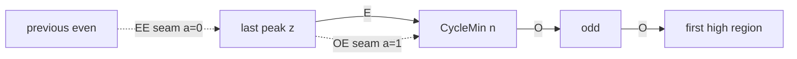

# Itinerary structure: termination, cycles, and escape

Status: laboratory extract. Date: 2 September 2026.

This gathers the **proved word-level facts** about Juggler
itineraries across Lemma 1.1's three fates — some iterate equals
\(1\); the trajectory is eventually periodic through a nontrivial
cycle; the trajectory is unbounded — into one reading path. It is
**not a halt theorem**, not a "no cycle of any length" claim, not
a divergent-orbit existence claim, not a density of starts that
reach \(1\), not a length-11 census, not a floor raise, **not a
second manuscript**, and not a Paper A or Paper B edit.

Paper A prints cycle geometry as §3 of
[juggler_finite_dynamics_note.md](juggler_finite_dynamics_note.md).
Paper B prints certified-descent densities as Corollaries 4.9
and 6.4 of
[juggler_parity_discrepancy_note.md](juggler_parity_discrepancy_note.md).
Flights already have
[juggler_flight_note.md](juggler_flight_note.md). This extract is
the **itinerary atlas**: what a realized \(O/E\) word is forced
to look like on each fate, plus the shared envelope and cells.
Finance leftovers, walk-charge DK kills, and Paper B's kernel
estimates stay in their own notes.

Cycle dossiers (program order):
[extrema](../problems/juggler_cycle_extrema.md),
[even-count \(\le 3\)](../problems/juggler_even_count_three.md),
[two-even](../problems/juggler_uniform_two_even.md),
[first-E](../problems/juggler_first_e_transport.md),
[bunched](../problems/juggler_bunched_last_cluster.md),
[gapped](../problems/juggler_gapped_cycle_word.md),
[prefix two-even](../problems/juggler_prefix_two_even.md),
[prefix bunched](../problems/juggler_prefix_bunched.md),
[last cluster](../problems/juggler_cyclemin_obstruction.md),
[entry corridor](../problems/juggler_cycle_entry_corridor.md),
[cyclic seam](../problems/juggler_cycle_cyclic_seam.md),
[\(O^7\mathrm{EEEE}\)](../problems/juggler_o7eeee_gap.md),
[\(O^6\mathrm{EEEOE}\)](../problems/juggler_o6eeeoe_gap.md),
[(1,3) EEE](../problems/juggler_one_three_eee_gap.md),
[fudge](../problems/juggler_cyclemin_fudge.md),
[tails](../problems/juggler_cyclemin_tails.md).
Termination:
[progress coverage](../problems/juggler_progress_coverage.md),
[capture certificates](../problems/juggler_capture_certificates.md),
[power composition](../problems/juggler_power_composition.md).
Escape: the five flight dossiers named in
[juggler_flight_note.md](juggler_flight_note.md).
Lean names:
[juggler_finite_dynamics_formalization.md](juggler_finite_dynamics_formalization.md).

## The bar

Print a structural fact about a *word* if it is already tagged
and is not a period table, a kernel estimate, or a density of
`ReachesOne`.

| Prints | Ledger | Fate |
|---|---|---|
| Three fates | Paper A Lemma 1.1 | shared |
| Envelope and contraction | `J-power-envelope-contraction`, `J-itinerary-semantics` | shared |
| One-step cells | `J-inverse-preimage-asymmetry` | shared |
| Hug word / prefix-odd domination | `J-cyclemin-walk-word-identity`, `cycleMin_prefix_odds_ge_hug`, `aboveAnchor_prefix_odds_ge_hug` | shared / cycle / escape |
| `FiniteProgress` boundary | `J-finite-progress-boundary`, `J-automatic-descent-density` | terminate |
| Four- and five-step descent classes | `J-four-step-descent-density`, `J-five-step-descent-density` | terminate |
| Equidistribution \(\Rightarrow\) density-one certificates | `J-equidistribution-implies-density-one` | terminate (implication) |
| Capture / even tower | capture lemmas in `Progress.lean` / `FloorPower.lean` | terminate |
| CycleMin geometry | `J-cycle-finite-structure`, `J-first-even-overshoots`, `J-cyclemax-succ-sq` | cycle |
| Seams and last odd-run | `J-cyclemin-last-odd-run` | cycle |
| Even-count \(\ge 4\) and leftover families | `J-even-count-le-three`, `J-two-even-leftover-*`, `J-three-even-*`, `J-gapped-cycle-itinerary-*` | cycle |
| Prefix transport and last-cluster split | `J-cyclemin-prefix-*`, `J-cyclemin-last-cluster` | cycle |
| Named four-even leftovers | `J-o7eeee-gap`, `J-o6eeeoe-gap`, `J-one-three-eee-gap`, `J-cyclemin-fudge`, `J-cyclemin-slack` | cycle |
| Flight envelope, height, dichotomy | `J-flight-envelope-transport`, `J-flight-height-law`, `J-flight-walk-divergence` | escape |
| Divergent structure and return lattice | `J-flight-divergent-structure`, `J-flight-return-quantization` | escape |

Do not reprint: finance leftover tables, Eliahou packaging, the
survivor lattice, walk-charge DK/window kills, Paper B kernel
proofs, densities \(57/64\) and \(29/32\) (**CONJECTURE**),
landing-\(\theta\) as a predictor, or a halt theorem.

---

## 0. Shared layer

**Three fates (Paper A Lemma 1.1).** The trajectory of \(n\) does
exactly one of: some iterate equals \(1\); some iterate \(m\ge 2\)
returns and the orbit is eventually periodic through a cycle
containing \(m\); the trajectory is unbounded. A bounded infinite
trajectory is eventually periodic. The lemma lists the only
logical possibilities. It does not say which fate occurs.

**Encoding (`J-itinerary-semantics`).** Lean: `List Branch` with
`follows` / `image` (`Itinerary.lean`). Python: ASCII `"O"` /
`"E"`. A start *realizes* \(w\) iff the trajectory matches those
parities. Images compose under concatenation
(`J-fixed-itinerary-image-monotone`: same word, larger start,
image is at least as large). `CycleItinerary n w` is a realized
return; `CycleMin n w` adds that the start is a minimum; every
cycle has a `CycleMin` rotation (`exists_cycleMin`).
`AboveAnchor n w` is a realized prefix that stays \(\ge n\).
`FiniteProgress n` is a realized block with image \(<n\) or
image \(=1\). `Capture` is a block into the basin \(\{1\}\).

**Power envelope (`J-power-envelope-contraction`).** Every
realized finite word obeys
\[
J^{|w|}(n)^{2^{|w|}}\le n^{3^{\#O(w)}}.
\]
If \(n\ge 2\) and \(3^{\#O(w)}<2^{|w|}\), then \(J^{|w|}(n)<n\):
a formally contracting prefix is a descent certificate
(`power_bound_word`, `FiniteProgress` of an exponent gap). The
ideal exponent of a length-\(k\) word with \(o\) odds is
\(3^o/2^k\). A mixed realized word has positive defect
\(\Delta_w(n)>0\) (Paper A Theorems 2.4–2.6); that is why a
mixed cycle must be formally expanding.

**One-step cells (`J-inverse-preimage-asymmetry`, Lemma 3.1).**
Even fiber: parity-restricted square interval
\(m^2\le n<(m+1)^2\). Odd fiber: at most one integer in
\(m^2\le n^3<(m+1)^2\). First-even freeze: on a realized
\(Ev\), the block output is constant on \([q^2,(q+1)^2)\) and
equals \(T_v(q)\). Next-square: \(q\ge 5\) on \(\mathtt{OO}\)
and \(q\ge 3\) on \(\mathtt{OOO}\) overshoots \((q+1)^2\).
\(\mathtt{EOO}\) contracts iff \(n>\mathrm{eooPreimageOutput}\,q\),
hence exactly on \(\{2,12,14\}\) (descent, not capture).

**Hug word (`J-cyclemin-walk-word-identity`).** The exact hug
rule: the letter at position \(k\) after \(a\) odds is even iff
\(2^{k+1}\le 3^a\). Then \(\mathrm{hugOdds}(k)\) is the least
odd budget with \(u_k=a\log_2 3-k\ge 0\), and is prefix-minimal
among admissible exponent walks. On `CycleMin` and on
`AboveAnchor`, every prefix has at least that many odds
(`cycleMin_prefix_odds_ge_hug`,
`aboveAnchor_prefix_odds_ge_hug`). The *charge* of that
itinerary is a different extract.

---

## 1. Termination to 1

A start *reaches* \(1\) if some iterate equals \(1\). A
*descent certificate* is a realized word with image \(<n\). A
*capture* is a realized word with image \(1\). Capture composes
through an arbitrary prefix (`capture_append`). Universal
`FiniteProgress` for starts above \(1\) would imply universal
`ReachesOne` (`J-finite-progress-boundary`). That implication
is not a halt theorem: `FiniteProgress` is not proved for every
start.

**Automatic short certificates (`J-finite-progress-boundary`,
`J-automatic-descent-density`).** Every even start \(n\ge 2\)
realizes \(E\) and descends (\(J(n)<n\)). Every odd start whose
first image is even realizes \(\mathtt{OE}\) and descends
(`floorPower_odd_even_two_step_lt`). Any start without
`FiniteProgress` is therefore odd-to-odd. Those two classes have
natural density \(3/4\) (odd-to-odd density \(1/4\); ambient
odd-input discrepancy \(\lvert S_O(N)\rvert\ll N^{5/6}\)).

**Four-step class (`J-four-step-descent-density`, Paper B
Corollary 4.9).** The disjoint prefixes
\[
E,\qquad OE,\qquad OOEE
\]
are certified descents (\(3^2<2^4\) for \(\mathtt{OOEE}\)). The
class has density \(13/16\). No other depth-\(\le 4\) word is
used; \(OOO*\) does not contract at length 4.

**Five-step class (`J-five-step-descent-density`, Paper B
Corollary 6.4).** The two length-five contractors
\(\mathtt{OOOEE}\) and \(\mathtt{OOEOE}\) (\(3^3<2^5\)) raise
the certified class to density \(7/8\):
\[
E,\qquad OE,\qquad OOEE,\qquad OOOEE,\qquad OOEOE.
\]
The leftover eighth is the expanding length-five tree
\[
OOEOO\cup OOOEO\cup OOOO*.
\]
The first two of those words are counted and do not contract;
\(OOOO*\) is the level-3 kernel (Paper B's remaining object,
not a Juggler word-census). Densities \(57/64\) and \(29/32\)
(length 7 / 8) remain **CONJECTURE**. They do not print here.

**Equidistribution implication (`J-equidistribution-implies-density-one`,
Paper B Proposition 7.1 / Paper A Proposition 6.1).** If every
length-\(d\) class has count \(2^{-d}N+E_d(N)\), the starts with
no contracting prefix of length \(\le d\) number at most
\((N_d/2^d)N+N_d E_d(N)\), where \(N_d\) is the exact number of
length-\(d\) words with no contracting prefix; the closed form
\(N_d\le 2^de^{-cd}\) with \(c=2(\log 2/\log 3-1/2)^2>0.0342\) is
Hoeffding on the endpoint alone and is lossy by a factor \(6.7\) at
\(d=5\), rising as \(d^{3/2}\).
All-depth equidistribution with power savings would give
density-one finite descent certificates. The implication is
proved; the hypothesis is proved for every word of length
\(\le 4\) and open beyond. Rate-free / biased-split weakenings
are recorded (`J-rate-free-density-one`); the remaining input
is external (`juggler_tower_rate_free_equidistribution`). Not a
density-one claim and not a halt theorem.

**Named capture families (`Capture` / `even_tower_to_one`).**
The even tower \(2^{2^{k-1}}\) reaches \(1\). Changing-family
collapses \(E^kO^{3k}\), \(\mathtt{OEEE}\), and the nested
\(q=2500\) even collapse are captures into \(\{1\}\). First-even
cell capture: \(T_v(q)=1\) on the square-root cell. A
hypothetical *minimal* \(n\) that never reaches \(1\) admits
neither a descent block nor a capture block
(`minimal_avoids_progress`). Even prefixes at \(n\ge 2\) are
already descent; landing at \(2,4,6,8\) is fatal for that
minimal start. This is obstruction vocabulary, not totality.

---

## 2. CycleMin geometry — **EXACT — LEAN VERIFIED**

Paper A Theorem 3.2 (`J-cycle-finite-structure`). Let \(w\) be a
cycle itinerary at \(n\ge 2\), of length \(L\) with \(o\) odd
letters.

(i) Formally expanding: \(2^L<3^o\). A contracting itinerary
cannot close a nontrivial cycle
(`cycle_itinerary_formally_expanding`).

(ii) The cycle minimum is odd and the cycle maximum \(M\) is
even. A minimum-based orientation cannot end in an odd letter
(`cycleMin_not_end_odd`). It cannot begin with \(E\) or
\(\mathtt{OE}\); the first two letters are \(\mathtt{OO}\)
(`cycleMin_starts_two_odds`).

(iii) A realized prefix that reaches a state at least \(n^2\) is
*superquadratic*: \(3^{\#O(v)}\ge 2^{|v|+1}\). On a cycle
minimum the path to any later even state is superquadratic. The
prefix \(\mathtt{OOE}\) is expanding (\(9>8\)) but not
superquadratic (\(9<16\)).

First-even overshoot (`J-first-even-overshoots`): the first even
residual sits at or above \((n+1)^2\). Hence \(M\ge(n+1)^2\)
(`J-cyclemax-succ-sq`); first-cell maxima are impossible, and
\(T(M)>n\).

Last-even cell (Lemma 3.4(iv)): if the itinerary ends in \(E\),
\[
n^2+1\le z<(n+1)^2,\qquad z\text{ even}
\]
(`cycle_last_even_interval`, `cycle_last_even_ne_odd_sq`). If it
ends with \(r\ge 1\) even letters, the state before that run is
strictly less than \((n+1)^{2^r}\) (`J-cycle-trailing-evens`).

Distinguished extrema order: write \(m\) for a minimum, \(M\)
for a maximum, \(x\) for the odd predecessor of \(M\), and \(p\)
for the odd landing after the top even run. Then
\(m\le p<x<M\). Direct return \(x=p\) is excluded
(`cycle_distinguished_order_succ_sq`).

Hug prefix-odd domination is §0 applied to `CycleMin`.

## 3. Seam — what touches the minimum

The **word cut** at CycleMin is not the isolated-square
junction.

Return through \(O\) is impossible. Launch is \(\mathtt{OO}\).
Every CycleMin word ends \(O^aE\) with \(a\le 1\)
(`J-cyclemin-last-odd-run`). The \(2{+}2\) window has exactly
two legal types (`cycleMin_has_two_seams`)
([juggler_cycle_cyclic_seam.md](../problems/juggler_cycle_cyclic_seam.md),
[juggler_cycle_entry_corridor.md](../problems/juggler_cycle_entry_corridor.md)):

- \(\mathtt{OE}\mid n\mid\mathtt{OO}\) — isolated last \(E\)
  (\(a=1\)). Last peak in \((n^2,(n+1)^2)\); last valley in
  the odd cell of scale \(n^{4/3}\).
- \(\mathtt{EE}\mid n\mid\mathtt{OO}\) — trailing even run
  \(r\ge 2\) (\(a=0\)). Same last-even cell; previous even of
  scale \(n^4\); count \(n(n^2+n+1)\).

Forced isolated-\(\mathtt{OE}\) is **REFUTED**
(`isolated_OE_not_forced_on_shape` at the word-shape level). Both types are
occupied (**COMPUTATIONALLY VERIFIED** at \(n=10^6+1\): \(33\)
CycleMin-legal \(\mathtt{OE}\) entries). The \(3{+}3\) window
only lengthens those two families.

Square seam \(s^2\to s^3\) / \(k^2\to k\) is zero-defect cell
language (`REPARAMETERIZATION`; **CLOSE**).

## 4. Canonical run form and valleys

Paper A Lemma 3.21b. After rotation to a minimum,
\[
w=O^{a_1}EO^{a_2}E\cdots O^{a_e}E,\qquad a_1\ge 2,
\]
with unused runs empty when \(e\le 3\). The combinatorial
splitting, \(a_1\ge 2\), and \(a_e\le 1\) are Lean
(`cycleMin_has_full_odd_even_run_form`); the leftover use of
that form for \(e\le 3\) stays the Paper A argument. The bead
schema is a projection of this run list, not a characterization. Valleys \(v_i\) are
cyclic even-to-odd landings; peaks \(p_i\) are the even states
just before each final \(E\):
\[
v_0=n,\qquad
p_i=J^{a_{i+1}}(v_i),\qquad
v_{i+1}=\lfloor\sqrt{p_i}\rfloor.
\]
Peak count equals circuit count \(m\) (`KNOWN` \(p\equiv m\)).

*Cycle entry* is the CycleMin cut. *Dynamical entry* is the last
even step into \(n\). The first peak overshoots the last-even
cell; the last peak lands in it. Block \(O^aE\) has ideal
exponent \(\mu(a)=3^a/2^{a+1}\): \(\mathtt{OE}\) contracts,
\(\mathtt{OOE}\) expands. Lemma 3.4(v) forbids \(O^aE\) as a
*cycle itinerary* for \(a\ge 3\); it does not forbid that shape
as an internal block.

Unique visit on leftover lengths: a proper prefix return would
be a shorter cycle. On a leftover length, \(n\) occurs once per
period, so for \(m\ge 2\) every other valley is a different odd
\(\ge n+2\) (`REPARAMETERIZATION` of prefix return).
Equal-valleys / \(n+2\) as a leftover-killer is **REFUTED**.
Run-type finance *prices* \(\mathtt{OOE}\)-scale versus
\(\mathtt{OE}\)-scale valleys; it is not a uniqueness theorem
for the word.

## 5. Four evens — the even-count wall

Paper A Theorem 3.22 / Corollary 3.23
(`J-even-count-le-three`):

> No itinerary with fewer than four even letters is a cycle
> itinerary at any \(n\ge 2\). Equivalently, a nontrivial
> cycle itinerary has at least four even letters, hence period
> at least eleven.

Lean: `no_cycle_itinerary_even_count_le_three`,
`cycle_itinerary_length_ge_eleven`. The comparison
\(2^L<3^{L-4}\) first holds at \(L=11\). Floor-free; superseded
as a *period* bound by finance.

| \(e\) | remaining forms | elimination |
|---:|---|---|
| \(0\) | all-odd | cannot return |
| \(1\) | \(O^aE\) | next-square; \(\mathtt{OOE}\) excluded |
| \(2\) | \(O^{k-2}EE\), \(O^{k-3}EOE\); last run \(\ge 2\) | Theorem 3.12; bootstrap |
| \(3\) | seven bunched tails; gapped \(O^aEO^bEE\) / \(EOE\) | Theorems 3.14–3.21 |
| \(\ge 4\) | not killed by even-count | last-cluster split; finance bounds *period* |

Bunched tails after \(O^a\): \(\mathrm{EEE}\), \(\mathrm{EOEE}\),
\(\mathrm{EOOEE}\), \(\mathrm{EOOOEE}\), \(\mathrm{EEOE}\),
\(\mathrm{EOEOE}\), \(\mathrm{EOOEOE}\). Gapped leftovers are
Theorem 3.13 on `CycleMin` and Theorem 3.21 as
`CycleItinerary`.

Prefix transport (`J-cyclemin-prefix-two-even-*`,
`J-cyclemin-prefix-bunched-*`): the same leftover tails remain
impossible after an arbitrary prefix \(u\) with
\(y=T_u(n)\ge n\). Not a `CycleItinerary` theorem at a
non-minimum start.

Last-cluster split for \(e\ge 4\) (`J-cyclemin-last-cluster`,
**EXACT — HUMAN PROOF**): last gap in \(\{0,1\}\) or bootstrap;
then the last two-even suffix is an excluded leftover, or the
last three-even suffix is bunched, or the last cluster is one
of the seven bunched-short pairs
\[
(b,c)\in\{(0,0),(1,0),(2,0),(3,0),(0,1),(1,1),(2,1)\}.
\]
The residual family is that bunched-short last cluster. There
is no `no_cycleMin_four_even`.

Primary Lean: `CycleCore.lean`, `EvenCountThree.lean`,
`LeftoverFamilies.lean`, `PrefixTwoEven.lean`,
`PrefixBunched.lean`, `CycleMinFudge.lean`, `O7EEEEGap.lean`,
`CycleExtrema.lean`, `CycleMinObstruction.lean`.

## 6. Laboratory four-even leftovers

Named-word theorems, not a length-11 census.

- \(O^7\mathrm{EEEE}\) is not a cycle itinerary
  (`J-o7eeee-gap`; \(T^7(n)\ge(n+1)^{16}\)).
- \(O^6\mathrm{EEEOE}\) is not a cycle itinerary
  (`J-o6eeeoe-gap`).
- The five leftovers \(O^aEO^{7-a}\mathrm{EEE}\) die as
  `CycleMin` (`J-one-three-eee-gap`).
- The thirty first-expanding short-gap leftovers in
  `fudgeParams` are not `CycleMin` words (`J-cyclemin-fudge`).
  Slack identically \(139=3^7-2^{11}\). The eight unique-rotation
  leftovers among them are not cycle itineraries.
- On every start-\(O\) four-even word with \(o\ge 7\), slack is
  \(3^o-2^{o+4}\) (`J-cyclemin-slack`). The 367 tails through
  \(a_0=16\) are **COMPUTATIONALLY VERIFIED**
  (`J-cyclemin-tails`).

Closed / parked: first-E at \(e=4\) is `REPARAMETERIZATION`;
\(Z_4\) is **PARK**; necklace slack is **REFUTED**
(`J-cyclemin-necklace`). The pin misses
\(\mathtt{OOEEEOOOOOE}=(2,0,0,5)\) and
\(\mathtt{OOOEEEOOOOE}=(3,0,0,4)\) are outside `CycleMinShape`
(`necklace_pin_misses_not_CycleMinShape`). There is no
`no_cycleMin_four_even`.

---

## 7. Infinite escape

A *descent-free flight* is an infinite orbit \(x_0=n\ge 2\) with
\(x_k\ge n\) for all \(k\). Every finite prefix is
`AboveAnchor`. Details and proofs live in
[juggler_flight_note.md](juggler_flight_note.md); this section
prints only the *word* constraints.

**Hug domination on every descent-free prefix
(`J-above-anchor-hug-domination`).** Same inequality as §0:
\(a_k\ge\mathrm{hugOdds}(k)\) and \(u_k\ge 0\). The two-sided
transport (`J-flight-envelope-transport`) says the parity word
determines \(\log x_k\) up to a \(1/n\) error. If the walk has
height \(B\) doublings, heights are doubly exponential in \(B\)
(`J-flight-height-law`).

**Walk-divergence (`J-flight-walk-divergence`).** Every
descent-free flight has unbounded exponent walk
\(\sup_k u_k=\infty\). In particular no flight stays in the hug
band \(0\le u_k^{\mathrm{hug}}<\log_2 3\). A bounded walk plus
determinism pigeonholes a cycle; a cycle is strictly expanding,
so each traversal adds \(\delta=\log_2(3^o/2^p)>0\) — contradiction.
The hug-hugging adversary of Paper A §5 is therefore
**cycle-exclusive**.

**Dichotomy at the certified floor \(N_0=162849448\).** A
descent-free flight from above \(N_0\) is exactly one of:
(1) finite injective preperiod, then a nontrivial cycle with
minimum \(>N_0\) and period \(\ge 478245\); or (2) an infinite
injective trajectory with all states distinct and
\(x_k\to\infty\). Anchor-period instance
(`J-flight-anchor-period`): a *bounded-walk* flight from
\(n\ge 3.5\cdot 10^8\) enters a cycle of period \(\ge 780239\).
Conditional; not a new floor.

**Divergent structure (`J-flight-divergent-structure`).** A
non-eventually-periodic descent-free flight has: all states
distinct, \(n\) the global minimum, \(x_k\to\infty\); linear
peak growth; hug excess \(a_k-\mathrm{hugOdds}(k)\to\infty\);
*recurrent hug domination* at cofinal record (tail-minimum)
indices. Exclusion of divergent orbits is not claimed.

**Shared lattice (`J-flight-return-quantization`).** Record
jumps occupy the \(\log_2 3\) lattice. The shortest near-return
is \(19\) (\(\theta_{19}=12\log_2 3-19=0.01955\)); as
\(\varepsilon\downarrow 0\) the spectrum passes through the
cycle survivors \(84\) and \(1054\). Cycles and flights share
one Diophantine skeleton. Hug circuits through the first
survivors are only \(\mathtt{OE}/\mathtt{OOE}\). Census mirror:
realized near-returns on orbits \(n\le 2000\) land on
\(\{19,38\}\).

Hug-cylinder *construction* stays **PARK**
(`J-hug-flow-window-depth-one`). Interval-ET depth \(2\) is
**CLOSE** (`J-hug-flow-image-gap`): the image is
\(3\sqrt X\)-separated. Odd towers
\(\mathcal T_\infty=\{x:F^j(x)\text{ odd for all }j\}\) are not
an itinerary-exclusion law (`ODD_LANDING_SETS_ARE_FORWARD_ORBITS`).
Valley-composition *exclusion* is **CLOSE** (occupancy is the
existing pigeonhole).

---

## 8. What does not meet the bar

Project-wide list, including BT-core and Paper B walls:
[negative_knowledge.md](../negative_knowledge.md).

- **Square seam, cyclic-seam leftover-killer, entry-corridor
  thin \(\mathcal B_n\), seam ancestry, first collision.**
  Cells plus Collision Factorization (first meeting iff the
  parent is off-cycle). Forced isolated-\(\mathtt{OE}\) is
  **REFUTED**.
- **Equal valleys, second valley, ceiling finance, peak count**
  as leftover-killers — **REFUTED** or `REPARAMETERIZATION`.
- **First-E at \(e=4\)** — `REPARAMETERIZATION`; \(Z_4\) **PARK**;
  necklace slack **REFUTED**.
- **Local attacks** (word-order, error-transport, mechanical
  lift). Collision Factorization or \(T^L(t)=c\ge n\). See
  [AGENTS.md](../../AGENTS.md).
- **Finance leftover tables, walk-charge envelope, Paper B
  kernels.** Already extracted. Hug *prefix-odd* domination
  prints in §0; the rest does not.
- **Length-7/8 descent densities \(57/64\), \(29/32\).**
  **CONJECTURE**. Leftover eighth \(OOOO*\) is the external
  two-monomial / exponent-pair problem, not a Juggler word
  family.
- **Landing-\(\theta\), iterated odd-landing sets, cube-not-square
  as a cycle-word family, word atlas as a prohibition.** Adjacent
  or closed; they do not add a new fate-wise word law.
- **Post-\(L\) escape corridor cluster.** Local envelope ladder,
  not new itinerary families.

---

## Endpoint

**Termination.** A start that is not odd-to-odd already carries
\(E\) or \(\mathtt{OE}\). Four-step certificates add
\(\mathtt{OOEE}\); five-step add \(\mathtt{OOOEE}\) and
\(\mathtt{OOEOE}\). The leftover expanding tree is
\(OOEOO\cup OOOEO\cup OOOO*\). Named even-tower and
changing-family blocks are captures into \(1\). A minimal
non-terminator avoids every such block. Density-one finite
descent is an implication from equidistribution, not a theorem
about reaching \(1\).

**Cycles.** A leftover cycle, written at its minimum \(n\), is
\[
w=O^{a_1}EO^{a_2}E\cdots O^{a_e}E
\]
with \(e\ge 4\), \(a_1\ge 2\), last odd-run \(a_e\le 1\), first
peak \(\ge(n+1)^2\), last peak in the even cell of \(n\), seam
one of the two \(2{+}2\) types, other valleys \(\ne n\) on
leftover lengths, and every prefix hug-admissible. The last
cluster is bootstrap, an excluded two-even or bunched tail, or
a bunched-short pair. What is **not** proved:
minimum geometry \(+\) necklace \(+\) entry cell
\(\Rightarrow\bot\). That is finance / walk-charge /
Diophantine.

**Escape.** A descent-free prefix is hug-admissible. An infinite
descent-free orbit cannot hug-hug; it either closes onto a
cycle above the floor or diverges with recurrent hug
domination and \(\log_2 3\)-quantized record jumps (shortest
\(19\)). Exclusion of divergent orbits is not claimed.

Not a halt theorem. The unconditional laboratory period bound
stays \(478245\) at \(N_0=162849448\). Certified descent
density stays \(7/8\).
