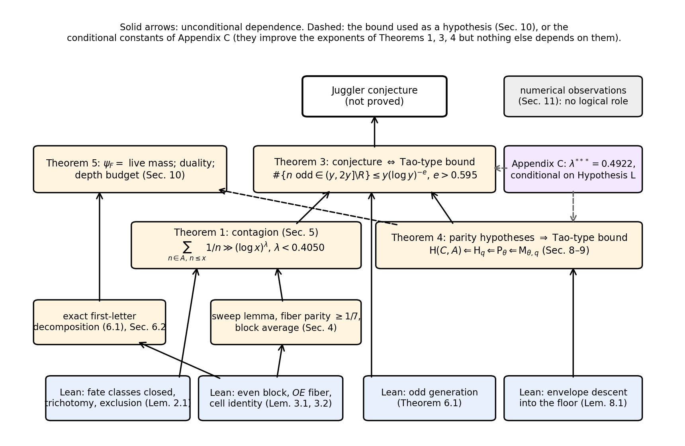

## Abstract

The Juggler map is the integer map
\[
J(n)=
\begin{cases}
\lfloor\sqrt n\rfloor,&n\ \text{even},\\
\lfloor n^{3/2}\rfloor,&n\ \text{odd}.
\end{cases}
\]
Every orbit has exactly one of three fates: it reaches \(1\), it
enters a nontrivial cycle, or it is unbounded. It is conjectured that
the first fate is the only one. This paper does not prove that
conjecture. Its main theorem is structural: every nonempty set \(A\)
of positive integers that is closed under taking preimages
(\(J(n)\in A\Rightarrow n\in A\)) — in particular every fate class
that occurs at all — satisfies
\(\sum_{n\in A,\,n\le x}1/n\ge c\,(\log x)^{\lambda}\) for every
\(\lambda<\lambda^{**}=0.4050\ldots\), whereas
\(\sum_{n\le x}1/n\sim\log x\). Fates are contagious. The mechanism is
that the one-step preimages of the Juggler map are large and
structured: the even preimages of \(m\) fill the interval
\([m^2,(m+1)^2)\), and the two-step preimages through an even middle
state fill a positive proportion of the fiber
\(\lfloor n^{3/4}\rfloor=m\), on which the parity of
\(\lfloor n^{3/2}\rfloor\) sweeps. The proof is elementary at this
depth; it needs positive proportions on fibers, not equidistribution.

Three consequences follow. First, a failure set is generated by its
odd members, which are the odd preimages of a sparse set of odd
images (odd generation). Second, the Juggler conjecture is equivalent
to a Tao-type almost-all statement with a *bounded* target and a
logarithmic rate: every positive integer reaches \(1\) if and only if
all but \(O(y(\log y)^{-e})\) odd starts in \((y,2y]\) enter the
certified interval \([1,N_0]\), for some \(e>1-\lambda^{**}\). For the
Collatz map no such equivalence is available, because the known
lower bounds for Collatz preimage trees are of polynomial size, which
a logarithmic error rate cannot see. Third, that almost-all statement
follows from parity control on itinerary cylinders of depth
\(C\log_2\log y\), in a hierarchy of forms whose weakest is a single
exponential moment of the odd count on live starts; we determine what
that weakest form does and does not need, show that no bounded-depth
cylinder statement implies it, and quantify the depth uniformity an
analytic cylinder bound would have to have. An exact first-letter
decomposition of the failure set has a single free term, and that
term is the infinite-depth live mass controlled by the same
hypothesis: the termination problem has one frontier statement. The
exact combinatorial layer is formalized in Lean 4; the counting is a
human proof; numerical experiments are reported as observations only.
No fate is excluded.

## 1. Introduction

The Juggler sequence was introduced by Pickover [1] and is
sequence A094683 of the OEIS [2]. Starting from any positive integer,
the orbit under \(J\) appears always to reach \(1\); this has been
verified for all starts up to \(3.5\cdot 10^8\) [11]. The map belongs
to the family of floor-power maps, and its dynamics resembles the
\(3x+1\) problem [3, 4] in one respect and differs from it in another.
The resemblance: a parity decides whether the orbit goes up or down,
and the heuristic model of the orbit is a random walk with negative
drift, here on the scale \(\log\log n\) with steps \(+\log_2 3-1\)
(odd) and \(-1\) (even). The difference: the Juggler map moves by
*powers*, so a single contracting certificate sends \(n\) to
\(n^{e}\) with \(e<1\), and the one-step preimages of an integer are
not a residue class but an interval.

This paper is about the second feature and what it forces. The
narrative has four steps.

*Contagion.* Let \(R\) be the set of starts that reach \(1\), \(F\)
its complement, \(B(C)\) the basin of a nontrivial cycle \(C\), and
\(D\) the set of divergent starts. Each is *backward-closed*: if
\(J(n)\) belongs to it, so does \(n\). Theorem 1 proves that every
nonempty backward-closed set is large in logarithmic density, with an
explicit exponent, by a downward recursion over two exact
productions. Applied to the fate classes: if a single start fails to
reach \(1\), the failures have logarithmic count \(\gg(\log x)^{0.40}\)
and, on infinitely many dyadic blocks, natural density
\(\gg(\log y)^{-0.6}\). This excludes no fate; it fixes the
quantitative shape of the trichotomy.

*Odd generation.* A set that is closed both forwards and backwards
and avoids \(1\) is the \(E\)-forest (iterated even preimages) over
its odd members, and its odd members are the odd preimages of its
intersection with the sparse set \(S=\{\lfloor m^{3/2}\rfloor:\ m\
\text{odd}\}\) (Theorem 2). An arbitrary failure set is thereby
replaced by sparse odd-image seeds together with deterministic even
ancestry. This is the geometry that the later sections use.

*The almost-all equivalence.* Tao [6] proved that almost all Collatz
orbits (in logarithmic density) attain almost bounded values, with a
target \(f(N)\to\infty\) arbitrarily slowly. For the Juggler map,
contagion and odd generation together turn a bounded-target statement
into the conjecture: every positive integer reaches \(1\) if and only
if all but \(O(y(\log y)^{-e})\) odd starts in \((y,2y]\) enter
\([1,N_0]\), for some \(e>1-\lambda^{**}=0.595\) (Theorem 3). The
threshold is the complement of the contagion exponent. For Collatz
the analogous implication is not available: the known lower bound for
a preimage tree below \(x\) is of polynomial size, \(x^{0.84}\)
(Krasikov--Lagarias [7]), and a set of that size is invisible to a
logarithmic error rate.

*The frontier.* What does the almost-all statement itself need?
Because descent is by powers, the exponent walk of an itinerary has
to travel only \(L(y)=\log_2(\log 2y/\log N_0)\) units to bring a
start of size \(y\) below \(N_0\), and a Chernoff count of the
itineraries whose walk fails to do so within \(C\,L(y)\) steps gives
the rate, provided the itinerary cylinders of that depth are not
over-populated (Theorem 4). The depth is \(O(\log\log y)\), where
cylinders are large; for the Collatz map the corresponding depth is
\(\Theta(\log y)\), where they have single elements. The hypothesis
has a hierarchy of forms; the weakest is one exponential moment of
the odd count on the starts still above the floor, or equivalently a
no-momentum statement: odd-heavy prefixes do not bias the next parity
toward odd, on average over depths. This form is insensitive to any
\(o(\log\log y)\) initial depths and to the all-odd tower cylinders,
no bounded-depth cylinder statement implies it, and an analytic
cylinder bound can feed it only if its saving exponent decays slower
than \(2^{-d/C}\) in the depth \(d\). Finally, an exact first-letter
decomposition of the failure set has a single free term, and that
term is the infinite-depth live mass of the \(OO\) cylinder — the same
quantity (Theorem 5). The termination problem therefore has one
frontier statement, stated in Section 12.

### 1.1 Main results

Write \(\ell_A(u,v]=\sum_{n\in A,\,u<n\le v}1/n\). Throughout,
\(N_0\) is any integer with \([1,N_0]\subseteq R\) (the Lean-verified
value is \(260\); the certified computational value is
\(3.5\cdot 10^8\) [11]).

**Theorem 1 (fate contagion).** Let \(A\subseteq\mathbb N\) be nonempty
and backward-closed, and let \(\lambda<\lambda^{**}=0.4050\ldots\), the
root of \(2^{-\lambda}+\tfrac5{21}(\tfrac38)^{\lambda}+\tfrac2{21}(\tfrac34)^{\lambda}=1\).
There are \(c>0\) and \(x_0\), depending on \(A\) and \(\lambda\), with
\[
\sum_{\substack{n\in A\\ n\le x}}\frac1n\ \ge\ c\,(\log x)^{\lambda}
\qquad(x\ge x_0).
\]
Consequently each fate class realized by at least one start — \(R\),
the basin of any existing nontrivial cycle, the divergent set —
satisfies this bound, and on infinitely many dyadic blocks has natural
density \(\gg(\log y)^{\lambda-1}\). (Theorem 5.3, Corollaries 5.4,
5.5.)

**Theorem 2 (odd generation).** Let \(A\) be forward- and
backward-closed with \(1\notin A\). Every \(n\in A\) descends by even
steps to an odd member \(m\ge 3\) of \(A\); for odd \(n\),
\(n\in A\iff\lfloor n^{3/2}\rfloor\in A\); and \(A\ne\emptyset\) iff
\(A\) contains the image \(\lfloor m^{3/2}\rfloor\) of some odd
\(m\ge 3\). In particular every positive integer reaches \(1\) iff no
odd image fails to. (Theorem 6.1; Lean.)

**Theorem 3 (the conjecture as an almost-all statement).** The
following are equivalent: (i) every positive integer reaches \(1\);
(ii) for some \(\lambda<\lambda^{**}\), the starts \(n\le x\) whose
orbit never enters \([1,N_0]\) have logarithmic count
\(o((\log x)^{\lambda})\); (iii) for some \(e>1-\lambda^{**}=0.5950\ldots\)
and all large \(y\), \(\#\{n\ \text{odd}\in(y,2y]:\ n\notin R\}\le y(\log y)^{-e}\).
(Corollary 7.1, Theorems 7.2, 7.3.)

**Theorem 4 (the frontier reduction).** Let
\(L(y)=\log_2(\log 2y/\log N_0)\), \(d(y)=\lceil CL(y)\rceil\),
\(p_C=(1-1/C)/\log_2 3\) and \(e(C)=C\,D(p_C\|\tfrac12)/\ln 2\). Each of
the following hypotheses implies (iii) of Theorem 3 with
\(e=e(C)-\varepsilon\), hence the conjecture for \(C\ge 21\)
(unconditionally; \(C\ge 19\) under the conditional Appendix C):

(a) *cylinder form* \(\mathrm H(C,A)\): no \(O\)-rooted itinerary
cylinder of depth \(d(y)\) exceeds its fair share \(2^{-(d-1)}y/2\)
among odd starts by more than \(y(\log y)^{-A}\), \(A>C+e(C)\)
(Theorem 8.3);

(b) *one-sided form* \(\mathrm H_q(C,A)\): every cylinder of depth
\(1\le t<d(y)\) sends at most a fraction \(q<\log 2/\log 3\) of its
members, plus \(y(\log y)^{-A}\), to an odd next state (Theorem 9.1;
\(C\ge 46\) at \(q=0.55\));

(c) *pressure form* \(\mathrm P_\theta(C)\):
\(\frac1N\sum_{n\ \mathrm{odd},\ \tau(n)>d}e^{\theta o_d(n)}\le(\tfrac12(1+e^{\theta}))^{d}e^{o(d)}\)
at \(\theta=\log(p_C/(1-p_C))\), where \(\tau\) is the entrance time
into \([1,N_0]\) and \(o_d\) the odd count of the first \(d\) letters;
and its *no-momentum form* \(\sum_{t<d}(s_\theta(t)-q)^+=o(d)\) for the
tilted odd share \(s_\theta\) of live starts (Theorem 9.2,
Proposition 9.3).

None of these hypotheses is proved here. Form (c) is insensitive to
any \(o(\log\log y)\) initial depths and tolerates tower cylinders
biased up to odd share \(0.836\); no cylinder statement of bounded
depth implies any of (a)--(c) (Section 9.3).

**Theorem 5 (the exact decomposition and the single frontier).** The
logarithmic density \(\varphi_A\) of a two-way closed set satisfies the
first-letter identity (6.1), whose single free term \(\psi_A\) is the
share of \(A\) among \(OO\)-type odd starts. For \(A=F\) that term is
the infinite-depth live mass of the depth-two cylinder \(OO\), and is
bounded by every hypothesis of Theorem 4 (Proposition 10.1). The two
halves of (6.1) are the contagion recursion of Theorem 1 and an upper
recursion for the failure density, with the same critical exponent
\(1-\lambda_{\rm ideal}=0.5073\) as the rate threshold of Theorem 3 up
to the fiber-constant gap; the upper recursion alone never yields
\(F=\emptyset\) (Corollary 10.2).

**Proposition (depth-uniformity budget).** A cylinder-count route to
Theorem 4(a) whose only error term at depth \(d\) is \(O(y^{1-\delta_d})\)
with \(\delta_d=\delta_02^{-cd}\) reaches the depth \(C\log_2\log y\)
iff \(cC<1\) (Proposition 10.3). Weyl differencing has \(c\ge 1\).

Under a localization of the triple parity discrepancy of nested floor
powers to sub-dyadic intervals — stated as an explicit hypothesis in
Appendix C, where its status relative to the working draft [12] is
described — the exponent of Theorem 1 improves to
\(\lambda^{***}=0.4922\ldots\), the rate threshold of Theorem 3 to
\(0.5078\), and the least depth constant of Theorem 4 to \(C\ge 19\).
Nothing in Sections 2--12 depends on Appendix C.

### 1.2 The three fates as currently constrained

The three fate classes are the three Moirai: Atropos cuts the thread
(the class \(R\)), Lachesis measures an allotted length (a cycle
basin), Clotho spins without end (divergence). What is known about
each, all from outside this paper:

- *Atropos.* Every \(n\le N_0=3.5\cdot 10^8\) reaches \(1\)
  (independently certified computation, [11, Section 5]); the
  Lean-verified floor is \(N_0=260\). Paper B [12] proves that
  \(7/8\) of all starts descend below themselves within five steps,
  with a power saving on dyadic blocks.
- *Lachesis.* A nontrivial cycle has minimum above \(3.5\cdot 10^8\)
  and period at least \(780239\) [11]; it has at least four even
  steps; its odd share is \(\log 2/\log 3\) up to \(O(\Lambda/L)\),
  the critical share at which the exponent walk has zero drift.
- *Clotho.* A divergent orbit has unbounded exponent walk; its record
  jumps are quantized to the \(\log_2 3\) lattice [11]. Nothing
  excludes it.

Theorem 1 adds one sentence to each: whichever of the three acts at
all acts on a set of logarithmic count \(\gg(\log x)^{0.40}\).

### 1.3 Related work

*Collatz parity vectors.* Terras [4] and Everett [5] showed that the
first \(k\) parities of the Collatz orbit of \(n\) are determined by
\(n\bmod 2^k\) and equidistributed exactly, and deduced that almost
all starts have finite stopping time (descend below themselves). The
analogous exact statement fails for the Juggler map: the parities of
\(\lfloor n^{3/2}\rfloor\), \(\lfloor\lfloor n^{3/2}\rfloor^{3/2}\rfloor\),
\(\dots\) are Diophantine, not algebraic, and their equidistribution
is proved only to depth four (Paper B, [12]).

*Tao's theorem.* Tao [6] proved that for any \(f(N)\to\infty\), almost
all Collatz orbits (in logarithmic density) attain a value below
\(f(N)\). The bounded-target version is not available, and the
renewal machinery through the Syracuse random variables is the heart
of the proof. Section 7.2 explains, as a structural analogy and not
as a transfer of methods, which parts of that picture change for the
Juggler map.

*Preimage trees.* Krasikov and Lagarias [7] proved that the Collatz
preimage tree of any integer has \(\ge x^{0.84}\) elements below
\(x\). The relevant point for this paper is the scale: a set of
polynomial size \(x^{0.84}\) has logarithmic count that may tend to
zero, so a bound of the form \(y(\log y)^{-e}\) on failures says
nothing about it. For the Juggler map the even preimages of \(m\) are
an interval of length \(2m+1\), and Theorem 1 gives every preimage
tree logarithmic count \(\gg(\log x)^{\lambda}\).

*Floor-power maps and exponential sums.* The parity of
\(\lfloor n^{3/2}\rfloor\) along an arithmetic progression is a
question about \(\{n^{3/2}/2\}\); Section 4 uses only an elementary
sweep argument and, on even blocks, the second-derivative test with
Vaaler's approximation [10], as for Piatetski-Shapiro sequences.
Deeper nesting is Paper B's subject.

*Companion papers.* Paper A [11] proves period lower bounds for a
hypothetical cycle from a certified descent floor (cycle financing,
walk-charge envelope); Paper B [12] proves parity equidistribution of
nested floor powers to depth four with power savings. Neither is
reproved here; both enter as citations, and one statement of the
type Paper B proves enters Appendix C as an explicit hypothesis.

### 1.4 Verification

Statements carry one of four roles. *Lean*: the exact combinatorial
layer is formalized in Lean 4 (`formal/Problems/Juggler/FateContagion.lean`,
no `sorry`; names in Appendix A). *Human proof*: the analytic and
probabilistic counting. *Verified computation*: exact integer
computations (the descent floor is Paper A's; the closure of
\([1,260]\) under the two productions up to \(10^9\) is computed
here). *Observation*: numerical experiments that check hypotheses and
constants; they prove nothing and are labelled wherever they appear.

| Result | Status |
|---|---|
| Fate classes closed; trichotomy; exclusion (Lemma 2.1) | Lean |
| Even block is an interval (Lemma 3.1) | Lean |
| \(OE\) fiber is an interval; cell identity (Lemma 3.2) | Lean |
| Odd generation (Theorem 6.1) | Lean |
| Envelope descent into the floor (Lemma 8.1) | Lean, on Paper A's power envelope |
| Sweep lemma, fiber parity, thin fibers (Lemmas 4.1--4.3) | human proof |
| Block average (Proposition 4.4) | human proof |
| Recursion lemma and contagion (Lemma 5.1, Theorem 5.3) | human proof |
| First-letter identity (6.1) | human proof (exact combinatorics) |
| Almost-all equivalence (Theorems 7.2, 7.3) | human proof |
| Chernoff, Azuma, exponential-moment arguments (Sections 8--10) | human proof |
| Localized triple discrepancy (Appendix C) | hypothesis, conditional |
| Numerical experiments (Section 11) | observation |

{ width=88% }

## 2. Fate classes and closure

\(\mathbb N=\{1,2,\dots\}\). For \(A\subseteq\mathbb N\) and
\(0\le u<v\) write
\[
\ell_A(u,v]=\sum_{\substack{n\in A\\ u<n\le v}}\frac1n,\qquad
g_A(t)=\ell_A\bigl(e^{t/2},e^{t}\bigr].
\]
For \(A=\mathbb N\), \(g(t)=t/2+O(e^{-t/2})\).

**Definition.** \(A\) is *backward-closed* if \(J(n)\in A\) implies
\(n\in A\), and *forward-closed* if \(n\in A\) implies \(J(n)\in A\).

**Lemma 2.1 (fate classes).** Let \(R=\{n:\exists k,\ J^k(n)=1\}\),
\(F=\mathbb N\setminus R\), \(B(m)=\{n:\exists k,\ J^k(n)=m\}\), and
\(D=\{n:\forall B\ \exists k,\ J^k(n)>B\}\). Each of \(R,F,B(m),D\) is
backward-closed; \(R,F,D\) are also forward-closed. Every \(n\ge 1\)
lies in \(R\), or in \(B(m)\) for some \(m\ge 2\) on a cycle, or in
\(D\), and these possibilities exclude one another.

*Proof.* Backward closure is the definition of each set (for \(D\):
\(J^k(J(n))=J^{k+1}(n)\)). Forward closure of \(R\): if \(J^k(n)=1\)
then \(J^{k-1}(J(n))=1\) for \(k\ge 1\), and \(J(1)=1\). Forward
closure of \(D\): given \(B\), pick \(k\) with \(J^k(n)>\max(B,n)\);
then \(k\ge 1\) and \(J^{k-1}(J(n))>B\). Trichotomy: a bounded orbit
repeats, a repeat is a cycle, a cycle through \(1\) is the fate
\(R\). Exclusion: an orbit that reaches \(1\) or enters a cycle is
bounded; an orbit that reaches \(1\) and passes through a cycle state
\(m\ge 2\) of period \(L\) would force \(m=J^{qL}(m)=1\). Lean:
`reachesOne_backwardClosed`, `not_reachesOne_backwardClosed`,
`ancestor_backwardClosed`, `escapes_backwardClosed`,
`reachesOne_floorPower`, `escapes_floorPower`, `fate_trichotomy`,
`reachesOne_not_escapes`, `cycle_basin_not_escapes`,
`reachesOne_not_cycle_basin`. \(\square\)

Throughout Sections 3--5, \(A\) is a nonempty backward-closed set.
Every statement applies to each fate class realized by at least one
start.

## 3. The two productions

**Lemma 3.1 (even block).** Let \(m\in A\). Every even \(n\) with
\(m^2\le n<(m+1)^2\) lies in \(A\). Writing \(E(m)\) for this set,
\(|E(m)|\ge m\) and
\[
\frac1m\Bigl(1-\frac2m\Bigr)\ \le\ \frac{m}{(m+1)^2}\ \le\ \sum_{n\in E(m)}\frac1n\ \le\ \frac{m+1}{m^2}.
\]

*Proof.* \(J(n)=\lfloor\sqrt n\rfloor=m\) exactly on that interval, so
\(n\in A\). The interval has \(2m+1\) integers, at least \(m\) and at
most \(m+1\) of them even, each between \(m^2\) and \((m+1)^2\). Lean:
`even_block_mem`, `even_block_card`. \(\square\)

**Lemma 3.2 (\(OE\) fiber).** Let \(m\in A\) and
\[
\Phi(m)=\{n\ \text{odd}:\ m^4\le n^3<(m+1)^4\}
=\{n\ \text{odd}:\ m^{4/3}\le n<(m+1)^{4/3}\}.
\]
If \(n\in\Phi(m)\) and \(\lfloor n^{3/2}\rfloor\) is even, then
\(J(J(n))=m\), hence \(n\in A\). Moreover
\(H_m:=|\Phi(m)|\in[\tfrac23m^{1/3}-1,\ \tfrac23(m+1)^{1/3}+1]\), and
the fibers of distinct \(m\) are disjoint.

*Proof.* \(J(n)=\lfloor\sqrt{n^3}\rfloor=:k\); if \(k\) is even then
\(J(k)=\lfloor\sqrt k\rfloor\), and
\(\lfloor\sqrt{\lfloor\sqrt N\rfloor}\rfloor=m\iff m^4\le N<(m+1)^4\):
this is the exact form of the transparent nesting
\(\lfloor\sqrt{\lfloor n^{3/2}\rfloor}\rfloor=\lfloor n^{3/4}\rfloor\).
The interval \([m^{4/3},(m+1)^{4/3})\) has length between
\(\tfrac43m^{1/3}\) and \(\tfrac43(m+1)^{1/3}\) by the mean value
theorem, and a half-open interval of length \(\ell\) contains between
\(\ell/2-1\) and \(\ell/2+1\) odd integers. Disjointness is the cell
identity. Lean: `sqrt_sqrt_eq_iff`, `oe_fiber_mem`,
`floorPower_oe_fiber`, `oe_fiber_disjoint`. \(\square\)

Write \(G_m=\#\{n\in\Phi(m):\lfloor n^{3/2}\rfloor\ \text{even}\}\).
The whole argument rests on lower bounds for \(G_m\): an elementary
bound on every fiber outside a thin exceptional set (Section 4.1),
and a classical average over an even block of \(m\)'s (Section 4.2).

{ width=100% }

## 4. Parity on a fiber

### 4.1 The sweep lemma

On \(\Phi(m)\) the quantity \(x=n^{3/2}/2\) has \(\lfloor n^{3/2}\rfloor\)
even iff \(\{x\}<\tfrac12\). Consecutive odd \(n\) advance \(x\) by
\(\approx\tfrac32n^{1/2}\approx\tfrac32m^{2/3}\), and over the whole
fiber this step drifts by less than one unit of \(1/H_m\). So modulo
\(1\) the fiber is an arithmetic progression with a nearly constant
step \(\alpha\), of length \(H_m\). Such a progression cannot avoid a
half-circle unless its step is within \(O(1/H_m)\) of \(0\), or its
two-step is (\(\alpha\approx\tfrac12\) with the wrong phase).

**Lemma 4.1 (sweep).** Let \(x_1<x_2<\dots<x_H\) be real numbers with
\(x_{j+1}-x_j\in[a,b]\) for all \(j\), where \(0<a\le b\le\tfrac12\),
\(b\le\tfrac{21}{20}a\) and \((H-1)a\ge 12\). Then
\[
\#\{j:\{x_j\}<\tfrac12\}\ \ge\ \tfrac H7
\qquad\text{and}\qquad
\#\{j:\{x_j\}\ge\tfrac12\}\ \ge\ \tfrac H7 .
\]
The same holds with the cells \((k/2,(k+1)/2]\) in place of
\([k/2,(k+1)/2)\), i.e. with the representative in \((0,1]\) in place
of the fractional part.

*Proof.* Cut \(\mathbb R\) into cells \(C_k=[k/2,(k+1)/2)\),
\(k\in\mathbb Z\); even \(k\) are the *good* cells (\(\{x\}<\tfrac12\)),
odd \(k\) the *bad* cells. Call \(C_k\) *traversed* if \(x_1\le k/2\)
and \((k+1)/2\le x_H\).

(i) *A traversed cell contains at least \(g:=\lfloor 1/(2b)\rfloor\ge 1\)
and at most \(G:=\lfloor 1/(2a)\rfloor+1\) of the points.* Let \(j_0\)
be the least index with \(x_{j_0}\ge k/2\). Then \(x_{j_0}<k/2+b\)
(either \(j_0=1\) and \(x_1=k/2\), or \(x_{j_0-1}<k/2\)). Since every
step is at most \(b\), \(x_{j_0+i}<k/2+(i+1)b\le(k+1)/2\) for all
\(i\le 1/(2b)-1\), and these indices exist because \((k+1)/2\le x_H\).
That gives at least \(\lfloor 1/(2b)\rfloor\) points in \(C_k\). Since
every step is at least \(a\), the points in \(C_k\) are \(x_{j_0+i}\)
with \(k/2+ia\le x_{j_0+i}<(k+1)/2\), so \(i<1/(2a)\) and there are at
most \(\lfloor 1/(2a)\rfloor+1\) of them. The same count holds for any
cell as an upper bound.

(ii) *Counting cells.* The traversed cells are consecutive, and their
number \(T\) is at least \(2(x_H-x_1)-2\ge 2(H-1)a-2\ge 22\). Good and
bad traversed cells alternate, so their numbers \(T_g,T_b\) differ by
at most one and \(T_g,T_b\ge 10\). Every point outside the traversed
cells lies in the cell of \(x_1\) or the cell of \(x_H\).

(iii) *The ratio.* Hence \(\mathrm{Good}\ge gT_g\) and
\(H\le G(T_g+T_b+2)\le G(2T_g+3)\), so
\[
\frac{\mathrm{Good}}H\ \ge\ \frac gG\cdot\frac{T_g}{2T_g+3}\ \ge\ \frac gG\cdot\frac{10}{23}.
\]
Put \(X=1/(2a)\ge 1\), so \(G=\lfloor X\rfloor+1\) and, from
\(b\le\tfrac{21}{20}a\), \(g\ge\lfloor\tfrac{20}{21}X\rfloor\). If
\(X<2\): \(g\ge 1,G\le 2\). If \(2\le X<3\): \(g\ge 1,G=3\). If
\(3\le X<4\): \(g\ge 2,G=4\). If \(4\le X<5\): \(g\ge 3,G=5\). If
\(X\ge 5\): \(g/G\ge(\tfrac{20}{21}X-1)/(X+1)\ge 0.62\). In all cases
\(g/G\ge\tfrac13\), so \(\mathrm{Good}/H\ge\tfrac{10}{69}>\tfrac17\).
The bad count is symmetric. For left-open cells the same proof applies
verbatim (the first point in a cell \((c,c+\tfrac12]\) after a point
\(\le c\) is \(\le c+b\le c+\tfrac12\)). \(\square\)

**Lemma 4.2 (fiber parity).** For \(m\ge 10^6\) put
\(\alpha_m=\{\tfrac32m^{2/3}\}\) and call \(m\) *good* if
\[
\|\alpha_m\|\ \ge\ 22\,m^{-1/3}
\qquad\text{and}\qquad
\|\alpha_m-\tfrac12\|\ \ge\ 2\,m^{-1/3},
\]
where \(\|\cdot\|\) is the distance to the nearest integer. If \(m\)
is good then \(G_m\ge\tfrac17H_m\) and \(H_m-G_m\ge\tfrac17H_m\).

*Proof.* Let \(n_1<\dots<n_H\) be the odd integers of \(\Phi(m)\),
\(n_{j+1}=n_j+2\), and \(x_j=n_j^{3/2}/2\). Then
\(\lfloor n_j^{3/2}\rfloor\) is even iff \(\{x_j\}<\tfrac12\). The
steps are
\[
\delta_j=x_{j+1}-x_j=\int_{n_j}^{n_j+2}\tfrac34t^{1/2}\,dt
\in\bigl[\tfrac32n_j^{1/2},\ \tfrac32(n_j+2)^{1/2}\bigr]
\subseteq[A_m,B_m],
\]
with \(A_m=\tfrac32m^{2/3}\) and
\(B_m=\tfrac32\bigl((m+1)^{4/3}+2\bigr)^{1/2}\). Using
\(\sqrt u-\sqrt v\le(u-v)/(2\sqrt v)\) and
\((m+1)^{4/3}-m^{4/3}\le\tfrac43(m+1)^{1/3}\),
\[
\eta_m:=B_m-A_m\le\frac{(m+1)^{1/3}+\tfrac32}{m^{2/3}}
\le m^{-1/3}\Bigl(1+\frac1{3m}+\frac32m^{-1/3}\Bigr)\le 1.02\,m^{-1/3}.
\]
Also \(H_m-1\ge\tfrac23m^{1/3}-2\ge 0.646\,m^{1/3}\).

*Case 1: \(\alpha_m\le\tfrac12-2m^{-1/3}\).* Put \(N=\lfloor A_m\rfloor\)
and \(y_j=x_j-jN\); then \(\{y_j\}=\{x_j\}\) and the steps of \(y\) lie
in \([a,b]=[\alpha_m,\alpha_m+\eta_m]\subseteq[22m^{-1/3},\tfrac12]\).
Now \(b/a\le 1+1.02/22<\tfrac{21}{20}\) and
\((H-1)a\ge 0.646\cdot 22>12\). Lemma 4.1 applies.

*Case 2: \(\alpha_m\ge\tfrac12+2m^{-1/3}\).* Put \(z_j=j(N+1)-x_j\),
increasing with steps
\((N+1)-\delta_j\in[1-\alpha_m-\eta_m,\ 1-\alpha_m]\subseteq[20.98\,m^{-1/3},\ \tfrac12]\);
again \(b/a\le 1+1.02/20.98<\tfrac{21}{20}\) and
\((H-1)a\ge 0.646\cdot 20.98>12\). Write \(\langle z\rangle\in(0,1]\)
for the representative of \(z\) modulo \(1\) in \((0,1]\). Then
\(\langle z_j\rangle=1-\{x_j\}\) for every \(j\), so
\(\{x_j\}<\tfrac12\iff\langle z_j\rangle\in(\tfrac12,1]\). Lemma 4.1 in
its left-open form gives both counts.

The middle range \(|\alpha_m-\tfrac12|<2m^{-1/3}\) and the range
\(\|\alpha_m\|<22m^{-1/3}\) are excluded by goodness. \(\square\)

**Lemma 4.3 (bad fibers are thin).** For \(u\ge 10^6\),
\[
\#\{m\in(u,2u]:\ m\ \text{bad}\}\le 63\,u^{2/3},
\qquad
\sum_{\substack{m>U\\ m\ \text{bad}}}\frac1m\le 306\,U^{-1/3}\quad(U\ge 10^6).
\]

*Proof.* \(\varphi(m)=\tfrac32m^{2/3}\) increases with
\(\varphi(m+1)-\varphi(m)\in[(m+1)^{-1/3},m^{-1/3}]\subseteq[(3u)^{-1/3},u^{-1/3}]\)
on \((u,2u]\). Badness means \(\{\varphi(m)\}\) lies in one of two arcs
of the circle, of total length at most \(48\,u^{-1/3}\). As \(m\) runs
over \((u,2u]\), \(\varphi\) increases by
\(\tfrac32u^{2/3}(2^{2/3}-1)<0.882\,u^{2/3}\), so it passes each arc at
most \(0.882u^{2/3}+2\) times, and each pass through an arc of length
\(w\) takes at most \(w(3u)^{1/3}+1\) values of \(m\). Hence the count
is at most \((0.882u^{2/3}+2)(48\cdot 3^{1/3}+2)\le 63\,u^{2/3}\) for
\(u\ge 10^6\). Summing \(63\,(2^iU)^{-1/3}\) over \(i\ge 0\) gives
\(63U^{-1/3}/(1-2^{-1/3})\le 306\,U^{-1/3}\). \(\square\)

### 4.2 The block average

The elementary bound \(G_m\ge H_m/7\) is far from the truth: in the
numerical experiments of Section 11 the mean of \(G_m/H_m\) is
\(\tfrac12\) and the minimum on good fibers is near \(\tfrac13\). When
the members of \(A\) come in even blocks — as the \(E\)-produced part
of \(A\) always does — the fibers can be averaged over the block, and
the average is exactly \(\tfrac12\) by a classical exponential-sum
estimate.

**Proposition 4.4 (block average).** For \(m'\ge 2\) let
\(I(m')=[m'^{8/3},(m'+1)^{8/3})\) and
\[
U(m')=\{n\ \text{odd in}\ I(m'):\ \lfloor n^{3/4}\rfloor\ \text{even},\ \lfloor n^{3/2}\rfloor\ \text{even}\}
=\bigsqcup_{m\in E(m')}\{n\in\Phi(m):\lfloor n^{3/2}\rfloor\ \text{even}\}.
\]
There is an absolute constant \(C_0\) with
\[
|U(m')|\ \ge\ \tfrac14\,\#\{n\ \text{odd in}\ I(m')\}-C_0\,m'^{11/9}\log(m'+1).
\]
Since \(\#\{n\ \text{odd in}\ I(m')\}\ge\tfrac43m'^{5/3}-1\), this reads
\(|U(m')|\ge\tfrac13m'^{5/3}\bigl(1-\varepsilon_B(m')\bigr)\) with
\(\varepsilon_B(m')=\tfrac34m'^{-5/3}+3C_0m'^{-4/9}\log(m'+1)\to 0\).

*Proof.* Write \(\psi(y)=(-1)^{\lfloor y\rfloor}\), so that
\([\lfloor y\rfloor\ \text{even}]=\tfrac12(1+\psi(y))\), and
\[
|U(m')|=\tfrac14\sum_{n}\bigl(1+\psi(n^{3/4})+\psi(n^{3/2})+\psi(n^{3/4})\psi(n^{3/2})\bigr),
\]
the sum over odd \(n\in I(m')\). Four terms.

*Term 1* is the main term.

*Term 2.* \(\lfloor n^{3/4}\rfloor=m\) is constant on each fiber, so
\(\sum\psi(n^{3/4})=\sum_{m'^2\le m<(m'+1)^2}(-1)^mH_m\). Since \(H_m\)
is within \(1\) of half the fiber length and consecutive fiber lengths
differ by at most \(1\), \(|H_{m+1}-H_m|\le 3\); pairing consecutive
\(m\) gives \(|\text{Term 2}|\le 3m'+\max H_m\ll m'\).

*Term 3.* Expand \(\psi\) by Vaaler's theorem [10]:
\(\psi(y)=V_J(y/2)+O(\Delta_J(y/2))\), where
\(V_J(t)=\sum_{0<|q|\le J}a_qe(qt)\) with \(|a_q|\ll 1/|q|\) and
\(\Delta_J\ge 0\) is a trigonometric polynomial of degree \(J\) with
constant term and coefficients \(\le 1/(J+1)\). Reindex \(n=2r+1\).
For \(q\ne 0\) the phase \(f(r)=q(2r+1)^{3/2}/2\) has
\(f''(r)=\tfrac32q\,n^{-1/2}\), which on \(I(m')\) lies between
\(\lambda_q=\tfrac32|q|(m'+1)^{-4/3}\) and \(2^{4/3}\lambda_q\). The
second-derivative test (van der Corput; [13, Theorem 2.2]) with
interval length \(M\le\tfrac43(m'+1)^{5/3}+1\) gives
\[
\Bigl|\sum_r e(f(r))\Bigr|\ll M\lambda_q^{1/2}+\lambda_q^{-1/2}
\ll |q|^{1/2}m'+|q|^{-1/2}m'^{2/3}.
\]
Summing against \(|a_q|\ll 1/|q|\) over \(0<|q|\le J\) gives
\(\ll J^{1/2}m'+m'^{2/3}\). The \(\Delta_J\) error contributes
\(\ll M/J+J^{-1}\sum_{0<|q|\le J}|\sum_re(f)|\ll m'^{5/3}/J+J^{1/2}m'\).
With \(J=m'^{4/9}\) both are \(\ll m'^{11/9}\).

*Term 4.* Expand both factors. The main part is
\(\sum_{q_1,q_2\ne 0}a_{q_1}a_{q_2}\sum_re\bigl(f_{q_1,q_2}(r)\bigr)\)
with \(f_{q_1,q_2}(r)=\tfrac12\bigl(q_1(2r+1)^{3/4}+q_2(2r+1)^{3/2}\bigr)\)
and
\[
f''_{q_1,q_2}(r)=\tfrac32q_2n^{-1/2}\Bigl(1-\frac{q_1}{4q_2}\,n^{-3/4}\Bigr).
\]
For \(|q_1|\le J=m'^{4/9}\) and \(n\ge m'^{8/3}\) the correction is
\(\le\tfrac14m'^{4/9-2}\), so \(|f''|\) is again between
\(\lambda_{q_2}\) and \(2^{4/3}\lambda_{q_2}\) up to a factor
\(1+o(1)\), uniformly in \(q_1\); the second-derivative test gives the
same bound as in Term 3, and the double sum against
\(|a_{q_1}a_{q_2}|\ll 1/(|q_1||q_2|)\) is
\(\ll(\log J)(J^{1/2}m'+m'^{2/3})\). Three error terms remain.
\(\sum\Delta_J(n^{3/2}/2)\) is bounded as in Term 3. For
\(\sum\Delta_J(n^{3/4}/2)\) the constant term gives \(M/(J+1)\) and
each mode \(0<|q_1|\le J\) gives
\((J+1)^{-1}|\sum_re(q_1(2r+1)^{3/4}/2)|\); here the phase has
derivative \(\tfrac34q_1n^{-1/4}\), monotone and of size between
\(\tfrac34|q_1|(m'+1)^{-2/3}\) and \(\tfrac34m'^{4/9-2/3}<\tfrac12\), so
the Kusmin--Landau first-derivative test bounds the sum by
\(\ll m'^{2/3}/|q_1|\); the modes contribute \(\ll m'^{2/3}\log J/J\)
in total. The product error \(\sum\Delta_J\Delta_J\) is at most
\(\sup\Delta_J\le 2\) times either of the two previous sums.
Altogether Term 4 is \(\ll m'^{11/9}\log m'\).

Collecting,
\(|U(m')|=\tfrac14\#\{n\ \text{odd in}\ I(m')\}+O(m'^{11/9}\log(m'+1))\).
\(\square\)

The proposition is not sharp; it is all the recursion needs.

## 5. The recursion and the contagion theorem

### 5.1 Three sources of members of \(A\) in \((\sqrt x,x]\)

Let \(x\ge 2\) and \(t=\log x\). Three families of members of
\(A\cap(\sqrt x,x]\) are pairwise disjoint.

1. **\(E\)-images.** For \(m\in A\cap(x^{1/4},\sqrt x-1]\),
   \(E(m)\subseteq(\sqrt x,x]\) (as \(m^2>\sqrt x\) and
   \((m+1)^2\le x\)). Distinct \(m\) give disjoint blocks. By
   Lemma 3.1 the log-mass is at least
   \(\sum_m\frac1m(1-\frac2m)\ge(1-2x^{-1/4})\,\ell_A(x^{1/4},\sqrt x-1]\),
   and \(\ell_A(x^{1/4},\sqrt x-1]\ge g_A(t/2)-2x^{-1/2}\) (at most one
   integer lies in \((\sqrt x-1,\sqrt x]\)).

2. **\(OE\)-images of \(E\)-blocks.** For
   \(m'\in A\cap(x^{3/16},x^{3/8}-1]\), \(U(m')\subseteq A\cap(\sqrt x,x]\)
   (Lemma 3.2 applied to the even \(m\in E(m')\subseteq A\);
   \(I(m')\subseteq(\sqrt x,x]\) as \(m'^{8/3}>\sqrt x\) and
   \((m'+1)^{8/3}\le x\)). Distinct \(m'\) give disjoint \(I(m')\). Each
   \(n\in U(m')\) has \(1/n>(m'+1)^{-8/3}\), so by Proposition 4.4 the
   log-mass of \(U(m')\) is at least
   \(\tfrac13m'^{5/3}(1-\varepsilon_B(m'))(m'+1)^{-8/3}\ge\frac1{3m'}\bigl(1-\varepsilon_B(m')-\tfrac8{3m'}\bigr)\),
   and summing,
   \(\ge\tfrac13(1-\varepsilon'(x))\bigl(g_A(3t/8)-2x^{-3/8}\bigr)\) with
   \(\varepsilon'(x)=\sup_{m'>x^{3/16}}(\varepsilon_B(m')+\tfrac8{3m'})\to 0\).

3. **\(OE\)-images of the rest.** Let
   \(A^{E}_x=\bigcup_{m''\in A}E(m'')\cap(x^{3/8},x^{3/4}]\) be the
   \(E\)-produced part of \(A\cap(x^{3/8},x^{3/4}]\) and
   \(A^{\rm rest}_x\) its complement in \(A\cap(x^{3/8},x^{3/4}]\). The
   blocks meeting \((x^{3/8},x^{3/4}]\) come from
   \(m''\in[x^{3/16}-1,x^{3/8}]\), so
   \(\ell(A^E_x)\le\sum_{m''}\frac{m''+1}{m''^2}\le(1+2x^{-3/16})\bigl(g_A(3t/8)+2x^{-3/16}\bigr)\)
   and
   \(\ell(A^{\rm rest}_x)\ge g_A(3t/4)-(1+2x^{-3/16})\bigl(g_A(3t/8)+2x^{-3/16}\bigr)\).
   For \(m\in A^{\rm rest}_x\) with \(m\le x^{3/4}-1\) (this drops at
   most one element, of log-mass \(\le 2x^{-3/4}\)),
   \(\Phi(m)\subseteq(\sqrt x,x]\); the fibers are disjoint from each
   other and from those of item 2 (different \(m\)), and for good
   \(m\ge 10^6\) Lemmas 4.2 and 3.2 give log-mass at least
   \(\tfrac17\bigl(\tfrac23m^{1/3}-1\bigr)(m+1)^{-4/3}\ge\frac2{21m}(1-2m^{-1/3})\).
   Bad \(m>x^{3/8}\) carry log-mass at most \(306x^{-1/8}\)
   (Lemma 4.3). Hence item 3 contributes at least
   \(\tfrac2{21}(1-2x^{-1/8})\bigl[\ell(A^{\rm rest}_x)-306x^{-1/8}-2x^{-3/4}\bigr]_+\).

The images in item 1 are even, those in items 2--3 odd, so the three
families are disjoint, and all lie in \((\sqrt x,x]\).

### 5.2 The functional inequalities

Adding items 1 and 2:
\[
g_A(t)\ \ge\ (1-\varepsilon_1(t))\,g_A(t/2)+\tfrac13(1-\varepsilon_2(t))\,g_A(3t/8)-\varepsilon_3(t),
\tag{5.1}
\]
with \(\varepsilon_1=2e^{-t/4}\), \(\varepsilon_2=\varepsilon'(e^t)\),
\(\varepsilon_3=2e^{-t/2}+e^{-3t/8}\), all tending to \(0\). Adding
item 3 as well, and noting that the coefficient of the *actual* value
\(g_A(3t/8)\) is
\(\tfrac13(1-\varepsilon_2)-\tfrac2{21}(1+2e^{-3t/16})\to\tfrac5{21}>0\):
\[
g_A(t)\ \ge\ (1-\varepsilon_1)\,g_A(t/2)+\bigl(\tfrac5{21}-\varepsilon_4\bigr)g_A(3t/8)+\bigl(\tfrac2{21}-\varepsilon_5\bigr)g_A(3t/4)-\varepsilon_6(t),
\tag{5.2}
\]
with \(\varepsilon_4,\varepsilon_5,\varepsilon_6\to 0\) (for \(t\) so
large that \(x^{3/8}\ge 10^6\); the bracket \([\cdot]_+\) may be
dropped because the right side of (5.2) is a lower bound for it).
Every coefficient of a \(g_A\)-value on the right is nonnegative for
large \(t\), so lower bounds for \(g_A\) at \(t/2\), \(3t/8\), \(3t/4\)
transfer.

### 5.3 The recursion lemma

The passage from a functional inequality with vanishing errors to a
power lower bound is a standalone statement.

**Lemma 5.1 (recursion lemma).** Let \(e_1,\dots,e_r\in(0,1)\),
\(c_1,\dots,c_r\ge 0\), and \(\lambda\in(0,1)\) with
\[
\zeta:=\sum_{i=1}^rc_ie_i^{\lambda}-1>0 .
\]
Put \(e_{\min}=\min_ie_i\), \(e_{\max}=\max_ie_i\). Let
\(g:(0,\infty)\to[0,\infty)\) satisfy, for all \(t\ge t_1\),
\[
g(t)\ \ge\ \sum_{i=1}^r\bigl(c_i-\eta_i(t)\bigr)\,g(e_it)-\eta_0(t),
\]
where \(0\le\eta_i(t)\le c_i\) for \(i\ge 1\), \(\eta_0(t)\ge 0\), and
\(\sum_{i\ge1}\eta_i(t)e_i^\lambda\le\zeta/3\) and \(\eta_0(t)\le\tfrac{2\zeta}3c_0\)
for all \(t\ge t_1\), for some \(c_0>0\) with \(g(t)\ge c_0\) on
\([e_{\min}t_1,\,t_1]\). Then
\[
g(t)\ \ge\ K\,t^{\lambda}\quad\text{for all }t\ge e_{\min}t_1,\qquad K=c_0t_1^{-\lambda}.
\]

*Proof.* On \([e_{\min}t_1,t_1]\), \(Kt^\lambda\le Kt_1^\lambda=c_0\le g(t)\).
Suppose \(g(t)\ge Kt^\lambda\) holds on \([e_{\min}t_1,T]\) for some
\(T\ge t_1\), and let \(t\in(T,T/e_{\max}]\). Then \(e_it\le e_{\max}t\le T\)
and \(e_it\ge e_{\min}t>e_{\min}t_1\), so each \(e_it\) lies in the
interval where the bound is known, and \(t\ge t_1\), so
\[
g(t)\ \ge\ \sum_i(c_i-\eta_i(t))K(e_it)^\lambda-\eta_0(t)
\ =\ Kt^\lambda\Bigl[\sum_ic_ie_i^\lambda-\sum_i\eta_i(t)e_i^\lambda\Bigr]-\eta_0(t)
\ \ge\ Kt^\lambda\Bigl(1+\tfrac{2\zeta}3\Bigr)-\tfrac{2\zeta}3c_0\ \ge\ Kt^\lambda ,
\]
using \(c_0=Kt_1^\lambda\le Kt^\lambda\). Hence the bound holds on
\([e_{\min}t_1,T/e_{\max}]\); induction on \(N\) covers
\([e_{\min}t_1,t_1e_{\max}^{-N}]\) for every \(N\), i.e. all
\(t\ge e_{\min}t_1\). \(\square\)

### 5.4 The seed

**Lemma 5.2 (seed).** Every nonempty backward-closed \(A\) contains an
integer \(m\ge 3\), and for any such \(m\),
\[
g_A(t)\ \ge\ c_A:=\Bigl(1-\frac2{m^4}\Bigr)\Bigl(\frac{0.375}{m+1}-\frac1{(m+1)^2-1}\Bigr)>0
\qquad\text{for all}\ t\ge 4\log(m+1).
\]

*Proof.* If \(A\ni a\le 2\) then \(E(a)\subseteq A\) contains \(2\) or
\(4\), and \(E(2)\ni 4\), so \(A\ni 4\). Fix \(m\ge 3\) in \(A\) and let
\(S_1=E(m)\), \(S_{k+1}=\bigcup_{m''\in S_k}E(m'')\). Then
\(S_k\subseteq A\cap[m^{2^k},(m+1)^{2^k})\) and, by Lemma 3.1,
\(\ell(S_{k+1})\ge(1-2m^{-2^k})\ell(S_k)\), so
\(\ell(S_k)\ge\ell(S_1)\prod_{j\ge 1}(1-2m^{-2^j})\ge 0.75\,\ell(S_1)\ge\frac{0.375}{m+1}\)
for \(m\ge 3\). Let \(y\ge(m+1)^4\) and choose \(k\ge 2\) with
\((m+1)^{2^k}\le y<(m+1)^{2^{k+1}}\). Then \(S_k\subseteq(y^{1/4},y]\)
(as \(y<m^{2^{k+2}}\)). The members of \(S_k\) above \(\sqrt y\) lie
in \((\sqrt y,y]\); the members in \((y^{1/4},\sqrt y-1]\) have their
\(E\)-images in \((\sqrt y,y]\), with log-mass at least
\((1-2m^{-2^k})\) times their own; at most one member lies in
\((\sqrt y-1,\sqrt y]\), with \(1/n\le 1/((m+1)^2-1)\). Hence
\(g_A(\log y)\ge(1-2m^{-4})\bigl(\ell(S_k)-1/((m+1)^2-1)\bigr)\ge c_A\),
and \(c_A>0\) because \(0.375(m+1)\ge 1+0.375/(m+1)\) for \(m\ge 3\).
\(\square\)

### 5.5 The theorem

Let \(\lambda^*\) and \(\lambda^{**}\) be the roots in \((0,1)\) of
\[
2^{-\lambda}+\tfrac13\bigl(\tfrac38\bigr)^{\lambda}=1,
\qquad
2^{-\lambda}+\tfrac5{21}\bigl(\tfrac38\bigr)^{\lambda}+\tfrac2{21}\bigl(\tfrac34\bigr)^{\lambda}=1 .
\]
Numerically \(\lambda^*=0.3774\ldots\) and \(\lambda^{**}=0.4050\ldots\).
For comparison: the elementary sweep alone, without Proposition 4.4,
gives \(2^{-\lambda}+\tfrac2{21}(\tfrac34)^\lambda=1\), root
\(0.138\ldots\); perfect fiber equidistribution at this depth would
give \(2^{-\lambda}+\tfrac13(\tfrac34)^\lambda=1\), root
\(\lambda_{\rm ideal}=0.4927\ldots\), the ceiling of the depth-two
method.

**Theorem 5.3 (logarithmic density of a backward-closed set).** Let
\(A\subseteq\mathbb N\) be nonempty and backward-closed, and let
\(0<\lambda<\lambda^{**}\). There are \(c>0\) and \(x_0\), depending on
\(A\) and \(\lambda\), such that
\[
\sum_{\substack{n\in A\\ n\le x}}\frac1n\ \ge\ c\,(\log x)^{\lambda}
\qquad\text{for all}\ x\ge x_0 .
\]
The same conclusion for \(\lambda<\lambda^*\) uses only
Proposition 4.4 (no sweep lemma).

*Proof.* Apply Lemma 5.1 to \(g=g_A\) with
\((e_i,c_i)=(\tfrac12,1),(\tfrac38,\tfrac5{21}),(\tfrac34,\tfrac2{21})\),
so that \(\zeta=2^{-\lambda}+\tfrac5{21}(\tfrac38)^\lambda+\tfrac2{21}(\tfrac34)^\lambda-1>0\)
exactly when \(\lambda<\lambda^{**}\). Inequality (5.2) has the
required form with \(\eta_1=\varepsilon_1\), \(\eta_2=\varepsilon_4\),
\(\eta_3=\varepsilon_5\), \(\eta_0=\varepsilon_6\), all tending to
\(0\). Let \(m\ge 3\) be a member of \(A\) and \(c_0=c_A\) from
Lemma 5.2. Choose \(t_1\) so large that \(\tfrac38t_1\ge 4\log(m+1)\),
that \(e^{3t_1/8}\ge 10^6\), and that for all \(t\ge t_1\) the errors
satisfy \(\sum_i\eta_i(t)e_i^\lambda\le\zeta/3\) and
\(\eta_0(t)\le\tfrac{2\zeta}3c_A\). Lemma 5.2 gives \(g_A\ge c_A\) on
\([\tfrac38t_1,t_1]\). Lemma 5.1 then gives \(g_A(t)\ge Kt^\lambda\) for
all \(t\ge\tfrac38t_1\), and
\(\sum_{n\in A,\,n\le x}1/n\ge g_A(\log x)\). For \(\lambda<\lambda^*\)
use (5.1) with \((e_i,c_i)=(\tfrac12,1),(\tfrac38,\tfrac13)\). \(\square\)

**Corollary 5.4 (natural density, infinitely often).** For every
\(\lambda<\lambda^{**}\) there is \(c>0\) such that for every
\(X\ge x_0\) some \(y\in(\sqrt X,X]\) satisfies
\(\#\bigl(A\cap(y/2,y]\bigr)\ge c\,y\,(\log y)^{\lambda-1}\).

*Proof.* \(\ell_A(\sqrt X,X]=g_A(\log X)\ge K(\log X)^\lambda\) is
spread over at most \(\tfrac12\log_2X+2\) dyadic blocks
\((y/2,y]\subseteq(\sqrt X,2X]\); one of them has
\(\ell_A(y/2,y]\ge K'(\log X)^{\lambda-1}\), hence
\(\#(A\cap(y/2,y])\ge\tfrac y2\,\ell_A(y/2,y]\ge\tfrac{K'}2\,y\,(2\log y)^{\lambda-1}\),
because \(\log X\le 2\log y\) and \(\lambda-1<0\). \(\square\)

**Corollary 5.5 (fate contagion).** Let \(\varphi\) be a fate realized
by at least one start: the trivial cycle, a particular nontrivial cycle
\(C\), or divergence. Then \(\{n:\mathrm{fate}(n)=\varphi\}\) satisfies
Theorem 5.3 and Corollary 5.4. In particular:

1. \(\sum_{n\in R,\ n\le x}1/n\gg(\log x)^{\lambda}\) for every
   \(\lambda<\lambda^{**}\).
2. If some start does not reach \(1\), then
   \(\sum_{n\notin R,\ n\le x}1/n\gg(\log x)^{\lambda}\), and on
   infinitely many dyadic blocks the failures have natural density
   \(\gg(\log y)^{\lambda-1}\).
3. If a nontrivial cycle exists, the set of starts that enter it has
   the same lower bounds; if a divergent orbit exists, so does the set
   of divergent starts.

*Proof.* Lemma 2.1 and Theorem 5.3. \(\square\)

### 5.6 Remarks

*Why the exponent is not \(1\).* Positive logarithmic density
(\(\lambda=1\)) would need the productions to account for all of the
mass: in the ideal recursion \(g(t)\ge g(t/2)+\sum_w c_w\,g(e_wt)\)
over descent certificates \(w\) with landing exponents \(e_w\), linear
growth requires the certificate classes to carry the full odd mass.
Depth two (\(E\), \(OE\)) carries \(\tfrac34\) of the integers and
gives at best \(\lambda_{\rm ideal}=0.4927\); Paper B's depth-five
classes (\(\tfrac78\)) would give about \(0.75\); the \(OO\)-rooted
classes send their mass to *larger* scales (\(x^{3/2}\)), which a
downward induction cannot use until a later descent certificate
returns it. Positive density of \(R\) is therefore as hard as the
full almost-all-descent statement with a rate, and is not claimed.

*Pointwise natural density.* Theorem 5.3 is logarithmic and
Corollary 5.4 holds infinitely often, not for every \(x\). A pointwise
bound \(\#(A\cap[1,x])\gg x(\log x)^{\lambda-1}\) cannot be inducted
through fixed-ratio intervals — the \(E\)-preimage of a ratio-\(r\)
interval has ratio \(\sqrt r\) — and for a backward-closed set
generated by a single seed it is false: the \(E\)-tree of one integer
is lacunary at the dyadic scale.

*Sharpness of the constants.* The fiber lemma gives \(\tfrac17\); the
observed value on good fibers is about \(\tfrac13\) (Section 11).
Replacing \(\tfrac17\) by \(\tfrac13\) would move \(\lambda^{**}\) from
\(0.405\) to \(0.448\); the ceiling of the depth-two method is
\(0.4927\).

*What is excluded.* Nothing. Corollary 5.5 does not say that a cycle
or a divergent orbit is impossible; it says that either would be
common.

## 6. Odd generation and the exact first-letter decomposition

Write \(S=\{\lfloor m^{3/2}\rfloor:\ m\ \text{odd}\}\) for the image of
the odd integers, and \(S_{\rm odd}\) for its odd members. The set
\(S\) is sparse: it has \(\asymp z^{2/3}\) members below \(z\).

### 6.1 Odd generation

**Theorem 6.1 (odd generation; Lean).** Let \(A\) be forward- and
backward-closed with \(1\notin A\). Then:

1. every \(n\in A\) descends by even steps only to an odd member
   \(m\ge 3\) of \(A\) (`exists_odd_ancestor_ge_three`);
2. for odd \(n\), \(n\in A\iff\lfloor n^{3/2}\rfloor\in A\)
   (`odd_mem_iff`), so the odd members of \(A\) are exactly the odd
   preimages of \(A\cap S\);
3. \(A\ne\emptyset\iff A\cap S\ne\emptyset\), i.e. \(A\) contains the
   image of some odd \(m\ge 3\) (`nonempty_iff_odd_image_mem`).

*Proof.* (1) If \(n\in A\) is even, \(\lfloor\sqrt n\rfloor\in A\) by
forward closure and is smaller; the chain stops at an odd integer,
which is \(\ge 3\) since \(1\notin A\) and \(2\notin A\) (\(J(2)=1\)).
(2) Forward closure gives one direction, backward closure the other.
(3) follows from (1) and (2). \(\square\)

Applied to the failure set \(F\): every positive integer reaches \(1\)
iff no image \(\lfloor m^{3/2}\rfloor\) of an odd \(m\) fails to reach
\(1\), and \(F\) is the \(E\)-forest over the odd preimages of
\(F\cap S\). The theorem changes the geometry of the problem. An
arbitrary failure set is replaced by a set of *seeds* — odd images,
a set of density \(\asymp z^{-1/3}\) at scale \(z\) — together with
the deterministic even ancestry of each seed (its \(E\)-forest, whose
levels are the intervals of Lemma 3.1) and the unique odd preimage of
each odd seed. Two consequences are used below: the log-count of
\(F\) is controlled by that of its odd members (Theorem 7.2), and the
first-letter decomposition of \(F\) has exactly one term that the
productions do not control (Section 6.2).

### 6.2 The exact decomposition and the free term

Let \(A\) be forward- and backward-closed. On \((\sqrt x,x]\) its
members split by first letters into three exact pieces (Figure 3):

- the **even** members, \(=\bigsqcup_{m\in A}E(m)\cap(\sqrt x,x]\),
  of log-mass \(\ell_A(x^{1/4},\sqrt x]+O(x^{-1/4})\) (Lemma 3.1);
- the **\(OE\)-type** odd members (\(\lfloor n^{3/2}\rfloor\) even),
  \(=\bigsqcup_{m\in A}\{n\in\Phi(m):\lfloor n^{3/2}\rfloor\ \text{even}\}\)
  (Lemma 3.2), of log-mass between \(\tfrac2{21}\) and \(\tfrac47\)
  times \(\ell_A(x^{3/8},x^{3/4}]\) on good fibers (Lemma 4.2,
  two-sided) and \(\tfrac13(1+o(1))\) times it on \(E\)-blocks
  (Proposition 4.4);
- the **\(OO\)-type** odd members (\(\lfloor n^{3/2}\rfloor\) odd),
  \(=\) the odd preimages of \(A\cap S_{\rm odd}\cap(x^{3/4},x^{3/2}]\),
  of log-mass \(\sum_{m\in A\cap S_{\rm odd}}1/n(m)\), where \(n(m)\)
  is the unique odd preimage.

Let \(\varphi_A(t)=\ell_A(e^{t/2},e^t]/(t/2)\) be the logarithmic
density of \(A\) on \((\sqrt x,x]\), \(t=\log x\). Define
\(\varphi^{\rm fib}_A(3t/4)\) by the normalization
\(\tfrac14\cdot\tfrac t2\cdot\varphi^{\rm fib}_A(3t/4)=\) log-mass of
the \(OE\)-type members, and \(\psi_A(t)\) by
\(\tfrac14\cdot\tfrac t2\cdot\psi_A(t)=\) log-mass of the \(OO\)-type
members. Then \(\varphi^{\rm fib}_A(s)\) is the density of \(A\) on
\((e^{s/2},e^s]\) weighted, on each fiber, by twice the even-image
fraction \(p_m=G_m/H_m\) of that fiber — so
\(\varphi^{\rm fib}_A(s)=\varphi_A(s)(1+o(1))\) when \(A\) consists of
\(E\)-blocks on that range (Proposition 4.4), and
\(\varphi^{\rm fib}_A(s)\le\tfrac87\varphi_A(s)+O(e^{-s/6})\) always
(Lemmas 4.2, 4.3) — and \(\psi_A(t)\) is the log-weighted share of
\(A\) among the \(OO\)-type odd integers of \((\sqrt x,x]\), up to a
factor \(1+O(e^{-\delta t})\) from the depth-two equidistribution of
the parity of \(\lfloor n^{3/2}\rfloor\). With these definitions the
three pieces give the exact identity
\[
\varphi_A(t)=\tfrac12\varphi_A(t/2)+\tfrac14\,\varphi^{\rm fib}_A(3t/4)+\tfrac14\,\psi_A(t)+O(e^{-t/4}/t),
\tag{6.1}
\]
whose only error is the boundary term of Lemma 3.1. For
\(A=\mathbb N\) every term is \(1+o(1)\). For \(A=F\) the boundary
condition is \(\varphi_F(t)=0\) for \(t\le\log N_0\).

![The first-letter decomposition of a two-way closed set on $(\sqrt x,x]$: the even members come from scale $x^{1/2}$ through $E$-blocks, the $OE$-type odd members from scale $x^{3/4}$ through fibers, and the $OO$-type odd members are the odd preimages of the odd images of $A$ at scale $x^{3/2}$ — the free term.](figures/paper_c_decomposition.png){ width=100% }

**Definition 6.2 (\(S\)-fairness).** A two-way closed set \(A\) is
*\(S\)-fair at scale \(t\)* if \(\psi_A(t)\le\varphi_A(3t/2)\), i.e. if
\(A\) is not over-represented among the odd images of odd integers at
scale \(e^{3t/2}\) relative to its density among all integers there;
it is *\(S\)-fair* if this holds for all \(t\ge t_0\).

**Proposition 6.3 (exact statements).** (i) \(\psi_F\equiv 0\) iff
\(F=\emptyset\): if \(F\ne\emptyset\), its minimum is odd with odd
image, so \(\psi_F(t)>0\) at the scale of \(\min F\). (ii) The
identity (6.1) holds for \(F\) with the stated error, and its right
side contains exactly one term, \(\tfrac14\psi_F(t)\), that is not
determined by \(F\) at smaller scales through the two productions.

*Proof.* (i) If \(F=\emptyset\) then \(\psi_F\equiv 0\). If
\(F\ne\emptyset\), let \(n_F=\min F\). It is odd (an even failure has
the smaller failure \(\lfloor\sqrt{n_F}\rfloor\)), and its image is
odd (if \(J(n_F)\) were even, \(J^2(n_F)\approx n_F^{3/4}<n_F\) would be
a smaller failure). So \(n_F\) is an \(OO\)-type failure and
\(\psi_F(t)>0\) for \(t\) with \(e^{t/2}<n_F\le e^t\). (ii) is the
decomposition. \(\square\)

**Remark 6.4 (the walk heuristic; not a theorem).** If \(F\) were
\(S\)-fair, if the fiber weights were ideal
(\(\varphi^{\rm fib}_F=\varphi_F\)), and if the error term of (6.1)
were zero, then (6.1) would give
\(\varphi_F(t)\le\tfrac12\varphi_F(t/2)+\tfrac14\varphi_F(3t/4)+\tfrac14\varphi_F(3t/2)\):
the harmonic inequality of a random walk on \(\log t\) with steps
\(\log\tfrac12,\log\tfrac34,\log\tfrac32\) of probabilities
\(\tfrac12,\tfrac14,\tfrac14\), whose drift \(-0.317\) is negative, so
that the boundary condition \(\varphi_F=0\) below \(\log N_0\) would
force \(\varphi_F\equiv 0\). None of the three conditions is available
with the constants proved here: the fiber weights are only known to
lie in \([\tfrac27,\tfrac87]\), so the coefficients of the inequality
can sum to \(\tfrac12+\tfrac27+\tfrac14=1.036>1\), and the boundary
error \(O(e^{-t/4}/t)\) is not zero at the scales just above the floor
where the walk exits. We therefore do not claim that \(S\)-fairness
implies the conjecture. What is exact is Proposition 6.3; what is
proved about the free term is Proposition 10.1, which identifies
\(\psi_F(t)\) with a quantity bounded by every hypothesis of
Sections 8--9.

### 6.3 Where Papers A and B sit

Paper A [11] constrains the fate Lachesis from the inside: finance and
the walk charge bound the *states* of a hypothetical cycle (minimum
\(>3.5\cdot 10^8\), period \(\ge 780239\)). Theorem 1 constrains the
basin: if the cycle exists, its basin is a two-way closed class with
the cycle's states as seeds and log-count \(\gg(\log x)^{0.405}\). The
two do not meet: finance bounds the seed, contagion the growth from
the seed, and no inequality bounds a basin from above. Paper B [12]
controls the descending branches of (6.1) — the fairness of the
landing distributions of \(E\), \(OE\) and, with its depth-4 and
depth-5 theorems, of deeper contracting words — on dyadic blocks;
Appendix C uses one statement of that type on sub-dyadic intervals as
an explicit hypothesis. Neither touches \(\psi_F\): the ascending
branch \(OO\) sends mass to \(x^{3/2}\), and its return is the
nested-floor parity at all depths.

## 7. The almost-all equivalence

**Corollary 7.1 (logarithmic form).** The following are equivalent:
(1) every \(n\ge 1\) reaches \(1\); (2) for some
\(\lambda<\lambda^{**}\), \(\sum_{n\le x,\ n\notin R}1/n=o((\log x)^{\lambda})\);
(3) for some \(\lambda<\lambda^{**}\), the starts \(n\le x\) whose orbit
never enters \([1,N_0]\) have logarithmic count \(o((\log x)^{\lambda})\).

*Proof.* (1)\(\Rightarrow\)(3): the set is empty. (3)\(\Rightarrow\)(2):
an orbit that enters \([1,N_0]\) reaches \(1\), so \(F\) is contained
in the set of (3). (2)\(\Rightarrow\)(1): \(F\) is backward-closed; if
it were nonempty, Theorem 5.3 would contradict (2). \(\square\)

**Theorem 7.2 (a Tao-type bound with rate implies the conjecture).**
Suppose that for some \(e>1-\lambda^{**}=0.5950\ldots\) and all
sufficiently large \(y\),
\[
\#\{n\ \text{odd},\ y<n\le 2y:\ n\notin R\}\ \le\ \frac{y}{(\log y)^{e}} .
\]
Then \(R=\mathbb N\).

*Proof.* Suppose \(F\ne\emptyset\). By Theorem 6.1 every \(n\in F\)
lies in the \(E\)-tree of an odd member of \(F\). For an odd
\(n_0\in F\) the level-\(j\) set \(S_j(n_0)\) of its \(E\)-tree has
log-mass at most \(\prod_{i<j}(1+n_0^{-2^i})/n_0\le 2/n_0\)
(Lemma 3.1 gives \(\sum_{n\in E(m)}1/n\le(m+1)/m^2\)), and only levels
with \(n_0^{2^j}\le x\), i.e. \(j\le\log_2\log x\), meet \([1,x]\).
Hence
\[
\sum_{\substack{n\in F\\ n\le x}}\frac1n
\ \le\ 2\,(1+\log_2\log x)\sum_{\substack{n_0\in F\ \text{odd}\\ n_0\le x}}\frac1{n_0}
\ \le\ 2\,(1+\log_2\log x)\Bigl(\sum_{k\ge k_0}\frac{2^k(k\ln 2)^{-e}}{2^k}+O(1)\Bigr)
\ \ll\ (\log x)^{1-e}\log\log x .
\]
By Theorem 5.3 the left side is \(\ge K(\log x)^{\lambda}\) for every
\(\lambda<\lambda^{**}\) and all large \(x\). Choosing
\(\lambda\in(1-e,\lambda^{**})\) gives a contradiction. \(\square\)

**Theorem 7.3 (equivalence).** Every positive integer reaches \(1\) if
and only if there is \(e>1-\lambda^{**}\) such that
\(\#\{n\ \text{odd}\in(y,2y]:\ n\notin R\}\le y(\log y)^{-e}\) for all
large \(y\).

*Proof.* If every integer reaches \(1\) the left side is \(0\).
Conversely Theorem 7.2. \(\square\)

The threshold \(1-\lambda^{**}\) is the complement of the contagion
exponent; with \(\lambda^{***}\) of Appendix C it becomes \(0.5078\).
Any improvement of the contagion exponent lowers the rate required of
the almost-all statement, and \(\lambda\to 1\) would make any positive
rate suffice — but that improvement requires all descent certificates
and is circular here (Section 5.6).

### 7.2 Comparison with the Collatz map: a structural analogy

The comparison with Tao's theorem [6] is a structural analogy, not a
transfer of methods, and it concerns two specific features.

*Depth.* Juggler descent is by powers — one contracting certificate
sends \(n\) to \(n^{e}\), \(e<1\) — so the exponent walk of an
itinerary has to travel \(\log_2\log y\) units to bring a start of
size \(y\) below a fixed \(N_0\), and the parity word needed is
\(O(\log\log y)\) letters long, a depth at which itinerary cylinders
still contain \(y/2^{d}\gg 1\) starts. Collatz descent is by constant
factors, the walk needs \(\Theta(\log y)\) steps, and cylinders of
that depth have single elements; a growing target \(f(N)\to\infty\)
and the renewal structure of the Syracuse random variables are what
make Tao's argument possible.

*Preimage trees.* For the Juggler map, Theorem 1 gives every preimage
tree logarithmic count \(\gg(\log x)^{\lambda}\), which a bound of the
form \(y(\log y)^{-e}\), \(e>1-\lambda\), on failures contradicts. For
the Collatz map the known lower bound for a preimage tree is
\(x^{0.84}\) below \(x\) [7]; a set of polynomial size \(x^{0.84}\) can
have logarithmic count tending to zero, so a logarithmic error rate on
failures is compatible with a nonempty failure tree of that size, and
the passage from almost all to all is not available from this
information. The distinction is one of growth scales — polynomial
against logarithmic — not a dichotomy between "thin" and "fat" trees.

What is exact for Collatz — the equidistribution of parity vectors
mod \(2^k\), Terras [4], Everett [5] — is the unproved hypothesis of
Section 8; what is difficult for Collatz — renewal to a bounded target
and the passage from almost all to all — is supplied here by the power
descent and by Theorem 1. Other ingredients of Tao's proof have no
counterpart in this paper and are not claimed to.

## 8. From parity control to the almost-all bound

### 8.1 Notation

For a word \(w\in\{O,E\}^d\) and \(t\le d\) write \(o_t(w)\) for the
number of odd letters among the first \(t\) and
\[
u_t(w)=o_t(w)\log_2 3-t
\]
for the *exponent walk*, so that the ideal image after \(t\) letters is
\(n^{2^{u_t}}\). For \(y\ge 1\) put
\[
L(y)=\log_2\frac{\log 2y}{\log N_0},\qquad d(y)=\lceil C\,L(y)\rceil ,
\]
with a constant \(C\ge 5\) fixed below. A word \(w\) of length \(d\) is
\(L\)-*bad* if \(u_t(w)>-L\) for every \(1\le t\le d\) (its walk never
descends to \(-L\)). \(\mathrm{word}_d(n)\) is the realized itinerary
of the first \(d\) steps of \(n\) (letter \(s\) is the parity of
\(J^{s-1}(n)\)); the *cylinder* \([w]_y\) is the set of odd
\(n\in(y,2y]\) with \(\mathrm{word}_{|w|}(n)=w\). Odd starts have first
letter \(O\), so the fair share of an \(O\)-rooted cylinder of depth
\(d\) among the \(N=y/2\) odd starts of \((y,2y]\) is \(2^{-(d-1)}N\).

### 8.2 Envelope descent and the rarity of bad words

**Lemma 8.1 (envelope descent).** Let \(n\in(y,2y]\) and \(d\ge 1\). If
\(\mathrm{word}_d(n)\) is not \(L(y)\)-bad, then \(n\in R\).

*Proof.* Some \(t\le d\) has \(u_t\le -L(y)\), i.e.
\(3^{o_t}/2^t\le\log N_0/\log 2y\le\log N_0/\log n\), i.e.
\(n^{3^{o_t}}\le N_0^{2^t}\) as integers. The power envelope
\(J^t(n)^{2^t}\le n^{3^{o_t}}\) (Paper A, Theorem 2.2;
`power_bound_word`) gives \(J^t(n)\le N_0\), so \(J^t(n)\in R\) and
\(n\in R\) by backward closure. Lean: `iterate_le_of_envelope`,
`mem_of_envelope_floor`, `reachesOne_of_itinerary_envelope`.
\(\square\)

**Lemma 8.2 (Chernoff).** For \(C\ge 5\) put
\[
p_C=\frac{1-1/C}{\log_2 3},\qquad
e(C)=\frac{C\,D(p_C\,\|\,\tfrac12)}{\ln 2},\qquad
D(p\|\tfrac12)=p\ln(2p)+(1-p)\ln(2(1-p)).
\]
For \(L>0\) and \(d\ge CL\), the number of \(L\)-bad words of length
\(d\) is at most \(2^d\cdot 2^{-e(C)L}\). Moreover, for every
\(\varepsilon>0\) there is \(L_0\) such that for \(L\ge L_0\) and
\(d=\lceil CL\rceil\) the number of \(L\)-bad words of length \(d\)
beginning with \(O\) is at most \(2^{d-1}\cdot 2^{-(e(C)-\varepsilon)L}\).

*Proof.* An \(L\)-bad word has \(u_d>-L\), i.e.
\(o_d>(d-L)/\log_2 3\ge p_Cd\) (as \(L/d\le 1/C\)). For a fair coin,
\(\Pr[\mathrm{Bin}(d,\tfrac12)\ge pd]\le e^{-dD(p\|1/2)}\) for
\(p\ge\tfrac12\), and \(D(\cdot\|\tfrac12)\) is increasing on
\([\tfrac12,1]\); \(p_C\ge\tfrac12\) for \(C\ge 5\). Hence the count is
at most \(2^de^{-dD(p_C\|1/2)}\le 2^de^{-CL\,D(p_C\|1/2)}=2^d2^{-e(C)L}\).
For the \(O\)-rooted count, the remaining \(d-1\) letters contain
\(o_d-1>(d-L)/\log_2 3-1=p'(d-1)\) odd letters with
\(p'=p_C-O(1/L)\); the same bound with \(d-1\) trials gives
\(2^{d-1}e^{-(d-1)D(p'\|1/2)}\), and
\((d-1)D(p'\|1/2)\ge(e(C)-\varepsilon)L\ln 2\) for \(L\) large.
\(\square\)

Numerically \(e(19)=0.527\), \(e(21)=0.621\), \(e(25)=0.812\),
\(e(30)=1.054\); \(e(C)\) grows linearly in \(C\) with slope
\(D(1/\log_2 3\,\|\,\tfrac12)/\ln 2=0.050\).

### 8.3 The cylinder hypothesis and the bound

**Hypothesis \(\mathrm H(C,A)\) (log-log-depth cylinder bound).** For
all sufficiently large \(y\), with \(d=d(y)\), every word
\(w\in\{O,E\}^d\) beginning with \(O\) satisfies
\[
\#[w]_y\ \le\ 2^{-(d-1)}\cdot\frac y2+\frac{y}{(\log y)^{A}} .
\]

Only an upper bound is asked, only at one depth per scale, and only
for the \(L(y)\)-bad words. Since \(2^{-(d-1)}y/2\asymp y(\log y)^{-C}\),
\(\mathrm H(C,A)\) with \(A>C\) says that no \(O\)-rooted cylinder of
depth \(d(y)\) exceeds its fair share by more than a relative
\(O((\log y)^{C-A})\).

**Theorem 8.3 (Tao-type bound from the cylinder hypothesis).** Assume
\(\mathrm H(C,A)\) with \(C\ge 5\) and \(A>C+e(C)\). Then for every
\(\varepsilon>0\) and all sufficiently large \(y\),
\[
\#\{n\ \text{odd}\in(y,2y]:\ n\notin R\}
\ \le\ \#\{n\ \text{odd}\in(y,2y]:\ J^t(n)>N_0\ \forall t\le d(y)\}
\ \le\ \frac y2\Bigl(\frac{\log 2y}{\log N_0}\Bigr)^{-(e(C)-\varepsilon)} .
\]
In words: all but \(O(y(\log y)^{-e(C)+\varepsilon})\) odd starts in
\((y,2y]\) enter \([1,N_0]\) within \(d(y)=O(\log\log y)\) steps.

*Proof.* The first inequality is Lemma 8.1 with \(d=d(y)\). Every odd
start has an \(O\)-rooted word; by Lemma 8.2 the \(O\)-rooted bad words
number at most \(2^{d-1}2^{-(e(C)-\varepsilon)L(y)}\), and by
\(\mathrm H(C,A)\) each carries at most \(2^{-(d-1)}y/2+y(\log y)^{-A}\)
odd starts. Hence the count is at most
\[
\frac y2\,2^{-(e(C)-\varepsilon)L(y)}+2^{d-1}\,\frac{y}{(\log y)^A}
\ \le\ \frac y2\Bigl(\frac{\log 2y}{\log N_0}\Bigr)^{-(e(C)-\varepsilon)}
+\Bigl(\frac{\log 2y}{\log N_0}\Bigr)^{C}\frac{y}{(\log y)^{A}},
\]
using \(2^{d-1}\le 2^{CL}\). The second term is
\(O(y(\log y)^{C-A})=o(y(\log y)^{-e(C)})\) because \(A>C+e(C)\).
\(\square\)

**Corollary 8.4 (the conjecture from a cylinder bound).** If
\(\mathrm H(C,A)\) holds for some \(C\ge 21\) and \(A>C+e(C)\), then
every positive integer reaches \(1\). Under the conditional exponent
\(\lambda^{***}\) of Appendix C the same conclusion holds for
\(C\ge 19\).

*Proof.* Theorem 8.3 gives the hypothesis of Theorem 7.2 with
\(e=e(C)-\varepsilon\ge e(21)-\varepsilon=0.621-\varepsilon>0.5950\);
with \(\lambda^{***}\) the threshold is \(0.5078<e(19)=0.527\).
\(\square\)

### 8.4 Constants

With the certified floor \(N_0=3.5\cdot 10^8\) and \(C=21\):

| \(y\) | \(L(y)\) | \(d(y)\) | exact fair-coin bad probability | \((\log y)^{-0.6}\) | least depth for rate \(0.6\) |
|---|---|---|---|---|---|
| \(10^{20}\) | \(1.25\) | \(27\) | \(0.052\) | \(0.100\) | \(19\) |
| \(10^{100}\) | \(3.55\) | \(75\) | \(0.014\) | \(0.038\) | \(56\) |
| \(10^{1000}\) | \(6.87\) | \(145\) | \(0.0028\) | \(0.0096\) | \(117\) |

The bad probability is the fair-coin probability that a walk of
length \(d(y)\) never reaches \(-L(y)\), by dynamic programming over
the walk (unconditioned first letter; conditioning on
\(u_1=\log_2 3-1\) roughly doubles the finite-depth values and leaves
the exponent unchanged); the last column is the least depth at which
it drops below \((\log y)^{-0.6}\) — about \(17\,L(y)\). With the Lean
floor \(N_0=260\) the depths grow by about \(38\) letters. For
comparison, Paper B controls depth \(4\) (all words) and two words of
depth \(5\), with relative error \(y^{-1/96}\) on dyadic blocks; the
hypothesis asks for depth \(d(y)\to\infty\) with relative error
\(o(1)\) — weaker in rate than a power saving, unbounded in depth.

## 9. Weaker forms of the hypothesis

Theorem 8.3 conditions on the past letter by letter and asks for
two-sided control of every cylinder. Neither is needed. This section
gives the hierarchy of forms down to the weakest one the concentration
argument can use, and records what that form does not need.

### 9.1 One-sided odd-share control

**Hypothesis \(\mathrm H_q(C,A)\).** For all sufficiently large \(y\),
every \(1\le t<d(y)\) and every \(w\in\{O,E\}^t\),
\[
\#\{n\in[w]_y:\ \mathrm{word}_{t+1}(n)=wO\}\ \le\ q\,\#[w]_y+\frac{y}{(\log y)^{A}} .
\]
(The depth-\(0\) cylinder is all odd starts, whose next letter is \(O\)
with share \(1\); the hypothesis starts at depth \(1\).)

**Theorem 9.1 (one-sided form).** Let \(q<\log 2/\log 3=0.6309\ldots\),
\(\mu=1-q\log_2 3>0\), \(C>1/\mu\), and
\(e_q(C)=2(C\mu-1)^2/(C(\log_2 3)^2\ln 2)\). Under
\(\mathrm H_q(C,A)\) with \(A>C+1\), for every \(\varepsilon>0\) and
all large \(y\),
\[
\#\{n\ \text{odd}\in(y,2y]:\ n\notin R\}\ \le\ \frac y2\Bigl(\frac{\log 2y}{\log N_0}\Bigr)^{-(e_q(C)-\varepsilon)} .
\]
Hence \(e_q(C)>1-\lambda^{**}\) implies the conjecture; the least
\(C\) is \(21\) at \(q=\tfrac12\), \(46\) at \(0.55\), \(255\) at
\(0.60\), \(1840\) at \(0.62\) (with \(\lambda^{***}\): \(19\), \(41\),
\(223\), \(1587\)).

*Proof.* Let \(n\) be uniform on the odd integers of \((y,2y]\),
\(\mathcal F_t\) the \(\sigma\)-algebra of the depth-\(t\) cylinders,
\(X_t=\mathbf 1[\mathrm{word}_{t+1}(n)=\mathrm{word}_t(n)O]\) for
\(t\ge 1\), and \(u_t=(\log_2 3-1)+\sum_{1\le s<t}(X_s\log_2 3-1)\)
the exponent walk. Put \(\eta_t=(\mathbb P(X_t=1\mid\mathcal F_t)-q)^+\).
On a cylinder \([w]\) of depth \(t\), \(\mathrm H_q\) gives
\(\eta_t\le y(\log y)^{-A}/\#[w]\), so
\(\mathbb E[\eta_t]\le 2^{t+1}(\log y)^{-A}\) and
\(\mathbb E[\sum_{1\le t<d}\eta_t]\le 4(\log 2y/\log N_0)^{C}(\log y)^{-A}\).
Since \(\mathbb E[u_{t+1}-u_t\mid\mathcal F_t]\le-\mu+\eta_t\log_2 3\),
the process
\(M_t=u_t-u_1-\sum_{1\le s<t}\mathbb E[u_{s+1}-u_s\mid\mathcal F_s]\)
is a martingale with increments in an interval of length \(\log_2 3\),
and \(u_d\le u_1+M_d-(d-1)\mu+\log_2 3\sum_{s<d}\eta_s\). Fix
\(\kappa\in(0,1)\). If \(n\notin R\) then by Lemma 8.1 \(u_d>-L\), so
either \(\log_2 3\sum_s\eta_s>\kappa(d-1)\mu\), an event of probability
\(O((\log y)^{C-A})\) by Markov's inequality, or
\(M_d>a:=(1-\kappa)(d-1)\mu-L-u_1\ge L((1-\kappa)C\mu-1)-\log_2 3\).
By the Azuma--Hoeffding inequality,
\(\mathbb P(M_d>a)\le\exp(-2a^2/((d-1)(\log_2 3)^2))\le 2^{-L(e_q^{(\kappa)}(C)-o(1))}\)
with \(e_q^{(\kappa)}(C)=2((1-\kappa)C\mu-1)^2/(C(\log_2 3)^2\ln 2)\to e_q(C)\)
as \(\kappa\to 0\). \(\square\)

So no lower bound on odd shares and no vanishing error are needed: if
no cylinder of depth below \(46\log_2(\log 2y/\log N_0)\) sends more
than \(55\%\) of its members to an odd state, every positive integer
reaches \(1\).

### 9.2 The pressure form

Let \(N=y/2\), let \(\tau(n)=\min\{t\ge 1:\ J^t(n)\le N_0\}\) be the
entrance time into the floor, call \(n\) *live at depth \(t\)* if
\(\tau(n)>t\), and write \(o_t(n)\) for the number of odd letters among
\(n,J(n),\dots,J^{t-1}(n)\). By Lemma 8.1, \(\tau(n)>t\) implies
\(u_t(n)>-L(y)\). The stopping is essential: \(J(1)=1\) is odd, so an
orbit that has reached \(1\) has an all-\(O\) tail and the unstopped
odd count of every start in \(R\) grows linearly. For \(\theta>0\) put
\(a_\theta=\tfrac12(1+e^{\theta})\).

**Hypothesis \(\mathrm P_\theta(C)\) (live pressure).** For all
sufficiently large \(y\), with \(d=d(y)\),
\[
\frac1N\sum_{\substack{n\ \mathrm{odd}\in(y,2y]\\ \tau(n)>d}}e^{\theta\,o_d(n)}
\ \le\ a_\theta^{\,d}\,e^{o(d)} .
\]

**Theorem 9.2 (pressure form).** Assume \(\mathrm P_\theta(C)\) with
\(C\ge 5\) and \(\theta=\theta_C=\log\bigl(p_C/(1-p_C)\bigr)\). Then for
every \(\varepsilon>0\) and all large \(y\),
\[
\#\{n\ \mathrm{odd}\in(y,2y]:\ \tau(n)>d(y)\}
\ \le\ \frac y2\Bigl(\frac{\log 2y}{\log N_0}\Bigr)^{-(e(C)-\varepsilon)},
\]
the bound of Theorem 8.3. Hence \(\mathrm P_{\theta_C}(C)\) with
\(C\ge 21\) implies the conjecture unconditionally, and with
\(C\ge 19\) under the conditional exponent of Appendix C.

*Proof.* If \(\tau(n)>d\) then \(u_d>-L\), i.e. \(o_d\ge p_Cd\). Hence
\[
\#\{\tau>d\}\le\#\{\tau>d,\ o_d\ge p_Cd\}
\le e^{-\theta p_Cd}\sum_{\tau(n)>d}e^{\theta o_d(n)}
\le N\,e^{-\theta p_Cd}a_\theta^{\,d}e^{o(d)} .
\]
At \(\theta=\theta_C\), \(\theta p_C-\log a_\theta=D(p_C\|\tfrac12)\),
so the count is \(\le N\exp(-dD(p_C\|\tfrac12)(1-o(1)))\le N2^{-(e(C)-\varepsilon)L}\).
\(\square\)

For \(1\le t<d\) let \(\mu_{\theta,t}\) be the probability measure on
the starts live at depth \(t\) with density proportional to
\(e^{\theta o_t(n)}\), and let
\(s_\theta(t)=\mu_{\theta,t}(J^t(n)\ \text{odd})\) be the *tilted odd
share*: the probability that the next letter is \(O\) when odd-heavy
live prefixes are up-weighted exponentially.

**Hypothesis \(\mathrm M_{\theta,q}(C)\) (no momentum).** For all large
\(y\), \(\sum_{t=1}^{d(y)-1}\bigl(s_\theta(t)-q\bigr)^+=o(d(y))\).

**Proposition 9.3.** \(\mathrm M_{\theta,1/2}(C)\) implies
\(\mathrm P_\theta(C)\). More generally \(\mathrm M_{\theta,q}(C)\) with
\(q<p_C\) gives \(\#\{\tau>d\}\le N\exp(-d\,D(p_C\|q)(1-o(1)))\), i.e.
the exponent \(e_q^{\rm Ch}(C)=C\,D(p_C\|q)/\ln 2\), at least the Azuma
exponent of Theorem 9.1 (least \(C\): \(21,46,245,1735\) at
\(q=0.5,0.55,0.60,0.62\); with \(\lambda^{***}\): \(19,41,214,1497\)).

*Proof.* Dropping the condition \(\tau>t+1\) in favour of \(\tau>t\)
only enlarges the sum, so
\[
\sum_{\tau>t+1}e^{\theta o_{t+1}}\le\sum_{\tau>t}e^{\theta o_{t+1}}
=\Bigl(\sum_{\tau>t}e^{\theta o_t}\Bigr)\bigl(1+(e^{\theta}-1)s_\theta(t)\bigr).
\]
With \(a_{\theta,q}=1+(e^\theta-1)q\) and \(c_\theta=(e^\theta-1)/a_{\theta,q}\),
\(1+(e^\theta-1)s\le a_{\theta,q}\exp\bigl(c_\theta(s-q)^+\bigr)\).
Telescoping from \(t=1\) gives
\(\sum_{\tau>d}e^{\theta o_d}\le Ne^{\theta}a_{\theta,q}^{\,d-1}\exp\bigl(c_\theta\sum_{t<d}(s_\theta(t)-q)^+\bigr)\),
which is \(\mathrm P_\theta\) at \(q=\tfrac12\); the exponential Markov
step of Theorem 9.2 with \(a_{\theta,q}\) in place of \(a_\theta\) and
\(\theta=\log\frac{p_C(1-q)}{q(1-p_C)}\) gives \(D(p_C\|q)\).
\(\square\)

### 9.3 What the weakest form does not need

**(a) Any \(o(\log\log y)\) initial depths are free.** A letter
contributes a factor at most \(e^\theta\) to the moment, so bias —
however extreme — at any set of depths of size \(o(d(y))\) is absorbed
by the \(e^{o(d)}\). In particular the depth-five split (Paper B's
Conjecture 7.3) and every split to any fixed depth, or to depth
\(s_0(y)\) for any \(s_0=o(\log\log y)\), is irrelevant to the
reduction.

**(b) The tower cylinders are nearly free.** A cylinder \(w\) of depth
\(t\) enters \(\mathrm P_\theta\) only through \(\#[w]e^{\theta o(w)}\),
against a fair total \(Ne^{\theta}a_\theta^{\,t-1}\). If the tower
\(O^t\) splits with odd share \(\beta\) at every level,
\(\#[O^t]=N\beta^{t-1}\) and its tilted weight relative to the fair
total is \((\beta e^{\theta}/a_\theta)^{t-1}\), which decays
geometrically iff \(\beta<\tfrac12(1+e^{-\theta})\), i.e. \(0.836\) at
\(\theta_{19}=0.396\). So a tower biased anywhere below \(0.836\)
contributes a bounded total to \(\sum_t(s_\theta(t)-\tfrac12)^+\) when
the rest of the population is fair; \(\mathrm H_q\) needs the same
tower to split below \(0.6309\), and the conclusion of Theorem 8.3
itself fails only once \(\beta>2^{-e(C)/C}=0.981\). A single cylinder
of depth \(t\) matters only if it is over-populated by a factor
\((2a_\theta e^{-\theta})^{t}=(1.67)^t\) relative to its fair share.

**(c) One-sidedness and aggregation.** \(\mathrm M_{\theta,q}\) bounds
one weighted average per depth from above; under-populated odd
continuations anywhere, and over-populated ones on cylinders of small
tilted weight, cost nothing. In Walsh terms,
\(e^{\theta X_s}=a_\theta+b_\theta(-1)^{J^s(n)}\) with
\(b_\theta/a_\theta=-\tanh(\theta/2)\), so the unstopped moment is
\[
\frac1N\sum_ne^{\theta o_d(n)}=a_\theta^{\,d}\Bigl(1+\sum_{\emptyset\ne T}(-\tanh\tfrac\theta2)^{|T|}\frac{W_T}{N}\Bigr),
\qquad W_T=\sum_n\prod_{s\in T}(-1)^{J^s(n)} :
\]
Walsh sums of high order are exponentially down-weighted
(\(\tanh(0.198)=0.196\) per letter), whereas the uniform cylinder
hypothesis needs all \(2^{d}\) of them with equal weight.

**(d) Intermediate forms are reparameterizations.** Between
\(\mathrm H(C,A)\) and \(\mathrm P_\theta\) sit the "almost all
cylinders" form (odd share \(\le q\) on all but a family of cylinders
of total mass \(\le N(\log y)^{-B}\) per depth, \(B>e_q(C)\); the
Markov step of Theorem 9.1 absorbs it) and its second-moment form.
With \(D(w)=\#[wO]-\tfrac12\#[w]\) and the collision count
\(\mathcal C_t=\sum_{|w|=t}\#[w]^2\), Parseval's identity gives
\(\sum_wD(w)^2=2^{-t-2}\sum_{S\subseteq[0,t)}|W_{S\cup\{t\}}|^2=\tfrac12\mathcal C_{t+1}-\tfrac14\mathcal C_t\),
so the almost-all form follows from the pair-correlation asymptotic
\(\mathcal C_t\le(N^2/2^{t-1})(1+(\log y)^{-A'})\), \(A'>C+2\); but by
Walsh inversion any such two-sided bound is equivalent, up to the
exponent, to polylogarithmic savings on every Walsh sum to depth
\(d(y)\), i.e. to \(\mathrm H(C,A)\) with another \(A\). They are not
weaker in substance; the pressure form is.

**(e) No bounded-depth cylinder statement implies the bound.** Fix
\(k\). The probability measure on parity words that is fair to depth
\(k\) and all-\(O\) afterwards satisfies every cylinder-count
statement of depth \(\le k\) exactly, and under it a positive
proportion of starts is live for ever. An argument for the Tao-type
bound that used only depth-\(\le k\) cylinder statistics of the
Juggler map and the walk logic would prove the same bound for that
measure. Hence every proof of the bound — in any of the forms above —
must use information about the parity words at depth \(\to\infty\);
fixed-depth equidistribution at any depth is neither necessary (by
(a)) nor sufficient (by (e)) for it.

### 9.4 Where the difficulty lies

\(\mathrm P_\theta(C)\) says that the exponentially tilted distribution
of live parity words of length \(d\asymp\log_2\log y\) has the fair
pressure \(\log a_\theta\): odd-heavy live words — those with about
\(e^\theta/(1+e^\theta)\approx 60\%\) odd letters, the words the tilt
selects — are not over-populated at an exponential rate in \(d\).
Typical such words contain odd runs of length \(\ge 4\), so the nested
towers of height \(\ge 4\) that stop Paper B at depth five sit inside
almost every relevant cylinder; but no individual cylinder is required
to split fairly, only the tilted average over the \(\approx 2^{0.97d}\)
typical cylinders at each depth. This is a statement about averaging
over cylinders at unbounded depth — a mean over characters, not a
supremum — of a kind for which analytic number theory sometimes has
tools where pointwise bounds fail. We record the question and do not
pursue an analytic approach here.

## 10. One frontier statement

### 10.1 The free term is the infinite-depth live mass

Recall the free term \(\psi_F\) of (6.1). For odd \(n\),
\(n\in F\iff\lfloor n^{3/2}\rfloor\in F\) (Theorem 6.1), and
\(n\in F\iff\tau(n)=\infty\) since \([1,N_0]\subseteq R\). Let
\(\mathbb P^{\log}_x\) be the \(1/n\)-weighted measure on the odd
\(n\in(\sqrt x,x]\).

**Proposition 10.1.**
\(\psi_F(t)=\lim_{d\to\infty}\mathbb P^{\log}_x\bigl(\tau(n)>d\ \big|\ \mathrm{word}_2(n)=OO\bigr)\),
a decreasing limit, and under \(\mathrm P_\theta(C)\) — equivalently
under any hypothesis of Sections 8--9 —
\[
\psi_F(t)\ \le\ 2\,(1+o(1))\Bigl(\frac{t}{2\log N_0}\Bigr)^{-(e(C)-\varepsilon)} .
\]

*Proof.* The first claim is the definition of \(\psi_F\) together with
\(F\cap\{\text{odd}\}=\bigcap_d\{\tau>d\}\cap\{\text{odd}\}\). For the
bound, cover \((\sqrt x,x]\) by dyadic blocks \((y,2y]\); the
\(OO\)-type odd starts of a block number \(\tfrac y4(1+O(y^{-\delta}))\)
(the parity of \(\lfloor n^{3/2}\rfloor\) over odd \(n\) is
equidistributed with a power saving: a single exponential sum, the
depth-two case of Paper B), the live starts at depth \(d(y)\) number at
most \(\tfrac y2(\log 2y/\log N_0)^{-(e(C)-\varepsilon)}\) by
Theorem 9.2, and \(\{\tau>d\}\) decreases in \(d\). The
\(1/n\)-weighting only averages the block ratios. \(\square\)

So the free term of the exact map is the infinite-depth live mass of
the depth-two cylinder \(OO\), and the hypotheses of Sections 8--9
bound it. There are not two frontier statements but one quantity — the
live mass of odd-heavy parity words at depth \(\asymp\log\log x\) —
seen once as a limit (exact map) and once at finite depth with a rate
(Tao-type bound).

### 10.2 Exact map = contagion + free term, and the critical exponent

The two halves of (6.1) are the two theorems of Sections 5 and 10.
Dropping \(\psi\ge0\) gives the lower recursion
\(\varphi_F(t)\ge\tfrac12\varphi_F(t/2)+\tfrac14\varphi^{\rm fib}_F(3t/4)\),
which in log-mass form \(g=(t/2)\varphi\) is
\(g(t)\ge g(t/2)+\tfrac13g^{\rm fib}(3t/4)\): the ideal depth-two
contagion recursion of Section 5 with perfect fibers (the proved
constants give \(\lambda^{**}=0.4050\), the ideal ones
\(\lambda_{\rm ideal}=0.4927\)). Dropping \(\psi\le1\) instead gives
the upper recursion for the failure density. Its homogeneous
solutions \(\varphi=t^{-e}\) satisfy \(\tfrac12 2^{e}+c\,(4/3)^{e}=1\)
with \(c=\tfrac14\) for ideal fibers and \(c=\tfrac27\) with the
two-sided sweep constant \(\tfrac47\) of Lemma 4.2:
\[
e_{\rm crit}=1-\lambda_{\rm ideal}=0.5073\quad(\text{ideal}),\qquad
e_{\rm crit}=0.4354\quad(\text{sweep}).
\]
The rate threshold \(e>1-\lambda^{**}\) of Theorem 7.2 (or
\(1-\lambda^{***}=0.5078\) with Appendix C) is therefore the
homogeneous decay exponent of the exact map up to the fiber-constant
gap: contagion's growth rate and the exact map's decay rate are the
same number because they are the same recursion.

**Corollary 10.2 (the exact map cannot replace contagion).** Suppose
\(\psi_F(t)\le t^{-e}\) with \(e\) as large as one likes. The upper
recursion then gives \(\varphi_F(t)\ll t^{-\min(e,e_{\rm crit})}\) and
nothing more: with the proved constants \(\varphi_F\ll t^{-0.435}\),
ideally \(\varphi_F\ll t^{-0.507}\), never \(\varphi_F\equiv 0\).
Theorem 1 gives \(\varphi_F\gg t^{-(1-\lambda)}\) if \(F\ne\emptyset\).
The two bounds do not cross. What crosses Theorem 1 is the direct
inclusion \(F\cap(y,2y]\subseteq\{\tau>d(y)\}\) applied to all starts
— Theorem 7.2 — not the recursion. Conversely, if \(F\ne\emptyset\) and
\(\psi_F\) decayed faster than the critical rate, the sandwich would
force \(\varphi_F(t)\asymp t^{-0.507}\): a nonempty failure set with a
small free term would have log-count exactly of the order
\((\log x)^{0.4927}\).

### 10.3 The depth-uniformity budget

Section 9.3(e) says that a proof of the Tao-type bound must use
information at depth \(\to\infty\). The form of Theorem 8.3 says how
uniform that information must be *along the cylinder-count route*.

**Proposition 10.3 (depth-uniformity budget).** Suppose a method
establishes, for every depth \(d\) and every \(O\)-rooted word
\(w\) of length \(d\),
\(\#[w]_y=2^{-(d-1)}\tfrac y2+O(y^{1-\delta_d})\) with
\(\delta_d=\delta_0 2^{-cd}\) for constants \(\delta_0,c>0\), and that
this is its only error term. Then the bound of Theorem 8.3 follows
from it at depth \(d(y)=\lceil C\log_2\log y\rceil\) if and only if
\(cC<1\).

*Proof.* The bad words number at most \(2^{d}\), so the total error is
\(\le 2^{d}y^{1-\delta_d}\). This is \(o(y(\log y)^{-e(C)})\) iff
\(\delta_d\log y-d\log 2\ge(e(C)+o(1))\log\log y\), i.e., with
\(2^{d}\asymp(\log y)^{C}\) and \(\delta_d\asymp(\log y)^{-cC}\), iff
\((\log y)^{1-cC}\gtrsim(C+e(C))\log\log y\), which holds iff
\(cC<1\). If \(cC\ge 1\) the error term alone exceeds the fair main
term. \(\square\)

At \(C=19\) this requires the saving exponent to lose less than a
factor \(2^{1/19}=1.037\) per depth; at \(C=41\), \(2^{1/41}=1.017\).
Weyl differencing loses a factor \(2^{c}\) with \(c\ge1\) per
differencing (Paper B's chain \(\tfrac1{24}\to\tfrac1{96}\) from depth
three to four is \(c=2\)), and with such a loss the cylinder-count
route reaches depth \(\approx\log_2\log y\) — one unit of \(L(y)\),
enough for the all-\(E\) word to reach the floor, not for the
Chernoff tail, which needs \(C\ge 5\) units. The proposition is
narrow by design: it concerns methods whose only available error
estimate deteriorates exponentially in the depth and are used through
the per-cylinder count of Theorem 8.3. A method that organizes its
errors differently, that proves a polylogarithmic relative saving
uniformly in the depth (as \(\mathrm H(C,A)\) asks), or that addresses
the pressure statement directly is not covered by it.

## 11. Numerical observations

Three numerical experiments accompany the theorems. They are exact
integer computations with fixed random seeds
(`research.juggler_sequence.fate_contagion`,
`research.juggler_sequence.tao_reduction`; artifacts in Appendix B),
they prove nothing, and they enter no proof. Detailed tables are kept
in the repository notes [14].

*Fibers, blocks, closure.* Over \(3375\le m<10^5\) and spot ranges at
\(10^6\) and \(10^7\), the mean of \(G_m/H_m\) is \(0.5000\), \(0.5004\),
\(0.5027\); the minimum on good fibers is \(0.328\) (\(m=1003635\),
\(\alpha_m\approx\tfrac13\)); no good fiber falls below \(\tfrac17\). On
the blocks \(m'\in[20,60)\cup[200,230)\cup[1000,1010)\cup\{3000,5000\}\)
the deviation of \(|U(m')|\) from its main term is at most
\(0.72\sqrt{|I(m')_{\rm odd}|}\), i.e. square-root scale. The closure
of the Lean-verified seed \([1,260]\) under the two productions of
Section 3, computed exactly up to \(10^9\), has density between
\(0.45\) and \(0.49\) on every dyadic block \((2^k,2^{k+1}]\),
\(16\le k\le 29\), against \(0.25\) for the \(E\)-only closure, and its
realized recursion coefficients at \(10^9\) are \(0.9998\) for \(E\)
(theory \(1\)) and \(0.3332\) for \(OE\) (heuristic \(\tfrac13\)); its
\(OO\)-type share is \(0\) against a fair \(0.30\), the omitted
production being exactly the free term of (6.1).

*Survival above the certified floor.* Because every
\(n\le N_0=3.5\cdot 10^8\) reaches \(1\), the statistic "\(J^t(n)\le N_0\)
for some \(t\le d\)" is a finite computation, and its complement is the
bad set of Theorem 8.3. For random odd starts in \((y,2y]\), the
fraction still above \(N_0\) after \(d\) steps is compared with the
odd-start fair-coin survival
\(\Pr[u_t>-L(y)\ \forall t\le d\mid u_1=\log_2 3-1]\):

| \(y\) | \(L(y)\) | \(d=10\) | \(d=20\) | \(d=30\) | \(d=40\) | ratio |
|------|------|-----------|-----------|-----------|-------------|---------|
| \(10^{12}\) | \(0.526\) | \(0.250/0.250\) | \(0.082/0.084\) | \(0.043/0.043\) | \(0.0215/0.0219\) | \(0.98\)--\(1.01\) |
| \(10^{15}\) | \(0.841\) | \(0.291/0.309\) | \(0.100/0.106\) | \(0.050/0.055\) | \(0.026/0.028\) | \(0.91\)--\(0.95\) |
| \(10^{20}\) | \(1.249\) | \(0.360/0.383\) | \(0.148/0.153\) | \(0.068/0.068\) | \(0.038/0.038\) | \(0.94\)--\(1.02\) |
| \(10^{30}\) | \(1.826\) | \(0.442/0.440\) | \(0.207/0.206\) | \(0.107/0.103\) | \(0.053/0.051\) | \(1.00\)--\(1.07\) |
| \(10^{50}\) | \(2.558\) | \(0.618/0.617\) | \(0.267/0.264\) | \(0.149/0.143\) | \(0.087/0.084\) | \(1.00\)--\(1.05\) |

Entries are empirical/fair (\(40000\) starts at \(10^{12},10^{15},10^{20}\),
\(20000\) at \(10^{30},10^{50}\)); the last column is the range of
empirical over fair for \(d\ge 10\). On the same orbits the tilted odd
share \(s_\theta(t)\) of Section 9.2 lies in \([0.44,0.56]\) for every
\(t\le 40\) and \(\theta\in\{0.396,0.6\}\), its cumulative excess over
\(\tfrac12\) equals the positive-part noise of the effective tilted
sample, and the live moment \(\frac1N\sum_{\tau>d}e^{\theta o_d}\) is
within \(5\)--\(8\%\) of its fair-coin value for \(d\le 40\). These are
observations about aggregates in the accessible range; the hypotheses
of Section 9 concern \(d(y)\to\infty\), which no sample can establish.

## 12. Limitations, and what a proof must do

*What is proved.* Theorems 1--5 and their corollaries, unconditionally
in the sense that they depend only on the stated hypotheses and on the
two exact productions. Appendix C depends on an additional analytic
hypothesis.

*What is not proved.* Termination. No cycle is excluded, no divergent
orbit is excluded, and no estimate in this paper or in Papers A and B
controls the orbits of almost all starts down to a fixed bound. The
numerical experiments are observations.

*What a proof must do.* Every argument available to us — cycle finance
and the walk charge (Paper A), kernel equidistribution (Paper B),
contagion (Section 5), the exact map (Section 6) — bounds a side of
(6.1) that does not contain \(\psi_F\). Sections 9--10 reduce the
remaining problem to one statement:

> **The frontier statement.** The number of odd starts in \((y,2y]\)
> whose orbit is still above the certified floor \(N_0\) after
> \(C\log_2\log y\) steps is at most \(y(\log y)^{-e}\) for some
> \(e>1-\lambda^{**}=0.595\) (\(0.508\) under Appendix C).

By Theorem 3 this statement is equivalent to the conjecture. Its
weakest sufficient condition on the concentration route is the
no-momentum hypothesis \(\mathrm M_{\theta,q}(C)\): the tilted odd
share of live starts exceeds \(q<\log 2/\log 3\) by \(o(\log\log y)\) in
total over depths. That condition is one-sided, aggregated over
cylinders, insensitive to any \(o(\log\log y)\) initial depths and to
towers biased below \(0.836\); it cannot be reached from cylinder
statistics of bounded depth; and along the cylinder-count route it
requires a saving that decays slower than \(2^{-d/C}\) in the depth.
The free term of the exact map is its \(OO\)-restriction at infinite
depth, and contagion is the mechanism that turns it into the
conjecture. What is needed, in the end, is a mean-over-cylinders
statement about the parities of the nested floor powers
\(\lfloor\cdots\lfloor\lfloor n^{3/2}\rfloor^{3/2}\rfloor\cdots\rfloor\)
at depth of order \(\log\log n\): the Terras step of the Juggler map.

## Appendix A. Lean names

All in `formal/Problems/Juggler/FateContagion.lean` unless noted; the
module compiles with `lake build Problems.Juggler` without `sorry`.
Lean certifies the exact combinatorial identities listed here, not the
analytic density estimates.

| Statement | Lean |
|---|---|
| backward closure | `BackwardClosed`, `backwardClosed_iterate` |
| Lemma 2.1, fate classes closed | `reachesOne_backwardClosed`, `not_reachesOne_backwardClosed`, `ancestor_backwardClosed`, `escapes_backwardClosed`, `reachesOne_floorPower`, `escapes_floorPower` |
| Lemma 2.1, trichotomy | `Periodic`, `periodic_of_repeat`, `fate_trichotomy` (from `cycles_or_escapes`) |
| Lemma 2.1, exclusion | `reachesOne_bounded`, `reachesOne_not_escapes`, `cycle_basin_bounded`, `cycle_basin_not_escapes`, `reachesOne_not_cycle_basin`, `periodic_iterate_mod` |
| Lemma 3.1 (even block) | `floorPower_even_block`, `even_block_mem`, `even_block_card` |
| Lemma 3.2 (\(OE\) fiber) | `sqrt_sqrt_eq_iff`, `floorPower_oe_fiber`, `oe_fiber_mem`, `oe_fiber_disjoint` |
| Theorem 6.1 (odd generation) | `ForwardClosed`, `reachesOne_forwardClosed`, `not_reachesOne_forwardClosed`, `escapes_forwardClosed`, `mem_iff_floorPower_mem`, `exists_odd_ancestor`, `exists_odd_ancestor_ge_three`, `nonempty_iff_odd_image_mem`, `odd_mem_iff` |
| Lemma 8.1 (envelope descent) | `iterate_le_of_envelope`, `mem_of_envelope_floor`, `reachesOne_of_itinerary_envelope`; power envelope `power_bound_word` (Paper A layer) |
| Lean floor \(N_0=260\) | `reachesOne_of_lt_two_hundred_sixty_one` |
| Lemmas 4.1--4.3, Proposition 4.4, Lemma 5.1, Theorem 5.3, Sections 7--10, Appendix C | human proofs |

## Appendix B. Constants and artifacts

*Exponents.* Roots of \(2^{-\lambda}+\sum_ic_ie_i^{\lambda}=1\):

| recursion | terms \((c_i,e_i)\) | root |
|---|---|---|
| elementary sweep only | \((\tfrac2{21},\tfrac34)\) | \(0.1385\) |
| block average only (\(\lambda^*\)) | \((\tfrac13,\tfrac38)\) | \(0.3774\) |
| block average + sweep (\(\lambda^{**}\), Theorem 1) | \((\tfrac5{21},\tfrac38),(\tfrac2{21},\tfrac34)\) | \(0.4051\) |
| + \(OOEEE\) on even blocks (\(\lambda^{***}\), Appendix C, conditional) | \(\ldots,(\tfrac19,\tfrac9{32})\) | \(0.4923\) |
| depth-two ideal | \((\tfrac13,\tfrac34)\) | \(0.4927\) |
| + \(OOOEEE\), \(OOEOEE\) (not proved, for orientation) | \(\ldots,(\tfrac2{27},\tfrac{27}{64})\) | \(0.5561\) |

*Depth constants.* Chernoff exponent \(e(C)\): \(0.480\) (\(18\)),
\(0.527\) (\(19\)), \(0.574\) (\(20\)), \(0.621\) (\(21\)), \(0.812\)
(\(25\)), \(1.054\) (\(30\)). Least \(C\) for the rate threshold
\(1-\lambda^{**}=0.5950\) / conditional \(1-\lambda^{***}=0.5078\):
fair Chernoff \(21\)/\(19\); one-sided Azuma at
\(q=0.5,0.55,0.60,0.62\): \(21,46,255,1840\) / \(19,41,223,1587\);
pressure (biased Chernoff) at the same \(q\): \(21,46,245,1735\) /
\(19,41,214,1497\). Depth \(d(y)=\lceil 21L(y)\rceil\) with
\(N_0=3.5\cdot 10^8\): \(27\) at \(10^{20}\), \(75\) at \(10^{100}\),
\(145\) at \(10^{1000}\), \(215\) at \(10^{10000}\).

*Artifacts* (repository `sneakyweasel/balanced_ternary`; SHA-256):

| file | hash |
|---|---|
| `data/research/juggler/fate_contagion/summary.json` | `0c324ce5d5c7ba2ad745f9f912aaf883f7ce7c150b3de127eab22ca1879a669e` |
| `data/research/juggler/tao_reduction/summary.json` | `0a7c3e396d02644d27d676e1e9a20c12d35fa7e6eb8df342ae74362d4b8e179d` |
| `formal/Problems/Juggler/FateContagion.lean` | `cac6a00884346fcc98a03603bf919e03a681f8f66b8b55f3cff9d336e83a2472` |
| `src/research/juggler_sequence/fate_contagion.py` | `f1e9c899c5178b971a8bbfba8d46ac033b1426f1a19c8a18ead2efcdab36c334` |
| `src/research/juggler_sequence/tao_reduction.py` | `98294d543da6f7850627fef773764c2ef1c0d8332ae639bae2d1b5019c236585` |
| `docs/theory/figures/render_paper_c_figures.py` | `d5be647511ef2d57f92cf8398092560fe9943be14e682df35c37149fb5ea443c` |

The numerical experiments of Section 11 use fixed random seeds and are
reproduced by `python -m research.juggler_sequence.fate_contagion` and
`python -m research.juggler_sequence.tao_reduction`; the figures by
`python docs/theory/figures/render_paper_c_figures.py`.

## Appendix C. A conditional strengthening

This appendix depends on one analytic hypothesis beyond the main text.
No statement of Sections 1--12 uses it; it improves the constants of
Theorems 1, 3 and 4 and nothing else.

### C.1 The hypothesis

For odd \(n\) put \(m=\lfloor n^{3/2}\rfloor\), \(v=\lfloor m^{3/2}\rfloor\),
\(\psi(y)=(-1)^{\lfloor y\rfloor}\), and
\[
\psi_1=\psi(n^{3/2}),\qquad\psi_2=\psi(m^{3/2}),\qquad\psi_3=\psi(v^{1/2}),
\]
the signs of the parities of \(m\), of \(\lfloor m^{3/2}\rfloor\) and of
\(\lfloor v^{1/2}\rfloor\) — the second, third and fourth letters of the
itinerary of \(n\) along the branch \(OOE\).

**Hypothesis L (localized triple parity discrepancy with a slow
twist).** For every \(\varepsilon>0\) there is \(P_0\) such that for all
\(P\ge P_0\), every interval \(I\subseteq(P,2P]\) of length
\(Y\ge P^{1/2}\), every \((a,b,c)\in\{0,1\}^3\setminus\{(0,0,0)\}\), and
every integer \(\ell\) with \(|\ell|\le P^{1/24}\),
\[
\Bigl|\sum_{n\in I,\ n\ \mathrm{odd}}\psi_1^{a}\psi_2^{b}\psi_3^{c}\,e\bigl(\tfrac{\ell}{2}n^{9/16}\bigr)\Bigr|
\ \le\ Y\,P^{-1/24+\varepsilon}.
\]

*Status.* For \(I=(P,2P]\) and \(\ell=0\) this is Theorem 4.7 of the
working draft [12], proved there by a seven-step Weyl-differencing
argument (exact linearization of the nested floors, differencing with
\(H=P^{1/12}\), a cell decomposition, second-derivative tests per
cell). The sub-dyadic range \(Y\ge P^{1/2}\) and the twist
\(e(\tfrac\ell2n^{9/16})\) are not proved in [12]. A step-by-step
re-examination of that proof over a sub-dyadic interval — in which
every displayed bound is either proportional to the number of summands
or independent of it and at most \(P^{7/16}\), and in which the twist,
of curvature \(\ll P^{-23/16}\), is negligible against the curvatures
between \(P^{-5/4}\) and \(P^{-1/2}\) that drive the cell analysis — is
recorded in the repository notes [14]. That record is not a refereed
proof, and nothing below relies on it: Hypothesis L is used only as
stated. What *is* proved here is everything that follows from it.

### C.2 The \(OOEEE\) production on even blocks

For \(m'\ge 2\) let \(I(m')=[m'^{32/9},(m'+1)^{32/9})\), an interval of
length \(Y=\tfrac{32}9m'^{23/9}(1+O(1/m'))\) at scale \(P=m'^{32/9}\), so
that \(Y\asymp P^{23/32}\ge P^{1/2}\). Let
\[
\mathcal O(m')=\{n\ \text{odd}\in I(m'):\ \mathrm{word}_5(n)=OOEEE,\ J^5(n)=m'\}.
\]

**Lemma C.1 (transparent nesting at the fifth letter).** For odd
\(n\ge 3\), with \(m,v\) as above,
\(0\le n^{9/16}-v^{1/4}\le n^{-15/16}\). Consequently
\(\lfloor v^{1/4}\rfloor=\lfloor n^{9/16}\rfloor\) unless
\(\{n^{9/16}\}<n^{-15/16}\).

*Proof.* \(v\le m^{3/2}\le n^{9/4}\) gives \(v^{1/4}\le n^{9/16}\). For
the other direction, \(m\ge n^{3/2}-1\) and \(v\ge m^{3/2}-1\) give
\(v\ge(n^{3/2}-1)^{3/2}-1\ge n^{9/4}-\tfrac32n^{3/4}-1\), and then, by
the mean value theorem for \(u\mapsto u^{1/4}\) on \([v,n^{9/4}]\),
\(n^{9/16}-v^{1/4}\le(n^{9/4}-v)/(4v^{3/4})\le(\tfrac32n^{3/4}+1)/(4v^{3/4})\).
Since \(v\ge\tfrac12n^{9/4}\) for \(n\ge 3\), \(v^{3/4}\ge 2^{-3/4}n^{27/16}\),
and the bound is at most \(2^{3/4}(\tfrac32n^{3/4}+1)/(4n^{27/16})\le n^{-15/16}\)
for \(n\ge 3\). The floors of two numbers in \([n^{9/16}-n^{-15/16},n^{9/16}]\)
differ only if an integer lies in that interval, i.e. if
\(\{n^{9/16}\}<n^{-15/16}\). \(\square\)

**Lemma C.2 (the exceptional set is small).** Let
\(\mathcal E(I)=\{n\ \text{odd}\in I:\ \{n^{9/16}\}<n^{-15/16}\}\). For
\(I\subseteq(P,2P]\) of length \(Y\ge P^{1/2}\),
\(|\mathcal E(I)|\ll YP^{-1/16}\).

*Proof.* \(\mathcal E(I)\subseteq\{n\ \text{odd}\in I:\ \{n^{9/16}\}\in[0,P^{-15/16})\}\).
By the Erdős--Turán inequality [15, Theorem 2.5], for any \(H\ge 1\),
\[
|\mathcal E(I)|\ \le\ \tfrac Y2P^{-15/16}+C\Bigl(\frac YH+\sum_{h=1}^{H}\frac1h\Bigl|\sum_{n\in I\ \mathrm{odd}}e(hn^{9/16})\Bigr|\Bigr).
\]
Write \(n=2k+1\) and \(F_h(k)=h(2k+1)^{9/16}\); then
\(F_h'(k)=\tfrac98h(2k+1)^{-7/16}\) is monotone with
\(0<F_h'\le\tfrac98hP^{-7/16}\le\tfrac12\) for \(h\le H:=\tfrac49P^{7/16}\),
so the Kusmin--Landau inequality [13, Theorem 2.1] gives
\(|\sum_ke(F_h(k))|\ll 1/\min F_h'\ll P^{7/16}/h\). Hence
\(|\mathcal E(I)|\ll YP^{-15/16}+YP^{-7/16}+P^{7/16}\), and
\(P^{7/16}\le YP^{-1/16}\) for \(Y\ge P^{1/2}\). \(\square\)

**Lemma C.3 (a Fourier expansion of the fifth letter).** Let
\(J=\lfloor P^{1/24}\rfloor\). There are coefficients \(b_q\), \(0<|q|\le J\),
with \(|b_q|\ll 1/|q|\), and a nonnegative trigonometric polynomial
\(\Delta_J\) of degree \(J\) with all coefficients at most \(1/(J+1)\),
such that for every real \(y\),
\(\bigl|\psi(y)-\sum_{0<|q|\le J}b_qe(qy/2)\bigr|\le 2\Delta_J(y/2)\).
Moreover, for \(I\subseteq(P,2P]\) of length \(Y\ge P^{1/2}\),
\[
\sum_{n\in I\ \mathrm{odd}}\Delta_J\bigl(\tfrac12n^{9/16}\bigr)\ll YP^{-1/24}+P^{7/16}\log P,
\qquad
\Bigl|\sum_{n\in I\ \mathrm{odd}}e\bigl(\tfrac q2n^{9/16}\bigr)\Bigr|\ll\frac{P^{7/16}}{|q|}\quad(0<|q|\le J).
\]

*Proof.* \(\psi(y)=2\cdot\mathbf 1[\{y/2\}<\tfrac12]-1\), and Vaaler's
theorem [10] approximates the indicator of \([0,\tfrac12)\) modulo \(1\)
by a trigonometric polynomial of degree \(J\) with coefficients
\(\ll 1/|q|\) and constant term \(\tfrac12\), with error at most a
majorant \(\Delta_J\) of the stated form; the constant terms cancel in
\(2\cdot\mathbf 1-1\). For the two sums, write \(n=2k+1\): the phase
\(\tfrac q2(2k+1)^{9/16}\) has derivative \(\tfrac{9q}{16}(2k+1)^{-7/16}\),
monotone, of absolute value between \(\tfrac9{16}|q|(2P)^{-7/16}\) and
\(\tfrac9{16}P^{1/24-7/16}<\tfrac12\), so Kusmin--Landau gives
\(\ll P^{7/16}/|q|\). The \(\Delta_J\) sum is its constant term,
\(\le Y/(J+1)\), plus \((J+1)^{-1}\sum_{0<|r|\le J}|\sum_ne(\tfrac r2n^{9/16})|\ll P^{7/16}\log J/J\).
\(\square\)

**Proposition C.4 (conditional on Hypothesis L).** For \(m'\ge 2\),
\[
|\mathcal O(m')|=\tfrac1{16}\#\{n\ \text{odd}\in I(m')\}+O_\varepsilon\bigl(|I(m')|\,m'^{-4/27+\varepsilon}\bigr),
\]
every \(n\in\mathcal O(m')\) has \(J^4(n)\in E(m')\), and for a
backward-closed \(A\) and \(m'\in A\), \(\mathcal O(m')\subseteq A\) with
log-mass at least \(\frac1{9m'}\bigl(1-O(m'^{-4/27+\varepsilon})\bigr)\).

*Proof.* Along \(OOEEE\) the states \(J^0(n),\dots,J^4(n)\) are \(n\)
(odd), \(m\) (odd), \(v\) (even), \(\lfloor v^{1/2}\rfloor\) (even),
\(\lfloor\sqrt{\lfloor v^{1/2}\rfloor}\rfloor=\lfloor v^{1/4}\rfloor\)
(even; the inner identity is the exact nesting of square roots,
Lemma 3.2), and \(J^5(n)=\lfloor\sqrt{J^4(n)}\rfloor\). If \(J^5(n)=m'\)
then \(J^4(n)\in[m'^2,(m'+1)^2)\) is even, i.e. \(J^4(n)\in E(m')\), so
\(n\in A\) by Lemma 3.1 and backward closure. For the count, let
\(I=I(m')\), \(P=m'^{32/9}\), \(Y=|I|\). For \(n\in I\setminus\mathcal E(I)\),
Lemma C.1 gives \(\lfloor v^{1/4}\rfloor=\lfloor n^{9/16}\rfloor\), and
\(n\in I\) means \(n^{9/16}\in[m'^2,(m'+1)^2)\); hence for such \(n\)
with \(\mathrm{word}_5(n)=OOEEE\), \(J^4(n)=\lfloor n^{9/16}\rfloor\in[m'^2,(m'+1)^2)\)
and \(J^5(n)=m'\) automatically. Therefore
\[
\bigl|\,|\mathcal O(m')|-\#\{n\ \text{odd}\in I:\ \mathrm{word}_5(n)=OOEEE\}\,\bigr|\le|\mathcal E(I)|\ll YP^{-1/16}
\]
by Lemma C.2. Next, for odd \(n\) the indicator of \(OOEEE\) is
\(\tfrac1{16}(1-\psi_1)(1+\psi_2)(1+\psi_3)(1+\psi_4)\) with
\(\psi_4=\psi(v^{1/4})\): the factor \(1-\psi_1\) enforces \(m\) odd, so
that \(J^2(n)=v\) and \(\psi_2\) is its parity sign; \(1+\psi_2\)
enforces \(v\) even, so that \(J^3(n)=\lfloor v^{1/2}\rfloor\) and
\(\psi_3\) is its sign; \(1+\psi_3\) enforces \(J^3(n)\) even, so that
\(J^4(n)=\lfloor v^{1/4}\rfloor\) and \(\psi_4\) is its sign. Expanding
the product gives the main term \(\tfrac1{16}\#\{n\ \text{odd}\in I\}\)
and fifteen sign sums \(\pm\tfrac1{16}\sum_n\psi_1^a\psi_2^b\psi_3^c\psi_4^d\),
\((a,b,c,d)\ne 0\).

*Sums with \(d=0\).* These are Hypothesis L with \(\ell=0\): each is
\(\le YP^{-1/24+\varepsilon}\).

*Sums with \(d=1\).* Replace \(\psi_4=\psi(v^{1/4})\) by
\(\psi(n^{9/16})\): by Lemma C.1 the two agree off \(\mathcal E(I)\), so
the change is \(\le 2|\mathcal E(I)|\ll YP^{-1/16}\). Then expand
\(\psi(n^{9/16})\) by Lemma C.3:
\[
\sum_n\psi_1^a\psi_2^b\psi_3^c\,\psi(n^{9/16})
=\sum_{0<|q|\le J}b_q\sum_n\psi_1^a\psi_2^b\psi_3^c\,e\bigl(\tfrac q2n^{9/16}\bigr)
+O\Bigl(\sum_n\Delta_J\bigl(\tfrac12n^{9/16}\bigr)\Bigr),
\]
using \(|\psi_i|=1\) for the error. If \((a,b,c)\ne 0\), each inner sum
is Hypothesis L with \(\ell=q\), \(|q|\le J\le P^{1/24}\), and
\(\sum_q|b_q|\ll\log P\), so the total is \(\ll YP^{-1/24+\varepsilon}\log P\).
If \((a,b,c)=0\) the inner sums are the pure sums of Lemma C.3,
\(\ll P^{7/16}/|q|\), and their total against \(|b_q|\ll 1/|q|\) is
\(\ll P^{7/16}\). The majorant term is \(\ll YP^{-1/24}+P^{7/16}\log P\)
by Lemma C.3.

Collecting, with \(P^{7/16}\log P\le YP^{-1/16}\log P\) for
\(Y\ge P^{1/2}\), every error is \(\ll YP^{-1/24+\varepsilon}\), and
\(P^{-1/24}=m'^{-4/27}\). For the log-mass, each \(n\in\mathcal O(m')\)
has \(1/n\ge(m'+1)^{-32/9}\), and
\(\tfrac1{16}\cdot\tfrac12\cdot\tfrac{32}9m'^{23/9}=\tfrac19m'^{23/9}\).
\(\square\)

### C.3 The improved exponent

**Theorem C.5 (conditional on Hypothesis L).** Theorem 5.3 holds for
every \(\lambda<\lambda^{***}=0.4922\ldots\), the root of
\[
2^{-\lambda}+\tfrac5{21}\bigl(\tfrac38\bigr)^{\lambda}+\tfrac2{21}\bigl(\tfrac34\bigr)^{\lambda}+\tfrac19\bigl(\tfrac9{32}\bigr)^{\lambda}=1 .
\]

*Proof.* Add to the three families of Section 5.1 a fourth: for
\(m'\in A\cap(x^{9/64},x^{9/32}-1]\), the set \(\mathcal O(m')\); then
\(I(m')\subseteq(\sqrt x,x]\) because \(m'^{32/9}>\sqrt x\) and
\((m'+1)^{32/9}\le x\). Its members are odd with odd
\(\lfloor n^{3/2}\rfloor\), hence disjoint from the even members and
from the \(OE\)-type members of the first three families, and distinct
\(m'\) give disjoint \(I(m')\). By Proposition C.4 the family has
log-mass at least
\(\tfrac19(1-\varepsilon_7(x))\bigl(g_A(9t/32)-2x^{-9/32}\bigr)\) with
\(\varepsilon_7\to 0\), so (5.2) gains the term
\((\tfrac19-\varepsilon_7)g_A(9t/32)\). Lemma 5.1 applies with the
additional pair \((e_4,c_4)=(\tfrac9{32},\tfrac19)\) and the new root.
\(\square\)

Downstream, every constant of Sections 7--10 improves: the rate
threshold of Theorems 7.2--7.3 becomes \(e>1-\lambda^{***}=0.5078\);
the least depth constant of Corollary 8.4 and Theorem 9.2 is
\(C=19\) (\(e(19)=0.527\)); in the one-sided form \(C(0.5)=19\),
\(C(0.55)=41\), \(C(0.60)=223\), \(C(0.62)=1587\); in the pressure form
\(19\), \(41\), \(214\), \(1497\). The exponent \(0.4922\) is within
\(0.0005\) of the depth-two ceiling \(0.4927\), reached by a different
route. A further production from the words \(OOOEEE\) and \(OOEOEE\)
on even blocks would give \(\lambda=0.5561\) and \(C=18\); it would need
the analogue of Hypothesis L for the kernel theorem of [12] (a double
Weyl differencing) on intervals of length \(P^{23/32}\), which we do
not assume. Hypothesis L concerns consecutive odd starts in an
interval and says nothing about the odd images \(S_{\rm odd}\); the
free term \(\psi_F\) is untouched by this appendix.

## Acknowledgments

The exact combinatorial layer was developed with machine assistance
and checked in Lean 4; the analytic counting, the reduction, and the
prose are the author's responsibility. The repository notes from which
this paper is distilled [14] record every intermediate step, including
the ideas that failed.

## References

1. C. A. Pickover, *Computers and the Imagination: Visual Adventures
   Beyond the Edge*, St. Martin's Press, New York, 1991, ch. 40, p. 232.
2. OEIS Foundation Inc., "Juggler sequence: if \(n\) even then
   \(\lfloor\sqrt n\rfloor\) else \(\lfloor n^{3/2}\rfloor\),"
   Sequence A094683 in *The On-Line Encyclopedia of Integer Sequences*,
   https://oeis.org/A094683 (accessed 28 August 2026).
3. J. C. Lagarias, "The \(3x+1\) problem and its generalizations,"
   *Amer. Math. Monthly* 92 (1985), 3–23.
   [doi:10.1080/00029890.1985.11971528](https://doi.org/10.1080/00029890.1985.11971528).
4. R. Terras, "A stopping time problem on the positive integers,"
   *Acta Arith.* 30 (1976), 241–252.
   [doi:10.4064/aa-30-3-241-252](https://doi.org/10.4064/aa-30-3-241-252).
5. C. J. Everett, "Iteration of the number-theoretic function
   \(f(2n)=n\), \(f(2n+1)=3n+2\)," *Adv. Math.* 25 (1977), 42–45.
   [doi:10.1016/0001-8708(77)90087-1](https://doi.org/10.1016/0001-8708(77)90087-1).
6. T. Tao, "Almost all orbits of the Collatz map attain almost bounded
   values," *Forum Math. Pi* 10 (2022), e12.
   [doi:10.1017/fmp.2022.8](https://doi.org/10.1017/fmp.2022.8).
7. I. Krasikov and J. C. Lagarias, "Bounds for the \(3x+1\) problem
   using difference inequalities," *Acta Arith.* 109 (2003), 237–258.
   [doi:10.4064/aa109-3-4](https://doi.org/10.4064/aa109-3-4).
8. J. C. Lagarias (ed.), *The Ultimate Challenge: The \(3x+1\)
   Problem*, American Mathematical Society, Providence, RI, 2010.
9. E. W. Weisstein, "Juggler Sequence," *MathWorld — A Wolfram Web
   Resource*, https://mathworld.wolfram.com/JugglerSequence.html.
10. J. D. Vaaler, "Some extremal functions in Fourier analysis,"
    *Bull. Amer. Math. Soc. (N.S.)* 12 (1985), 183–216.
    [doi:10.1090/S0273-0979-1985-15349-2](https://doi.org/10.1090/S0273-0979-1985-15349-2).
11. P. Cochin, "Cycle financing and near-convergent Diophantine
    obstructions in the Juggler map" (Paper A), manuscript, 2026;
    `docs/theory/juggler_finite_dynamics_note.md` in the repository
    https://github.com/sneakyweasel/balanced_ternary/.
12. P. Cochin, "Parity equidistribution of nested floor powers, with
    descent applications to the Juggler map" (Paper B), working draft,
    2026; `docs/theory/juggler_parity_discrepancy_note.md`, same
    repository.
13. S. W. Graham and G. Kolesnik, *Van der Corput's Method of
    Exponential Sums*, London Mathematical Society Lecture Note
    Series 126, Cambridge University Press, Cambridge, 1991.
14. P. Cochin, research notes on fate contagion and the Tao-type
    reduction for the Juggler map, 2026;
    `docs/theory/juggler_fate_contagion_note.md` and
    `docs/theory/juggler_tao_reduction_note.md`, same repository.
15. L. Kuipers and H. Niederreiter, *Uniform Distribution of
    Sequences*, Wiley-Interscience, New York, 1974.
